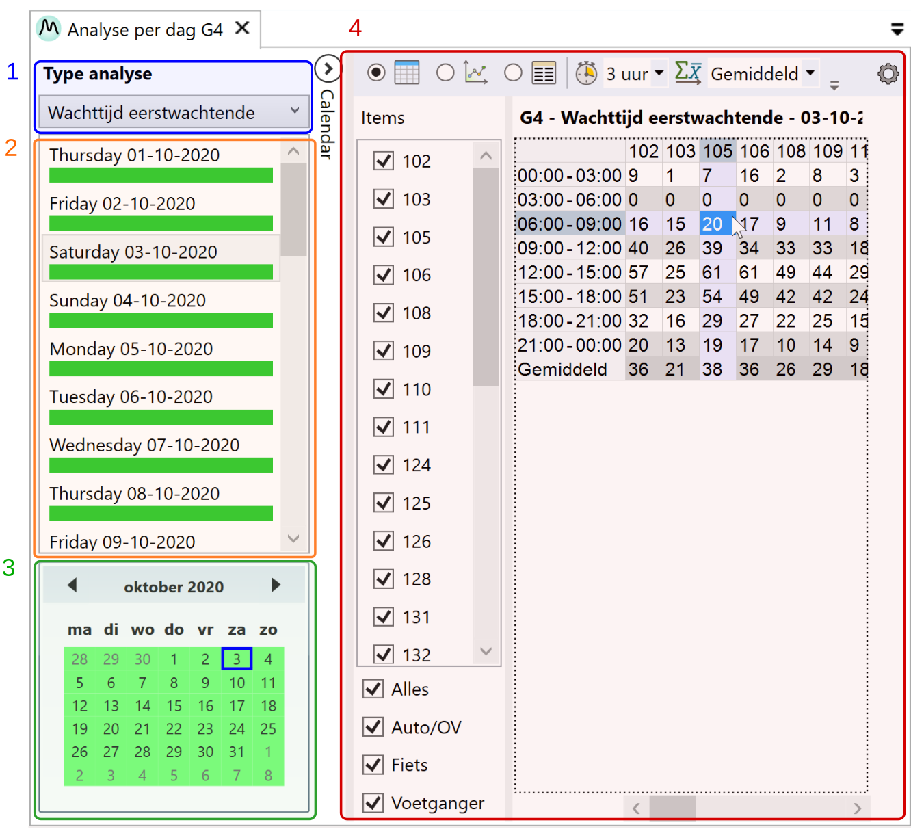
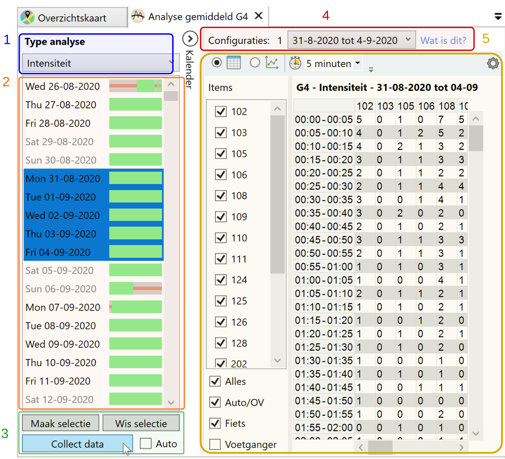
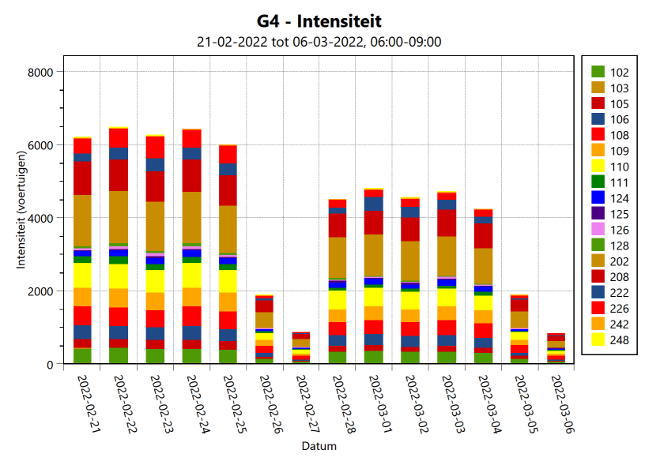

Binnen YAVC-client zijn diverse werkbladen beschikbaar waarmee analyse data kan worden opgevraagd:

- Analyse per dag: weergave van vooraf doorgerekende analyse data per dag
- Analyse gemiddeld: weergave van gemiddelde analyse data over meerdere dagen
- Analyse realtime: weergave van analyse data per dag, live doorgerekend obv VLOG data
- Analyse trend: weergave van totalen/gemiddelden per (deel van een) dag over een langere periode

Hieronder wordt per werkblad nader toegelicht waar dit voor dient, en welke data hiermee precies kan worden opgevraagd.

De diverse tabbladen zijn beschikbaar via rechtermuisklik op een kruispunt op de kaart: er verschijnt een context menu met de diverse opties. Al naar gelang wat is ingesteld, zijn er ook snelkoppelingen zichtbaar in de lijst met kruispunten.

## Export van analyse data

Voor alle analyse werkbladen geldt: de data kan worden geëxporteerd naar:

- .xlsx (Excel)
- .csv (met ; gescheiden data velden in een tekstbestand)
- .pdf (afbeelding met tabel)
- .png (afbeelding)
- .png of .csv naar klembord

## Analyse per dag

Bij openen van dit werkblad wordt de meest recente dag geselecteerd waarvoor analyse data beschikbaar is; doorgaans is dit vandaag.

De analyse resultaten die worden getoond zijn _altijd op basis van gefilterde data_ (tenzij alle filters zijn uitgeschakeld in de configuratie, wat niet wordt aangeraden).

Het werkblad ziet er als volgt uit:

Toelichting van de elementen:

1. Keuze voor weer te geven type analyse
2. Weergave met dagen van de geselecteerde maand, waarbij zichtbaar is welke data wel/niet beschikbaar is
3. Kalender weergave, waarmee van maand/jaar kan worden gewisseld; wisselen naar een andere maand ververst ook de lijst met dagen (2). De kleur van de dagen in de kalender is een maar voor de dekking van de data (lichter groen betekent minder data)
4. Feitelijke analyse weergave (zie [hier](../analyse-weergave/index.md) voor meer uitleg)

De analyse weergave ververst automatisch bij het wisselen van dag, of van type analyse. Instellingen zoals interval en selectie van items blijft dan behouden.

## Analyse gemiddeld

Bij openen van dit werkblad wordt niet direct data geladen. Dit gebeurt pas wanneer:

- Er een of meer data zijn geselecteerd in de lijst
- De knop "Collect data" wordt geklikt (of 'Auto' aan staat en de selectie/type wordt gewijzigd)

De analyse resultaten die worden getoond zijn _altijd op basis van gefilterde data_ (tenzij alle filters zijn uitgeschakeld in de configuratie, wat niet wordt aangeraden).

Dit tabblad toont gemiddelde data: de analyse resultaten worden gemiddeld over het aantal geselecteerde dagen. Er wordt geen rekening gehouden met gaten in de data op bepaalde dagen; een halve dag data zal dus op de andere helft van de dag onterecht een temperende invloed hebben. Dit geldt overigens niet voor analyses met afzonderlijke metingen, zoals wachttijd eerstwachtende of cyclustijd. Wel geldt dit voor analyses met tellingen.

Het tabblad ziet er als volgt uit:

Toelichting van de elementen:

1. Type analyse
2. Complete lijst met alle beschikbare data, waarbij zichtbaar is welke data voor een bepaalde datum wel/niet beschikbaar is
3. Instructie knoppen:
   1. Maak selectie: toont een dialoogvenster met de mogelijkheid op basis van voorwaarden een selectie van dagen te maken. Let op: selecteer éérst de eerste en laatste dag in de lijst, waartussen de selectie gemaakt moet worden; bij toepassen van de voorwaarden worden in dat bereik dagen geselecteerd die aan de voorwaarden voldoen
      1. Let op: dagen waarop een wijziging in configuratie heeft plaatsgevonden zijn roodgekleurd en kunnen niet worden geselecteerd (want: ze kunnen niet als geheel worden verwerkt)
   2. Wis selectie: alle dagen deselecteren
   3. Collect data: ophalen van data
   4. Auto: indien aangevinkt, wordt bij wijzigen van de selectie of wijzigen van het type analyse, de data automatisch ververst (gebruik hiervan is enkel aan te raden bij selectie van een beperkt aantal dagen!)
4. Na ophalen van de data verschijnt hier een dropdown box met de mogelijkheid tussen configuraties te wisselen: indien er binnen het bereik van de selectie een of meer wijzigingen in de configuratie heeft plaatsgevonden, worden de resultaten opgehaald per configuratie. Via de dropdown kan worden gewisseld tussen configuraties
5. Feitelijke analyse weergave: zie [hier](../analyse-weergave/index.md) voor meer info

## Analyse realtime

Dit tabblad werkt nagenoeg zoals 'Analyse per dag', echter wordt de analyse data hier live berekend: de achterliggende VLOG data wordt opgehaald, en de analyse wordt op basis van die data live uitgevoerd.

_Let op:_ de resulterende analyse data is in dit geval _niet gefilterd_. De optie om de data te filteren staat op de wensenlijst.

Het is mogelijk de configuratie aan te passen, zodat de analyse live wordt doorgerekend met aangepast instellingen. Zijn analyse gegevens nodig met aangepaste instellingen, en betreft dit een eenmalige actie, dan is het aan te raden gebruik te maken van dit tabblad, en niet alle analyse data te herberekenen.

## Analyse trend

In dit tabblad kan net als bij 'Analyse gemiddeld' een selectie van dagen worden gemaakt. Aanvullend kan een tijdspanne worden ingesteld waarvoor data moet worden opgehaald. Vervolgens wordt per dag voor de ingestelde tijdspanne de data opgehaald, en als totaal (of gemiddelde) weergegeven.

Bijvoorbeeld:

- De totale intensiteit tussen 06:00 en 09:00 per richting voor de periode 01-03-22 tot en met 07-03-22: dit levert een gestapelde grafiek op, of een tabel met per richting per dag de totale intensiteit voor dit tijdvak.
- De gemiddelde cyclustijd tussen 16:00 en 19:00 over een bepaalde periode: voor die periode wordt per dag de gemiddelde cyclustijd voor het betreffende tijdvak berekend en weergegeven in een tabel of grafiek.

Dit ziet bijvoorbeeld als volgt uit:

De analyse weergave voor trend data lijkt qua opzet op die van de overige tabbladen, maar kent gezien de aard van de data wat minder opties.
