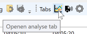
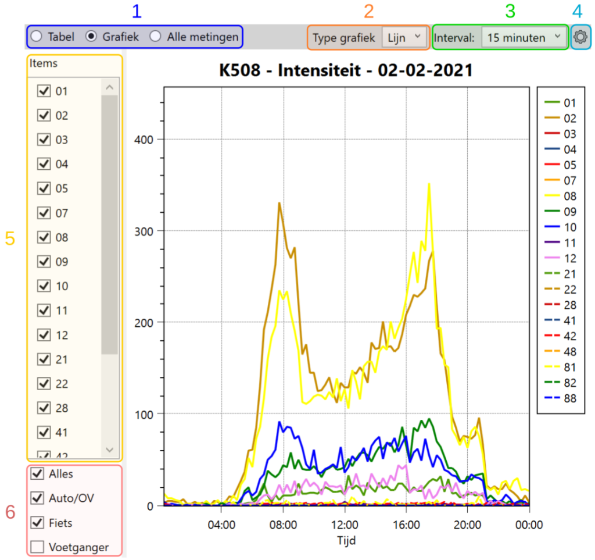
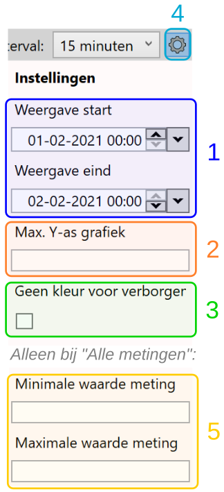
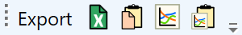

De weergave van analyse data gebeurt binnen YAVV en YAVC op een generieke manier: de opbouw van de gebruikersinterface is overal nagenoeg gelijk. De bron van de analyse data kan uiteen lopen:

- het kan gaan om analyse data op basis van één bestand of reeks bestanden, zoals gebruikelijk in YAVV; dit is beschikbaar via de knop op de toolbar:

[]

- wordt gewerkt met [YAVV big-data](../../yavv/yavv-big-data-trend-analyse/index.md), dan kan het gaan om gemiddelde data over meerdere dagen, of over data van één specifieke dag uit een reeks
- in YAVC-client geldt ook dat het kan gaan om een weergave van data van één specifieke dag, of een gemiddelde over meerdere dagen

Ongeacht de bron: de weergave van de resultaten is steeds hetzelfde opgebouwd. Dit artikel omschrijft die opbouw en geeft een overzicht van de mogelijkheden qua visualisatie (en export) van analyse data.

Een opmerking vooraf: zowel in YAVV als in YAVC wordt bij wisselen van analyse en/of dag altijd zoveel mogelijk gezorgd dat de instellingen worden overgezet (bv: interval, type grafiek, type analyse, etc.). Soms is dit niet mogelijk en moeten bepaalde weergave instellingen na een wisseling van analyse en/of dag opnieuw worden opgegeven.

## Opbouw gebruikersinterface

Hieronder wordt de grafische interface voor weergave van analyse data weergegeven:

[]

De volgende onderdelen zijn hier te zien:

1. Weergave type: tabel, grafiek of lijst met alle metingen
2. Type grafiek (alleen zichtbaar bij weergave type grafiek)
    1. Waar van toepassing is hiernaast nog een vinkje zichtbaar: weergeven alle metingen
3. Interval tbv. maken tijdvakken
4. Knop openen extra analyse opties
5. Lijst met items binnen de analyse
6. Snelkoppelingen om alle items van een bepaald type aan/uit te vinken

### Selectie van items

Items (signaalgroepen, detectoren, of cyclustijden) kunnen afzonderlijk worden aan- en uitgevinkt (5). Tevens is het mogelijk alle signaalgroepen van een bepaald type in één keer aan of uit te vinken (6).

Wanneer een bepaald item **geen metingen** heeft, krijgt het een donkergrijze kleur en wordt dit default uitgevinkt.

### Type weergave

De volgende weergaven zijn beschikbaar:

- Tabel: een reguliere tabel met data per item per tijdsinterval in een grid
- Grafiek: dezelfde data geplot in de vorm van een grafiek (lijn, balk, heatmap, etc.)
- Alle metingen: een "ruwe" lijst met alle metingen onder elkaar; dit is de brondata

#### Tabel

Default wordt altijd de **tabel** weergave geopend. Hierin is een lijst met data te zien, waarbij de data per item wordt weergegeven (kolommen), en wordt opgedeeld in tijdblokken (rijen).

De grootte van de tijdblokken is instelbaar via het interval (3).

Let op: momenteel wordt nog niet gevisualiseerd wanneer er evt. sprake is van onvolledige of ontbrekende data.

#### Grafiek

Bij weergave in **grafiek** vorm is er al naar gelang het type analyse de keuze uit:

- Lijn – weergave van data middels een lijn per item die loopt in de tijd
- Balk – weergave van data middels een balk per item per tijdblok; die is vooral nuttig (want overzichtelijk) bij weergave van weinig items, of een zeer groot interval (bv. 3 uur)
- Heatmap – bij deze weergave wordt er per item per tijdblok een kleur geplot; de kleur geeft de hoogte van de meting voor dat tijdblok en dat item aan; hierdoor worden bv. zwaartepunten snel visueel en inzichtelijk
- Boxplot – dit is alleen beschikbaar waar het nuttig is: bij analyses die een verdeling van metingen hebben, zoals wachttijd eerstwachtende; de boxplot geeft een indicatie van de spreiding van de metingen

Ook hier geldt: de grootte van de tijdblokken is instelbaar via het interval (3).

Bij weergave in grafiek vorm is het waar sprake is van afzonderlijke metingen met een waarde (bv. wachttijd eerstwachtende) mogelijk **alle metingen in de lijn-grafiek** weer te geven; wanneer dit mogelijk is verschijnt hiervoor een vinkje rechtsboven de grafiek. Dit levert geen zeer overzichtelijke grafiek, maar maakt het wel mogelijk eventuele pieken in de data te visualiseren en snel te vinden. Stel, in één interval is een met van 10 en 90 sec.; het gemiddelde komt dan uit op 50 sec, waardoor de piek van 90 sec. wegvalt; door gebruik van dit vinkje is de piek toch zichtbaar te maken.

#### Lijst met alle metingen

Deze weergave toont de achterliggende data: de afzonderlijke metingen die ten grondslag liggen aan de cijfers in de tabel/grafiek. Alle metingen staan hier in een lijst onder elkaar. De data is qua inhoud gelijk voor alle analyses, maar de betekenis van de cijfers loopt soms uiteen.

Deze lijst is vooral handig om snel hoge waarden te filteren uit de data (zie hieronder bij Extra waargave opties bij 5). Daarnaast is het mogelijk te dubbelklikken (of enter toets) op een item in de lijst om naar het betreffende tijdstip te manouvreren.

### Extra weergave opties

Middels de tandwiel knop (4) is het mogelijk een aantal aanvullende zaken in te stellen rond de visualisatie van de analyse data:

[]

De opties hier zijn als volgt:

1. Instellen vanaf waar tot waar de data gevisualiseerd moet worden. Dit is begrent door het begin en einde van de huidige data (in YAVV is dat de geopende data, in YAVC doorgaans de geselecteerde dag)
    1. Let op: start/einde moeten eigenlijk liggen op “hele” interval afstanden vanaf de start van de data. Dit wordt momenteel evenwel niet afgedwongen door de applicatie.
2. Max. Y-as grafiek: normaal gesproken schaalt de grafiek automatisch mee met de data. Middels deze optie kan de maximale waarde van de Y-as worden vastgezet; hiermee kunnen grafiek op basis van uiteenlopende data gemakkelijk worden vergeleken
3. Geen kleur voor verborgen items: de applicatie neemt bij elk volgende item de volgende kleur lijn uit een lijst. Ook uitgevinkte items krijgen normaal gesproken een kleur toegewezen. Soms is het handiger als dit niet zo is, zodat tussen verschillende grafieken de kleuren van de lijnen identiek zijn (bv.: intensiteit en intensiteit-fietsers).
4. Dit is de knop waarmee de extra opties weergegeven/verborgen kunnen worden.
5. Minimale/maximale waarde meting: dit is enkel van toepassing op de weergave “Alle metingen”; de lijst is middels deze opties in te perken, zodat extreme waarden makkelijker vindbaar zijn. Let op! Vergeet niet dit weer op te heffen, anders lijkt het soms onterecht alsof er geen metingen zijn.

### Export

In de toolbar bovenaan het applicatie venster bevinden zich een aantal knoppen waarmee het exporteren van analyse data mogelijk is:

[]

Van links naar rechts zijn hier de mogelijkheden:

- Export van de tabel naar Excel (.xlsx)
- Export van de tabel naar het klembord (als .csv data, gescheiden met ;)
- Export van de grafiek naar een plaatje (.png)
- Export van de grafiek naar het klembord

De bigdata addon heeft hier nog een extra optie: exporteren van meerdere dagen tegelijk naar één of meer .csv bestanden. Zie hierover verder [de documentatie rond bigdata](../../yavv/yavv-big-data-trend-analyse/index.md).
