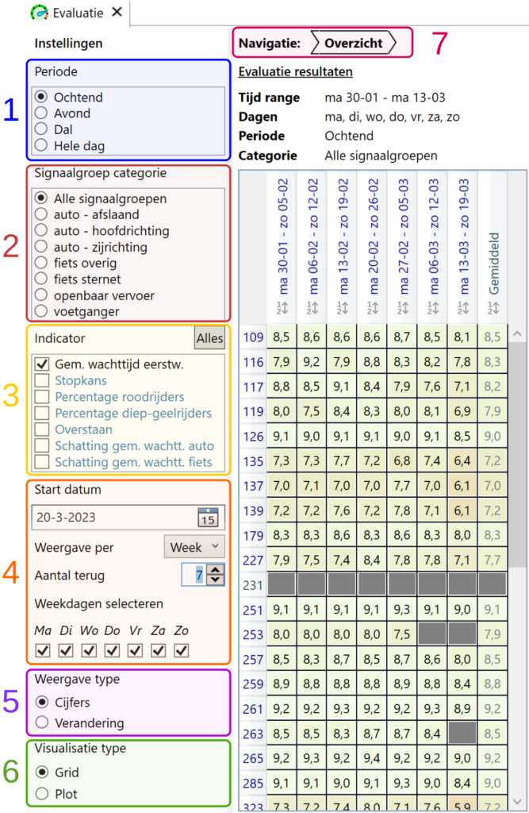

Dit artikel omschrijft de beschikbare functionaliteiten in YAVV/YAVC voor het visualiseren van evaluatie gegevens. Er wordt hierbij dus van uitgegaan dat er een evaluatie configuratie is. Zie voor algemene informatie omtrent de evaluatie tooling [hier](../yavv-yavc-evaluatie-introductie/index.md) en voor de configuratie [hier](../evaluatie-configuratie/index.md).

De evaluatie tooling van YAVV/YAVC berekent per dag, per periode, per signaalgroep per indicator een rapportcijfer. De wijze waarop het cijfer wordt berekend is betrekkelijk eenvoudig: op basis van een curve wordt een analyse resultaat vertaald naar een rapportcijfer. De omschreven werkwijze levert echter zeer veel cijfers op, en de vraag is dus hoe deze bekeken en geïnterepreteerd kunnen worden, zonder snel de weg te verliezen.

Precies deze vraag heeft centraal gestaan bij de ontwikkeling van de tooling voor visualisatie van evaluatie resultaten in YAVV/YAVC. Het resultaat is een interactieve en intuïtieve gebruikersinterface, waarmee vliegensvlug door de data heen kan worden gemanoevreerd, zonder uit het oog te verliezen wat wordt bekeken en dus wat de betekenis en context is van de weergegeven data.

De gebruikersinterface wordt hieronder weergegeven; de verschillende elementen worden verderop nader toegelicht:

De interface bestaat in de basis uit 3 elementen:

- De weergave instellingen, aan de linkerkant, nummers 1 t/m 6
- De actuele navigatie positie ("breadcrum"), bij nummer 7
- De weergave van de eigenlijke data, onder de kop "Evaluatie resultaten": de header, en de cijfers

Het resultaat van de evaluatie wordt telkens weergegeven als matrix, met in de rijen de kruispunten/categorieën/signaalgroepen, en in de kolommen de datums/indicatoren. Wat precies wordt weergegeven is afhankelijk van de actuele instellingen voor de weergave.

## Instellingen weergave

Voor het instellen van de weergave zijn diverse opties beschikbaar:

- De weer te geven periode (1): alleen data van de geselecteerde periode wordt weegegeven
- De weer te geven signaalgroep categorie (2):
  - hiermee kan een subset uit de data worden gefilterd voor de weergave; bijvoorbeeld enkel meenemen van signaalgroepen van één bepaalde categorie
  - deze optie is niet beschikbaar wanneer op een categorie of signaalgroep is ingezoomd
- Mee te nemen/weer te geven indicatoren (3):
  - voor meer informatie over de indicatoren: zie [hier](../evaluatie-indicatoren/index.md)
  - afhankelijk van de actuele weergave wordt hiermee bepaald welke indicatoren worden meegenomen voor het bepalen van het weer te geven cijfer
  - bij meerdere indicatoren wordt het rekenkundige gemiddelde over de betreffende cijfers weergegeven
  - is ingezoomd op een signaalgroep of periode, dan wordt hiermee bepaald welke indicatoren in de matrix weergegeven moeten worden
- Tijdsperiode instellingen (4):
  - Start datum: de datum vanaf wanneer de matrix wordt gevuld (let op: we gaan tbv. ophalen data vanaf dit _terug_ in de tijd!)
  - Weergave per: lengte periode: dag/week/maand
  - Aantal terug: aantal perioden terug dat moet worden opgehaald en weergegeven (momenteel maximaal 31)
  - Weekdagen selecteren: hiermee kan worden bepaald welke dagen van de week moeten worden weergegeven of moeten worden meegenomen om het weer te geven cijfer (bv. per week) te bepalen.
- Weergave type (5): hier kan worden gekozen tussen rapportcijfers of verandering/delta (ten opzichte van de vorige cel). Indien op een periode (dag/week/maand) is ingezoomd, kan de delta niet worden weergegeven; in plaats kan dan de analyse waarde die de basis heeft gevormd voor het cijfer worden weergegeven. Merk hierbij op: deze data wordt zonder grootheid weergegeven; de betekenis van het getal is verschillend per indicator!
  - In de toekomst zal nog worden toegevoegd de optie om de afwijking ten opzichte van het gemiddelde over de ingestelde periode weer te geven.
- Visualisatie type (6): in plaats van een matrix kan ook een grafiek worden gebruikt voor de visualisatie van de data. Inzoomen op een periode is bij weergave in grafiekvorm momenteel niet mogelijk.

## Navigatie door de data

Op rijnamen/kolomnamen met blauwe tekst, kan worden geklikt om "in te zoomen" op de betreffende data. De navigatie (7) geeft aan welke data momenteel wordt gevisualiseerd. Door te klikken op een element "lager" in de hiërarchie, kan weer worden "uitgezoomd".

Bij YAVC is de "basis", ofwel het laagste zoomniveau, een weergave van alle kruispunten voor het opgegeven aantal perioden (dagen/weken/maanden) in de tijd. Voor YAVV geldt dat die basis de weergave is van de geconfigureerde categorieën voor het opgegeven aantal perioden.

Het zoomen staat hier tussen aanhalingstekens omdat natuurlijk niet letterlijk sprake is van zoomen; het betreft het meer gedetailleerd weergeven van een bepaald deel van de data, die eerder ook al deels de basis vormde voor de visualisatie.

Mogelijk vergt het navigeren door de data middels de gebruikersinterface enige oefening. Advies: klik een tijdje op de kollemen/rijen van de matrix, en probeer dat uit met diverse instellingen qua weergave. Het zal snel duidelijk worden hoe eenvoudig het is de gewenste data naar voren te krijgen.

## De resultaten

De resultaten worden default weergegeven in een matrix. Ze krijgen in die matrix een kleur gebaseerd op het cijfer: hoe lager, hoe roder, hoe hoger, hoe groener. Bij weergave van de delta wordt tussen -1,5 en 1,5 verandering een kleurverloop van rood via wit naar groen toegepast. Bij weergave van analyse waarden blijven de cellen wit.

De matrix toont waar mogelijk ook het gemiddelde of totaal van rijen/kollomen. In geval van een gemiddelde betreft dit het rekenkundige gemiddelde over de cijfers uit de rij/kolom.
