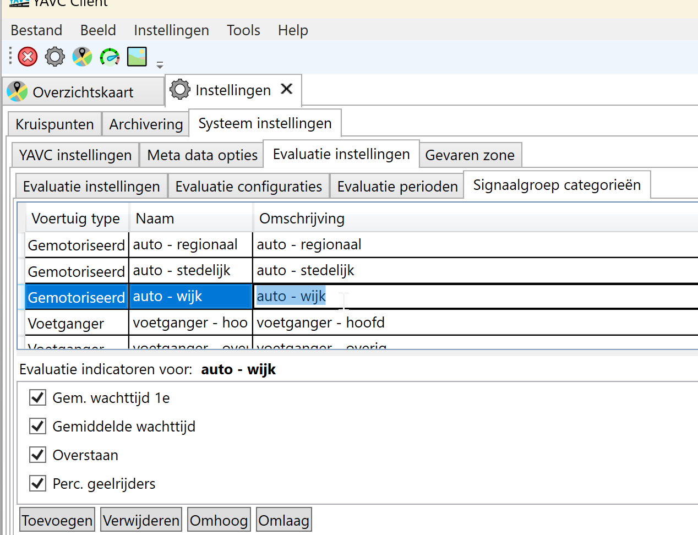
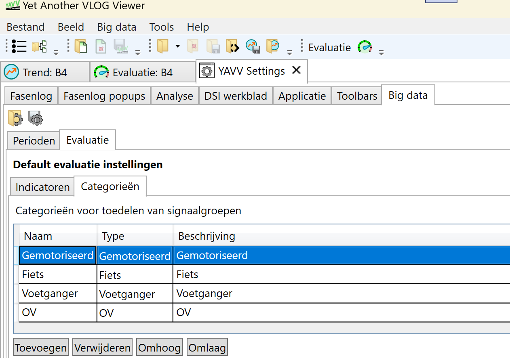
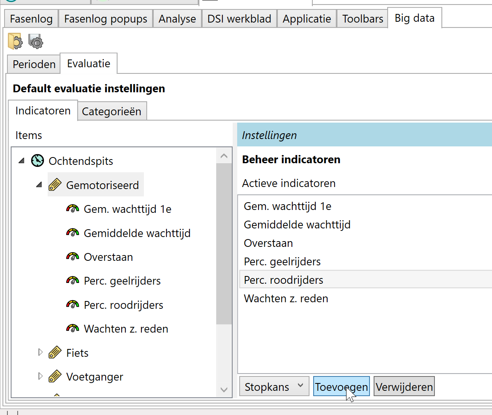
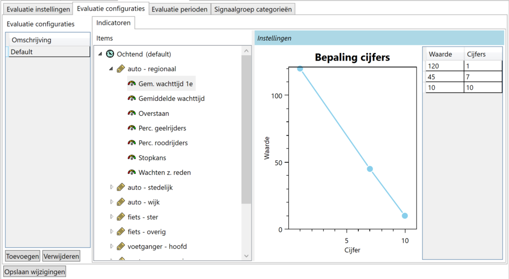
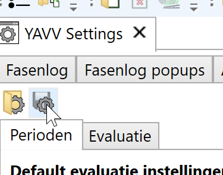
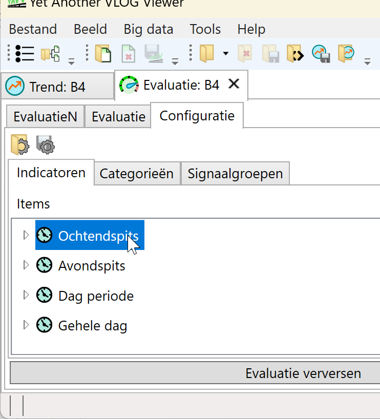

Dit artikel omschrijft hoe de evaluatie tooling van YAVV/YAVC op een verkeerskundig zinvolle geconfigureerd kan worden. Voor algemene informatie omtrent de evaluatie tooling van YAVV/YAVC, zie [hier](../yavv-yavc-evaluatie-introductie/index.md).

## Introductie

Het functioneren van de evaluatie module van YAVV/YAVC - en daarmee ook de bruikbaarheid en meerwaarde - staat of valt met een zinvolle configuratie. Immers: de configuratie is bepalend voor de wijze waarop analyse resultaten worden vertaald naar rapportcijfers. Die cijfers zijn dus zeer relatief, en zullen enkel dan een goede reflectie vormen van de mate waarin doelen worden behaald, wanneer over deze vertaalslag goed is nagedacht.

### Achtergrond: werking evaluties

Om goed te kunnen plaatsen precies wat en om precies welke reden moet worden geconfigureerd, kijken we eerste naar de werking van de evaluatie module:

- Uitgangspunt is de beschikbaarheid van analyse data
    - **Merk op!** Met andere woorden: een correcte [configuratie van de kruising](../../yavc/kruispunten-configureren-in-yavc/index.md) is een voorwaarde voor het verkrijgen van zinvolle evaluatie uitkomsten.
    - Voor YAVC geldt: de evaluatie data wordt continu doorgerekend; hiervoor is wel een gevalideerde analyse configuratie nodig
    - Voor YAVV (bigdata) geldt: er moet vóór de evaluatie optie beschikbaar komt een trend analyse worden uitgevoerd op een dataset
- De VLOG data gaat dus door een soort pijplijn:
    - Stap 1: uitlezen van VLOG data
    - Stap 2: filteren van de data
    - Stap 3: uitvoeren analyses op de data
    - Stap 4: verwerken analyse resultaten tot evaluatie
- Voor de 4e stap in deze pijplijn geldt:
    - De evaluatie kan enkel worden uitgevoerd indien alle benodigde analyse data beschikbaar is (voor de indicator wachten-zonder-reden zijn dus bv. conflicten nodig in de kruispunt analyse-configuratie)
    - De analyse resultaten worden verwerkt per dag, tot een waarde per signaalgroep per geconfigureerde periode
    - De bepaalde waarde voor de betreffende periode wordt vertaald naar een rapportcijfer

Dit laatste punt is cruciaal: hier worden relatief "harde" analyse waarden vertaald naar een relatief (en dus "zacht") cijfer. Een cijfer - zoals 7,8 of 5,3 - zegt op zichzelf weinig; pas wanneer bekend is welke grenswaarden zijn ingesteld om de "harde" waarde naar een cijfer te vertalen, krijgt het cijfer betekenis.

Daarnaast geldt: cijfers hebben de meeste betekenis in relatie tot andere cijfers.

Opzet configuratie

Een evaluatie configuratie kent de volgende opzet:

- Evalutie periode
    - Signaalgroep categorie
        - Indicatoren

Hierbij geldt dat rapportcijfers altijd worden berekend per dag, en vervolgens dus per geconfigureerde evaluatie periode. Binnen de periode worden voor elke signaalgroep cijfers berekend. Hierbij geldt:

- Per signaalgroep wordt bepaald bij welke signaalgroep categorie die hoort
- Voor de indicatoren die voor deze categorie zijn geconfigureerd worden cijfers berekend

Deze verschillende elementen worden hieronder nader toegelicht.

### Evaluatie perioden

Een evaluatie periode is niets anders dan een gedeelte van de dag. Bijvoorbeeld: 07:00 tot 09:00. De evaluatie tooling maakt per periode een set resultaten aan. Bij de weergave van de resultaten kan tussen perioden worden gewisseld.

### Signaalgroep categorieën

Om een signaalgroep op de juiste wijze te kunnen beoordelen, moet rekening worden gehouden met het type verkeer op signaalgroep. Het gaat hierbij niet om het type voertuigen, maar veeleer de functie die een bepaald wegvak vervult in het netwerk. Bijvoorbeeld: doorgaand verkeer op het hoofdwegennet ten opzichte van een afslaande richting op het onderliggend wegennet. Aan de doorstroming op doorgaande hoofdrichtingen worden doorgaans immers andere eisen gesteld dan aan de doorstroming op zijrichtingen.

Binnen de evaluatie tooling wordt hierin voorzien middels signaalgroep categorieën: per categorie kunnen afzonderlijk indicatoren worden gekozen die meegenomen moeten worden, en is de instelling van deze indicatoren afzonderlijk te regelen.

### Indicatoren

Per signaalgroep categorie kan worden ingesteld welke verkeerskundige indicatoren meegenomen moeten worden in de evaluatie. Per indicator is vervolgens instelbaar hoe de gemeten analysewaarde moet worden vertaald naar een rapportcijfer. Dit gebeurt middels het bepalen van een curve; de meetwaarde wordt op deze curve geplot en het bijbehorende cijfer op die manier gevonden.

Voor meer informatie over de beschikbare indicatoren: zie [hier](../evaluatie-indicatoren/index.md).

### Tip: keep it simple!

Door de getrapte opzet van de evaluatieconfiguraties, is het mogelijk zeer gecompliceerde configuraties op te bouwen. Zo zouden bijvoorbeeld in theorie per periode andere signaalgroep categorieën kunnen worden gekozen, en/of per signaalgroep categorie andere indicatoren. Tevens is het denkbaar de indicatoren per signaalgroepen categorie afzonderlijk in te stellen per evaluatieperiode, zodat bijvoorbeeld de ochtendspits anders wordt gewaardeerd dan de avondspits.

Enerzijds is dit een kracht van de opzet van de evaluatie tooling: er is zeer veel mogelijk. Tegelijk ontstaat al snel een zeer complex geheel aan instellingen, met navenant moeilijk te interpreteren resultaten. Daarom een aantal tips:

- Gebruik een periode als de default, en stel voor andere perioden in dat ze de default instellingen gebruiken; enerzijds scheelt dit zeer veel qua configuratie, en anderzijds is het op deze manier eenvoudiger de resultaten te duiden, omdat deze voor alle perioden op dezelfde manier worden bepaald
    - Wordt toch gekozen voor afwijkende instellingen per periode: zorg er binnen de YAVV voordat de indicatoren per signaalgroepen categorie per periode overal identiek zijn (binnen YAVC wordt dit afgedwongen)
- Gebruik voor alle perioden dezelfde signaalgroepen categorieën; dit wordt overigens momenteel zowel in YAVV als in YAVC afgedwongen
- En vooral: beperk het aantal perioden, het aantal signaalgroepen categorieën en (in YAVC) het aantal evaluatie configuraties

Hieronder wordt nader ingegaan op de wijze waarop al deze elementen binnen de YAVV YAVC kunnen worden ingesteld.

## Instellen evalutie configuraties

Het instellen van evaluatieconfiguraties verloopt binnen de YAVV en YAVC grotendeels hetzelfde. Het overlappende gedeelte wordt hieronder als eerste omschreven. Onderaan wordt nog ingegaan op punten die specifiek alléén gelden voor YAVV of YAVC.

### Evaluatie perioden instellen (YAVV en YAVC)

De evaluatie perioden zijn niet meer dan ingestelde tijdsperioden: bij het uitvoeren van de evaluatieconfiguratie worden de resultaten per opgegeven periode bepaald. Toevoegen/verwijderen van evaluatieperiode, wordt ook verwerkt in de evaluatieconfiguratie: voor YAVV dus in de default evaluatieconfiguratie, voor YAVC in alle aangemaakte evaluatieconfiguraties (de client geeft hierover een melding).

### Signaalgroep categorieën (YAVV en YAVC)

De betekenis van signaalgroep categorieën is hierboven reeds omschreven. Hier geldt qua configuratie dat dit enigszins verschilt tussen YAVV en YAVC:

- In YAVC: categorieën, inclusief bijbehorende indicatoren, worden beheerd via het tabblad "Signaalgroep categorieën":  
      
    Hier aangemaakte/verwijderde categorieën, worden ook toegevoegd aan/verwijderd uit alle aangemaakte evaluatie-configuraties
- In YAVV: categorieën worden aangemaakt en beheerd via het tabblad Evaluatie > Categorieën:  
      
    De categorieën komen vervolgens terug in de boomstructuur onder "Indicatoren"; klik hier op een categeorie om in te stellen welke indicatoren meegenomen moeten worden:  
    

### Evaluatie configuraties (YAVV en YAVC)

De kern van de evaluatie tooling vormt de vertaling van verkeerskundige data naar rapportcijfers. Dit wordt geconfigureerd in een boomstructuur per geconfigureerde periode, en per periode weer per geconfigureerde signaalgroep categorie. De boomstructuur kent drie niveaus:

- Periode
    - Categorie
        - Indicator

Hieronder een voorbeeld van hoe dit eruit ziet in YAVC (in YAVV is dit verder gelijk):

[]

Door te klikken op elementen in de boomstructuur komen de beschikbare instellingen voor dat element naar voren:

- Periode: de naam en ingestelde tijden van de periode zijn hier te zien (maar niet in te stellen, dit gebeurt zoals hierboven omschreven elders). Tevens is in te stellen:
    - Gebruik als default: er kan één periode als default worden aangegeven
    - Gebruikt default indicatoren: indien aangevinkt, is er voor deze periode verder niets in te stellen; de periode maakt in plaats gebruik van de instellingen van de aangegeven default periode
- Categorie: in YAVV kunnen hier indicatoren worden toegevoegd en/of verwijderd; in YAVC kan slechts worden bekeken welke indicatoren bij deze categorie zijn geconfigureerd
- Indicator: door te klikken op een indicator, komen de grafiek en de tabel tevoorschijn met de curve die wordt gebruikt om analysedata te vertalen naar een rapportcijfer; de curve kan worden bewerkt door de waarden aan te passen in de tabel en/of te klikken/slepen in de grafiek

## Evaluatie in YAVC

Binnen YAVC kunnen meerdere evaluatie configuraties worden aangemaakt. De evaluatieconfiguratie is beschikbaar via menu Instellingen > Systeem instellingen > tabblad Systeem instellingen > tabblad Evaluatie instellingen.

Hieronder wordt per beschikbaar tabblad van de evaluatie-instellingen een toelichting gegeven.

### Algemene evaluatie instellingen

In het tabblad "Evaluatie instellingen" worden een aantal YAVC-brede zaken omtrent evaluaties ingesteld:

- Default evaluatie configuratie: indien er bepaalde kruising niet aan een groep is toegewezen, en er dus langs die weg niet bepaald kan worden welke evaluatieconfiguratie voor deze kruising van toepassing is, wordt de hier ingestelde default genomen
- Minimale dekking voor dagen: alleen data waarvoor geldt dat deze een minimale data-dekking hebben van het hier ingestelde percentage, worden meegenomen in de evaluatie (mogelijke waarden: 0 - 100)
- Default signaalgroepen categorieën: indien bij de analyseconfiguratie van een bepaalde kruising, voor een bepaalde signaalgroepen niet expliciet is aangegeven tot welke signaalgroep categorie deze behoort, wordt gebaseerd op het voertuigtype de hier ingestelde categorie genomen voor de evaluatie

De eerste en derde optie van bovenstaand zorgen ervoor dat met een minimale hoeveelheid configuratie, de evaluatie reeds kan gaan lopen: ook zonder toedelen van kruispunten aan groepen, en zonder toedelen van signaalgroepen aan categorieën, kan de evaluatie reeds worden uitgevoerd.

### Evaluatie configuraties

In het tabblad "Evaluatie configuraties" kunnen de diverse evaluatieconfiguraties worden beheerd. Het is hier mogelijk configuraties toe te voegen en/of te verwijderen, en de instellingen van configuraties aan te passen, zoals hierboven omschreven.

### Perioden en categorieën

Deze twee elementen worden ingesteld in de resterende beschikbare tabbladen.

Voor perioden geldt dat de naam van de periode wordt gebruikt in de weergave van resultaten; de omschrijving is momenteel slechts voor de configuratie zelf relevant.

Voor categorieën geldt: per aangemaakt categorie moet worden opgegeven:

- Voor welk type voertuig van deze categorie van toepassing zijn? Dit is bepalend voor de beschikbare indicatoren (voor voetgangers is bijvoorbeeld geen percentage roodrijders beschikbaar)
- Welke voor dit voertuigtype beschikbare indicatoren moeten bij deze categorie worden meegenomen?

Binnen YAVC zijn de evaluatie perioden, alsook de signaalgroep categorieën gelijk tussen alle evaluatie configuraties. De reden dat de periode en categorieën tussen alle aangemaakte evaluatieconfiguraties gelijk moeten zijn: dit maakt het mogelijk de informatie op eenduidige en overzichtelijke manier te presenteren. Zouden configuratie tussen verschillende perioden en/of categorieën te zeer uiteenlopen, dan zit dat een overzichtelijke presentatie in de weg.

## Evaluatie in YAVV

Binnen YAVV is er één default evaluatie configuratie. Bij het uitvoeren van een evaluatieconfiguratie wordt hiervan gebruik gemaakt, en kan vervolgens voor die specifieke evaluatie configuratie nog worden bijgesteld (en de evaluatie nadien worden herberkend).

De default evaluatieconfiguratie kan worden ingesteld via menu Help > Instellingen YAVV, en vervolgens op het tabblad "Big data":

- Perioden worden ingesteld via het tabblad "Perioden"; hier aangemaakte/verwijderde perioden komen automatisch terug (of vallen weg) in het tabblad "Evaluatie"
- Er kan één evaluatieconfiguratie worden ingesteld (tabblad "Evaluatie")
- De evaluatieconfiguratie kan worden opgeslagen en weer worden ingeladen:  
    

Om binnen YAVV vervolgens gebruik te maken van de evaluatie tooling:

- Indexeer via "Openen map" een map met data (zie ook [hier](../../yavv/yavv-big-data-trend-analyse/index.md))
- Voer vervolgens na selectie van een aantal dagen via tabblad "Trend analyse" een trendanalyse uit (zie ook [hier](../../yavv/yavv-big-data-trend-analyse/index.md))
- Nu komt de knop "Evaluatie" in de Toolbar beschikbaar. Deze knop opent een nieuw werkblad.
- In het tabblad "Configuratie" van het evaluatie werkblad kan de evaluatieconfiguratie voor de actuele evaluatie worden nabewerkt:  
      
    Hier zijn exact dezelfde instellingen beschikbaar, als bij de defaults. Aanvullend is onder de tabblad "Signaalgroepen" instelbaar welke signaalgroepen bij welke signaalgroep categorie hoort. Ook hier kan de evaluatie worden opgeslagen/ingeladen
- Klik na evt. wijzigen van de actuele evaluatie configuratei op "Evaluatie verversen"
- **Merk op:** deze evaluatieconfiguratie is uitsluitend van toepassing binnen de context van dit werkblad
- **Merk op 2**: controleer na inladen van een evaluatieconfiguratie altijd de toedeling van signaalgroepen aan signaalgroep categorieën; wordt bijvoorbeeld een evaluatieconfiguratie van een andere kruising ingeladen, dan klopt toedeling mogelijk niet
