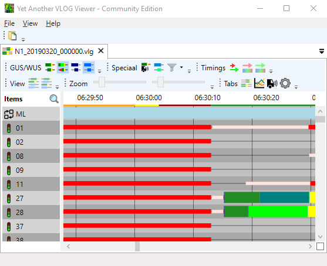
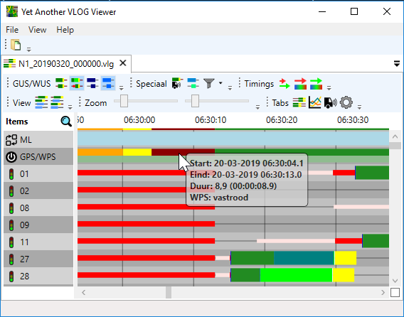

YAVV biedt de mogelijkheid in de fasenlog de gewenste (GPS) en werkelijke programma status (WPS) weer te geven:

- Als smalle lijn onderin de tijdbalk (WPS)
- Als item in de fasenlog (GPS en WPS, alleen beschikbaar in de pro versie)

WPS wordt altijd weergegeven als een smalle gekleurde lijn onder de tijdbalk. Daarbij gelden de volgende kleurcodes:

- gedoofd
- geel knipperen
- statisch geel
- alles rood
- regelen

In onderstaande afbeelding is de weergave van WPS in de tijdlijn te zien:

De bovengenoemde kleurcodes gelden ook wanneer GPS/WPS als item in de fasenlog wordt weergegeven. Voor WPS gelden de volgende kleurcodes:

- gedoofd
- geel knipperen
- statisch geel
- alles rood
- regelen

In de fasenlog wordt voor GPS in de tooltip tevens de evt. foutstatus en de bron (indien bekend) weergegeven. Voor GPS wordt eveneens de evt. foutstatus weergegeven.

In onderstaande afbeelding is de weergave van GPS/WPS in de fasenlog te zien:

