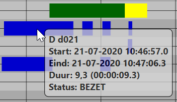
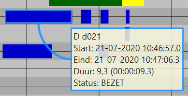
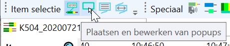
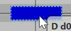
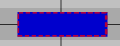

De fasenlog van YAVV biedt de mogelijkheid VLOG data in de fasenlog te voorzien van statische popups, met optioneel commentaar. De popups fungeren direct als bookmarks waarmee eenvoudig naar een speficiek moment in de fasenlog gemanouvreerd kan worden.

_Merk op_: gezien de verschillende wijze waarop data wordt geladen in YAVC-client, biedt deze momenteel geen mogelijkheden voor plaatsen van popups.

Ter info vooraf, een kort overzicht van gebruikte termen:

- Wanneer hier wordt gesproken over een **tooltip**, wordt het 'balonnetje' bedoeld dat naast de muis zweeft wanneer die over de fasenlog beweegt. Hierin is informatie te zien over item/status onder de muis. Hieronder een voorbeeld:  
   
- Met een **popup** wordt bedoeld een statisch vakje met informatie over één specifieke status van een item. Dit is uitsluitend zichtbaar nadat het bewust in de fasenlog is geplaatst:  
   

Plaatsen van popups gaat middels de toolbar "Item selectie":

De toolbar bestaat uit vier knoppen:

- Weergeven van popups
  - Dit is een aan/uit knop
  - Wanneer ingeschakeld, zijn in de fasenlog aanwezig popups zichtbaar. Het gedrag van de fasenlog bij bewegen met de muis, klikken en slepen is ongewijzigd - de muis gaat zeg maar 'door de popups heen'.
  - _Let op_! enkel wanneer deze aan staat zijn de overige opties beschikbaar.
- Plaatsen en bewerken van popups
  - Eveneens een aan/uit knop
  - Wanneer ingeschakeld, is een lichtblauw gestippeld rand zichtbaar rond de status die onder muis ligt:  
     
  - Een muisklik zorgt nu voor selectie van de betreffende status, de status krijgs dan een rood gestippelde rand:  
     
  - De fasenlog kan nu met klik+slepen niet meer worden verplaatst. Door de Shift toets in te drukken kan dit alsnog.
- Plaats info popup bij item
  - Deze knop is enkel beschikbaar indien er een status is geselecteerd
  - Een klik zorgt ervoor dat een 'info popup' wordt geplaatst bij de geselecteerde status
  - Een info popup bevat precies dezelfde informatie als de tooltip die bij de status verschijnt als de muis eroverheen komt.
  - De popup kan middels klikken+slepen worden verplaatst.
  - Bevindt de muis zich op de popup, dan zijn rechts bovenin een aantal knopjes beschikbaar:
    - Een rondje: weergeven instellingen, met de mogelijkheid de doorzichtigheid in te stellen, en te kiezen voor een kromme of rechte verbindingslijn
    - Twee streepjes: tonen en kunnen bewerken van commentaar. Dit commentaar is direct de beschijving voor de bookmark.
    - Een kruisje om de popup mee te verwijderen
  - Deze knop heeft ook een sneltoets: Control+Shift+P
- Plaats tijd/snelheid meting bij twee items
  - Deze optie is uitsluitend beschikbaar indien twee statussen zijn geselecteerd. Dit kan middels Control+klik
  - De popup toont informatie over de relatie tussen de twee statussen. In geval van twee detectoren op dezelfde rijbaan wordt ook een inschatting van de gereden snelheid weergegeven.
    - _Let op!_ De configuratie qua ligging van de lussen moet goed staan, wil dit een zinvolle meting zijn. Zelfs dan: de snelheid is **altijd** een inschatting. VLOG heeft een resolutie van 0,1 seconden, en de ligging van lussen op straat wijkt vaak enigszins af. Zie ook de omschrijving [hier](../../analyse/analyse-snelheidsprofiel/index.md).
