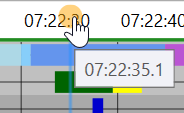
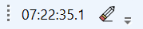
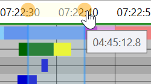
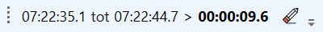

Het is mogelijk in de fasenlog een verticale lijn te plaatsen op een bepaald punt in de tijd. Tevens is het mogelijk een tweede lijn te plaatsen, waarmee tevens het gebied tussen de twee lijnen geselecteerd wordt.

Dit gaat als volgt:

- Klik in de tijdblak bovenaan de fasenlog, er verschijnt nu een bolletje, en daaronder wordt over de fasenlog heen een verticale lijn geplaatst  
    
- Tevens verschijnt nu in de toolbar sectie een nieuwe toolbar waarin de tijd van de verticale lijn wordt weergegeven  
      
    Middels de "gum" knop geheel rechts op de toolbar kan de actuele lijn (of selectie) worden verwijderd
- Middels een muisklik+slepen op he bolletje kan de verticale lijn worden verplaatst
    - _Tip_: houdt de Control toets ingedrukt tijdens het slepen om de verticale lijn heel precies op de juiste plek te kunnen plaatsen
    - _Nog een tip_: gebruik Control+muiswiel om snel in en uit te zoomen en zo beter te kunnen zien waar de verticale lijn precies staat
- Klik elders in de tijdbalk: er wordt nu een tweede verticale lijn geplaatst en er ontstaat een selectie in de tijd.  
      
    Tevens wordt in de toolbar nu ook de einde tijd van de selectie weergegeven, alsook de duur tussen start en eind.  
    

De geplaatste lijn of gemaakte selectie kan worden gebruikt om in detail te kijken of bepaalde events al dan niet gelijktijdig optreden, of hoe ver ze uit elkaar liggen in de tijd. De selectie wordt ook gebruik (indien aangevinkt) bij het exporteren van data als nieuwe VLOG data of als 'ruwe' lijst met events.
