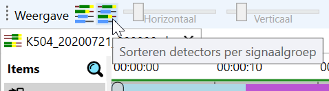
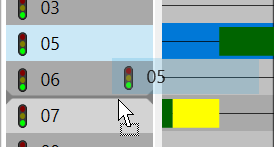
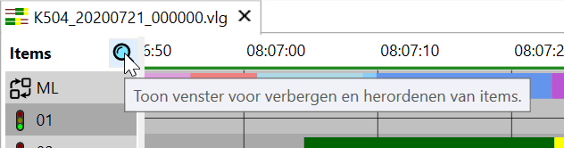
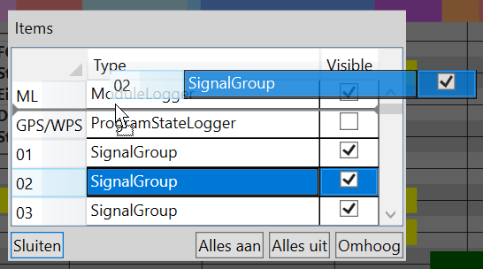

Bij openen van data is de default volgorde van items:

- alle **signaalgroepen** onder elkaar
- gevolgd door alle **detectoren**
- dan alle **ingangen**
- en tenslotte alle **uitgangen**

_Let op_: indien een .yavv file gevonden wordt bij de data of in de default map met configuraties ([zie hier](../../yavc/omgang-met-configuraties-in-yavc/index.md)) wordt de volgorde uit de configuratie direct ingeladen.

_Let op 2_: in YAVC-client worden wijzigingen in weergave of sortering momenteel na afsluiten van de fasenlog niet bewaard; opslag van weergave profielen staat op de wensenlijst.

### Plaatsen van detectoren bij signaalgroepen

Bij aanwezigheid van een configuratie bestand bij de data kunnen detectoren bij de fasen worden geplaatst middels de betreffende knop op de toolbar:

[]

Hoe dit precies werkt is afhankelijk van de informatie uit de configuratie:

- Bij een CFG bestand doet YAVV een automatische match van detectoren bij fasen, op basis van namen van elementen
- Bij een .yavv bestand zit de toedeling expliciet in de configuratie en wordt zo toegepast

De knop zorgt ervoor dat de detectoren die bij een bepaalde signaalgroep horen in de fasenlog direct onder de betreffende signaalgroep komen te staan.

### Handmatig sorteren van items

Wanneer de automatische toedeling van detectoren niet klopt, of er moeten ingangen of uitgangen naar boven of onder worden geplaatst, moet dit handmatig. Hiervoor zijn twee manieren:

- Door items te slepen direct in de lijst naast de fasenlog  
    
- Door gebruik van het dialoogvenster middels de vergrootglas knop boven de lijst met items  
      
    Er verschijnt dan een dialoogvenster waarin ook gesleept kan worden.  
    

_Tip_: het is mogelijk items in één geheel bovenaan de lijst te plaatsen. Dit kan op twee manieren:

- Rechtermuisklik op geselecteerde item(s) > Omhoog plaatsen klikken
- In het dialoogvenster zoals hierboven, middels de knop "Omhoog"

_Nog een tip_: zowel in de lijst als in het dialoogvenster kan middels Shift of Control een selectie van meerdere items worden gemaakt.

### Verbergen en tonen van items

Middels rechtermuisklik op items in de lijst naast de fasenlog is het mogelijk items verbergen. Om verborgen items weer in beeld te krijgen kan gebruik worden gemaakt van het dialoogvenster via de vergrootglasknop rechts bovenaan de fasenlog (zie hierboven). Met de vinkjes in die lijst kunnen items worden verborgen of juist getoond.
