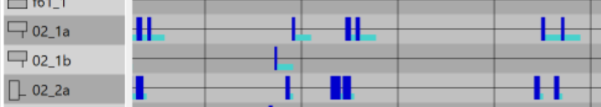

De VLOG standaard biedt ruimte voor "eigen" ofwel "zelfgedefiniëerde" berichttypen. Deze hebben conform de standaard de nummers 129-253 (oneven, status) en 130-254 (even, update). Het is altijd raadzaam bij de keuze voor te gebruiken nummers te kiezen voor twee opeenvolgende berichtnummers: bv. 145 voor status en 146 voor update. Zo volgt de opzet zo veel mogelijk de opzet van de VLOG standaard.

Dit artikel voorondersteld dat de lezer kennis heeft van de VLOG standaard. De informatie refereert ook aan de toolkit CCOL, omdat hierin een standaardisering is opgenomen voor het werken met "eigen" VLOG berichten, die binnen YAVV/YAVC wordt gevolgd.

## Zelfgedefiniëerde VLOG berichten

Bij de implementatie van zelfgedefiniëerde VLOG berichten binnen YAVV/YAVC is uitgegaan van de implementatie zoals die binnen CCOL is gedaan. Uiteraard is het wegschrijven van dit type berichten niet voorbehouden aan CCOL, maar _kan elke regelapplicatie dit doen_.

Binnen CCOL wordt middels de functie `vlog_put_message()` data weggeschreven in de logging buffer, zodat die in de VLOG data terecht komt. Daarbij geldt voor resulterende VLOG berichten:

- Ze hebben het opgegeven nummer (bv. 145; één byte)
- Ze krijgen de offset vanaf de meest recente timestamp mee (evenals alle andere reguliere berichten)
- Het aantal elementen wordt weggeschreven (altijd in 1,5 bytes, zowel voor status als update, dus altijd overlappend met de offset, zoals bv. ook geldt voor berichttype 13 uit de VLOG standaard)
- Het type data wordt weggeschreven (in één byte): dit wordt verderop nader toegelicht
- Per element wordt data weggeschreven (lengte afhankelijk van type en aantal)

Op deze wijze houden de "eigen" berichten dus ongeveer het formaat aan zoals dat ook geldt voor bijvoorbeeld multivalente IO: <berichttype><offset><aantal-items><data-type><index-en-data-per-item>. Ten opzichte van de reguliere berichten is enkel het "data-type" gedeelte hier extra.

Binnen CCOL is de programmeur er zelf voor verantwoordelijk dat elke 5 minuten de status wordt weggeschreven (indien dat gewenst is).

Voor wat betreft het type data:

Binnen CCOL worden de volgende typen gedinieerd:

```
#define VLOGDATATYPE_STRING 1 /* no index - info message */ #define VLOGDATATYPE_BYTEARRAY 2 /* no index – byte array */ #define VLOGDATATYPE_INDEX1_BYTE 11 /* index1 + byte - 1+1 bytes */ #define VLOGDATATYPE_INDEX1_MULV 12 /* index1 + mulv - 1+2 bytes */ #define VLOGDATATYPE_INDEX2_BYTE 21 /* index2 + byte - 2+1 bytes */ #define VLOGDATATYPE_INDEX2_MULV 22 /* index2 + mulv - 2+2 bytes */
```

Hiervan zijn de eerste twee binnen YAVV/YAVC **niet** beschikbaar, omdat de feitelijke inhoud niet bekend is

De overige 4 typen worden wel ondersteund

In het "data" gedeelte van een bericht dient per item zowel index als data te worden weggeschreven, en daarbij is belangrijk: _dit geldt zowel bij update als status berichten!_ De data heeft afhankelijk van het type een andere vorm: er is ofwel één ofwel zijn er twee bytes beschikbaar voor de index, en idem voor de data. Per item worden dus afhankelijk van het type 2, 3 of 4 bytes gebruikt.

Dit levert bijvoorbeeld op (ASCII, hexidecimaal): 9100000315000005000107000205

Waarbij:

- 0x91 = 145 = bericht type (hier dus een status, want oneven)
- 000 = offset
- 003 = aantal items
- 0x15 = 21 = type data, ofwel "index2 + byte"
- per item:
  - 0000 = index 0
  - 05 = data
  - 0001 = index 1
  - 07 = data
  - 0002 = index 2
  - 05 = data

Merk op dat niet per sé voor alle indices (dus bv. voor alle signaalgroepen of detectoren) data hoeft te worden weggeschreven, ook niet bij een status bericht.

Zie voor verdere informatie omtrent het werken met "eigen" VLOG binnen CCOL de handleiding van de toolkit (zoek op "vlog_put_message").

## Visualisatie in YAVV/YAVC

_Merk op:_ YAVV biedt momenteel nog niet de mogelijkheid de eigen berichten in te stellen; dit staat op de todo-lijst (ambitie is implementatie in versie 1.19).

Binnen YAVV/YAVC is visualisatie van "eigen" VLOG data mogelijk middels het schilderen van rechthoekjes op de fasenlog. Zo kan de duur dat een bepaalde waarde actief is visueel worden verklikt. In de tooltip wordt net als voor overige VLOG data start/einde en inhoud weergegeven. Bij enumeraties wordt een numerieke waarde vertaald naar de bijbehorende tekst.

Om de "eigen" VLOG data binnen YAVV/YAVC te visualiseren is een configuratie nodig. Dit werkt door JSON data op te bouwen, waarin wordt gespecificeerd wat voor data het betreft, en hoe deze in de fasenlog moet worden geplot.

Binnen YAVC is deze configuratie te vinden onder: Systeem instellingen > YAVC instellingen > naar onder scrollen > uitklappen "Instellingen visualisatie gebruikers VLOG data". YAVC geeft middels een rood/groene indicator aan of de JSON geldig.

Hieronder een voorbeeld van een JSON configuratie:

```
{
  "CustomConfigurations": [
    {
      "StatusMessage": 201,
      "UpdateMessage": 202,
      "RowHeigth": 0,
      "ItemHeigth": 5.0,
      "ItemOffset": -7.4,
      "Color1": "MediumTurquoise",
      "Color2": "MediumAquamarine",
      "MessageDescription": "TDH actief",
      "EnumValues": null,
      "BelongsToType": 1,
      "DataType": 1
    },
    {
      ... evt. nog een object ...
    }
  ]
}
```

Het resultaat van bovenstaande configuratie is in de fasenlog te zien:



Wat precies te zien is, is natuurlijk vooral afhankelijk van de data die in de VLOG wordt weggeschreven.

Binnen de json configuratie kunnen onder "CustomConfigurations" meerdere object worden geplaatst (dit is een array); zie ook bovenstaand voorbeeld

De beschikbare instellingen van het object zijn:

- StatusMessage - nummer van het statusbericht; dit moet een oneven nummer zijn, zodat zoveel mogelijk de VLOG standaard wordt gevolgd
- UpdateMessage - nummer van het update bericht; dit moet een oneven nummer zijn; idealiter volgt dit nummer direct op het status nummer, om verwarring te voorkomen
- RowHeight - de totale hoogte van de "regel" voor dit item in de fasenlog; deze is 0 als de visualisatie óver iets anders komt te liggen
- ItemHeight - de hoogte van het te schilderen balkje; dit kan afwijken van de hoogte van het item, zodat er ruimt boven/onder het balkje kan worden gelaten
- ItemOffset - de offset van dit item ten opzichte van de onderkant van het VLOG-item waar deze data bij hoort (bv. een signaalgroep of een detector)
- Color1 - de kleur voor het te schilderen balkje
- Color2 - indien de waarde van een item wijzigt, maar niet naar 0 gaat, wijzigt de kleur van het balkje naar deze kleur (en bij een volgende wisseling naar niet-0 weer naar kleur 1)
- MessageDescription - beschrijving voor de tooltip in de fasenlog
- EnumValues - de tekst-waarden die horen bij verschillende nummerieke waarden, zie ook het voorbeeld hieronder
- BelongsToType - type VLOG-item waar deze data bij hoort, zoals detector, signaalgroep, etc.
  - 0 - signaalgroep
  - 1 - detector
  - 2 - input
  - 3 - output
- DataType - dit geeft aan hoe de data per item geïnterpreteerd en weergegeven moet worden
  - 0 - boolean
  - 1 - decimale integer
  - 2 - hexidecimale integer
  - 3 - binaire integer
  - 4 - bits, bv. BIT0 | BIT1 | BIT5
    - **Merk op:** voor boolean, integers en bits wordt bij een waarde 0 niets geplot
  - 5 - enumeratie, bv.: tram, bus, trein, boot
    - Voor zowel 4 als 5 geldt dat in de json de enumeratie opties opgegeven moeten worden, in het formaat zoals onderaan te zien
  - 6 - vlaggen enumeratie, dus met potentieel meerdere waarden, bv.: aanvraag detector, aanvraag knop, mee aanvraag, aanvraag richtinggevoelig
    - **Let op!** Voor de de bitwise enumeratie moet met machten van 2 worden gewerkt voor de mogelijke waarden; bv. 1, 2, 4, 8, 16, etc.

Formaat voor enumeraties in de JSON:

```
{
  "CustomConfigurations": [
    {
      ...
      "EnumValues": {
        "0": "Test",
        "1": "Nog een test"
      },
      ...
    }
  ]
}
```
