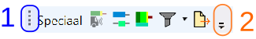
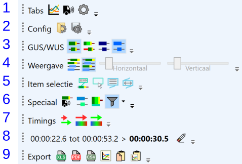

Wanneer data is geopend in YAVV en de fasenlog wordt weergegeven, verschijnen er in de toolbar sectie (dat is de balk bovenin onder het menu) diverse knoppen. Middels deze knoppen is de weergave van data in de fasenlog precies af te stellen.

## Fasenlog in YAVC

In YAVC zijn niet alle toolbars zoals hieronder beschreven beschikbaar. Dit betreft:

- Tabs: binnen YAVC worden werkbladen geopend via de kaart of de lijst met kruispunten. Bij YAVV wordt vanuit de fasenlog andere tabbladen geopend, bij YAVC geldt dit niet
- Config: configuratie verloopt in YAVC via de systeem instellingen
- Item selectie: de fasenlog functioneert in YAVC client qua laden van data anders dan in YAVV. Hierdoor is de huidige implementatie van plaatsen van popups enkel geschikt voor YAVV.

Daarnaast geldt voor YAVC client, dat 'wachten zonder reden' uitsluitend beschikbaar is wanneer er conflicten zijn geconfigureerd, en de configuratie is gevalideerd. De fasenlog maakt hier namelijk gebruik van de achterliggende analyse data voor wachten-zonder-reden; dit werkt dus enkel wanneer die data beschikbaar is.

## Fasenlog optie via menu & verbergen toolbars

Vooraf: sinds YAVV versie 1.12 zijn een groot aantal van de functies die via de toolbar toegankelijk zijn, ook ontsloten via het menu Fasenlog. Dit geeft sommige gebruikers mogelijk meer inzicht in de beschikbare functionaliteiten.

Daarnaast biedt dit de mogelijkheid om sommige toolbars te verbergen, en toch bij de betreffende functionaliteit te kunnen wanneer die nodig is. Bijvoorbeeld: stel je gebruikt de export opties zelden of nooit, dan kun je die toolbar verbergen (via menu Help > Instellingen YAVV > Toolbars). Wil je nu toch data van de fasenlog exporteren, dan kan dat alsnog via het menu Fasenlog > Export.

## Indelen toolbars en toegang tot verborgen knoppen

De toolbar is eigenlijk een verzameling van toolbars: elke afzonderlijke toolbar heeft links vier stippen en rechts een klein pijltje omlaag. Dit is te zien in de afbeelding hieronder.

Door te klikken+slepen op de vier stippen (1), kan de toolbar worden verplaatst. Wanneer de toolbar niet voldoende plek heeft worden sommige knoppen verborgen. Deze kunnen dan kan via het pijltje omlaag (2) worden weergegeven en bediend. In sommige gevallen zijn bepaalde opties altijd op deze manier verborgen, om de toolbar overzichtelijk te houden.

## Functionaliteiten

Hieronder wordt kort toegelicht welke opties beschikbaar zijn. De beschrijving van functionaliteiten gebeurt per afzonderlijke toolbar, zoals hieronder weergegeven. Per toolbar worden alle opties behandeld.

_Let op_: de toolbar "Speciaal" heeft een aantal extra opties die alleen via het knopje met het pijltje zichtbaar worden.

1. Openen tabbladen (behorende bij de betreffende fasenlog)
    1. Openen analyse tabblad
    2. Openen tabblad 'DSI op kaart'
    3. Openen configuratie tabblad
2. [Configuraties](https://www.codingconnected.eu/yavvwiki/uncategorized/omgang-met-configuraties-in-yavc/)
    1. Openen opgeslagen configuratie
    2. Opslaan huidige configuratie
3. GUS/WUS (gewenste en werkelijke aansturing IO)
    1. Werkelijke status signaalgroepen
    2. Gewenste status signaalgroepen
    3. Werkelijke status uitgangen
    4. Gewenste status uitgangen
4. Weergave ([sortering items](https://www.codingconnected.eu/yavvwiki/fasenlog/fasenlog-sortering-van-items/) en [zoom](https://www.codingconnected.eu/yavvwiki/fasenlog/werking-van-de-fasenlog/))
    1. Signaalgroepen sorteren boven detectie
    2. Detectoren sorteren bij signaalgroepen
    3. Horizontale zoom
    4. Verticale zoom
5. Item selectie
    1. Wel/niet weergeven popups
    2. Activeren plaatsen van popups
    3. Plaatsen popup bij geselecteerde status
    4. Plaatsen popup bij twee gerelateerde statussen
6. Speciaal
    1. DSI weergeven bij signaalgroepen
    2. Weergeven multivalente IO
    3. Weergeven alternatieve realisaties
    4. Verbergen gefilterde detectie
        1. Middels het knopje naast de filter knop: opties voor verbergen of visualiseren van gefilterde detectie
    5. Via de kleine knop geheel rechts op de toolbar zijn nog extra opties beschikbaar:
        1. Weergave wachten voor niets
        2. Weergave reden voor wachttijd
        3. Weergave snelheidsmetingen (bij ingangen)
        4. Weergave hiaattijden
        5. Weergave bezettijden
        6. Weergave SWICO data
        7. Visualiseren "eigen" VLOG data
7. Timings
    1. Visualisatie timings op de fasenlog
    2. Weergave accuraatheid voorspellingen roodtijd
    3. Weergave accuraatheid voorspellingen groentijd
8. [Selectie in de tijd](https://www.codingconnected.eu/yavvwiki/fasenlog/fasenlog-selectie-in-de-tijd/): hier wordt start, einde en duur van een selectie in de tijd in de fasenlog weergegeven. Middels de "gum" knop geheel rechts wordt de selectie verwijderd.
9. Export
    1. Export naar .xlsx (Excel)
    2. Export naar PDF
    3. Export naar .csv (tekstbestand met daarin met ; gesepareerde data velden)
    4. Export .png (afbeelding)
    5. Zet .csv data op klembord
    6. Zet .png data op klembord
