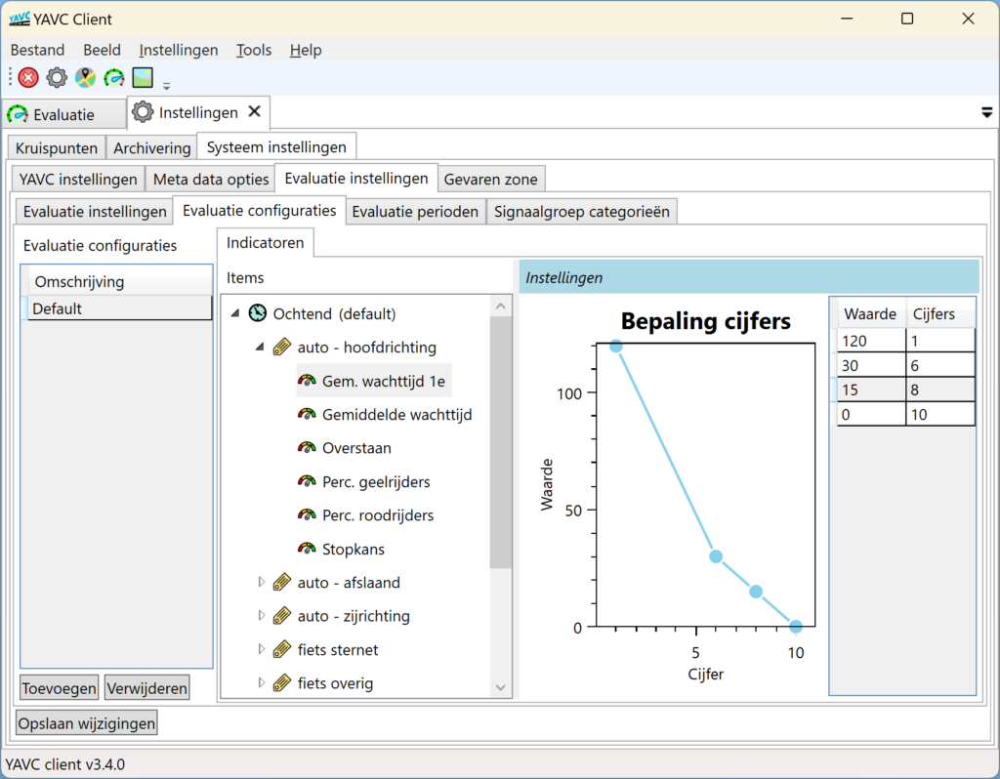
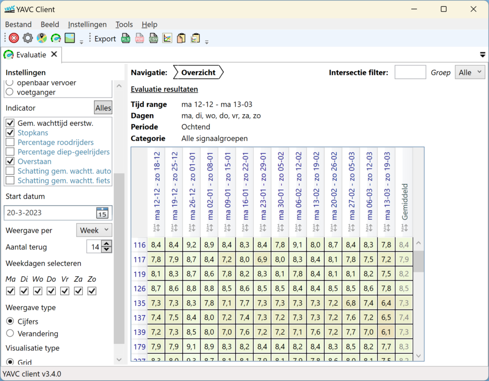

De artikelen omtrent de evaluatie functionaliteit omvatten een aantal artikelen:

- deze introductie
- hoe en wat rond de [configuratie](../evaluatie-configuratie/index.md)
- uitleg omtrent de beschikbare [indicatoren](../evaluatie-indicatoren/index.md)
- werken met de [visualisatie van de resultaten](../evaluatie-bekijken-resultaten/index.md)

## Introductie

VLOG centrale YAVC en VLOG viewer YAVV bieden de mogelijkheid voor het uitvoeren van kruispunt evaluaties. Binnen YAVC betreft het hier een aanvullende module, voor YAVV geldt dat dit onderdeel is van [de big-data addon](../../yavv/yavv-big-data-introductie/index.md).

Bij een evaluatie worden op basis van verkeerskundige indicatoren rapportcijfers berekend; hiermee kan een beeld worden verkregen van de prestaties van een kruispunt. Met de evaluatie tooling kan op eenvoudige en efficiente wijze inzicht worden verkregen in:

- de ontwikkeling van de prestaties van een kruispunt over langere tijd
- de (verandering van) prestatie van een kruispunt na een wijziging
- de prestaties van kruispunten ten opzichte van elkaar
- de prestaties van signaalgroepen ten opzichte van elkaar
- opvallende/afwijkende dagen/perioden

Dit is mogelijk omdat de berekende rapportcijfers op overzichtelijk en interactieve wijze worden gepresenteerd; de verkeerskundige kan hiermee gestructureerd door grote hoeveelheden data heen - en daarmee snel antwoord vinden op relevante vragen, en/of zicht krijgen op uitschieters in de data.

## Praktische toepassing

De evaluatie tooling van YAVV/YAVC maakt **pro-actief verkeerskundig beheer** mogelijk. In plaats van reageren op punten waar problemen de kop op steken, kan middels de tooling actief worden gemonitord op potentiële aandachtspunten. Doordat (in het geval van YAVC) deze monitoring continu mogelijk is en relatief weinig tijd kost, draagt de tooling daarmee bij aan effectief verkeerskundig beheer.

De evalutie tooling wordt door CodingConnected continu doorontwikkeld. Een punt voor de (nabije) toekomst is het mogelijk te maken geautomatiseerd aandachtspunten uit inkomende data naar voren te halen, zodat de verkeerkundig beheerder nog verder geholpen wordt zijn of haar (beperkte) tijd en aandacht juist daar in te zetten waar dit de meeste meerwaarde biedt.

Heeft u interesse in de evalutie tooling? [Neem contact op](https://www.codingconnected.eu/contact/) voor meer informatie.

## Algemene opzet

De evaluatie tooling is in de basis relatief eenvoudig:

- Voor een gegeven signaalgroep wordt een waarde bepaald voor een geconfigureerde indicator (bijvoorbeeld: de gemiddelde wachttijd eerstwachtende gedurende de opchtendspits)
- De berekende waarde wordt geplot op een curve, waarmee deze wordt vertaald van een meetwaarde naar een rapportcijfer
- Dit gebeurt per dag, per geconfigureerde periode voor alle signaalgroepen

Hieronder een voorbeeld van de wijze waarop de vertaling van verkeerskundige data naar cijfers kan worden geconfigureerd (het cijfer wordt gevonden door de gemiddelde wachttijd eerstwachtende op de y-as op te zoeken; het bijbehorende punt op de x-as is dan het rapportcijfer):

[]

Deze eenvoudige basis vormt een stevig fundament voor de tooling; in de praktijk geldt daarbij dat de configuratie om te komen tot correcte cijfers aandacht vergt, en al snel een zeer grote dataset ontstaat. Aan deze beide punten is bij de implementatie van de evaluatie tooling binen YAVV/YAVC veel aandacht besteed:

- De benodigde hoeveelheid configuratie is waar mogelijk geminimaliseerd; één goed doordachte evaluatie configuratie is voldoende om de tooling te kunnen gebruiken
- De presentatie van de uitkomsten maakt de grote hoeveelheid achterliggende data op interactieve en intuïtieve wijze behapbaar en overzichtelijk, en daarmee verkeerskundig relevante punten inzichtelijk

Hieronder een voorbeeld van de visualisatie (YAVC client versie 3.4.0), waarin de data voor een aantal indicatoren per week wordt weergegeven:

[]
