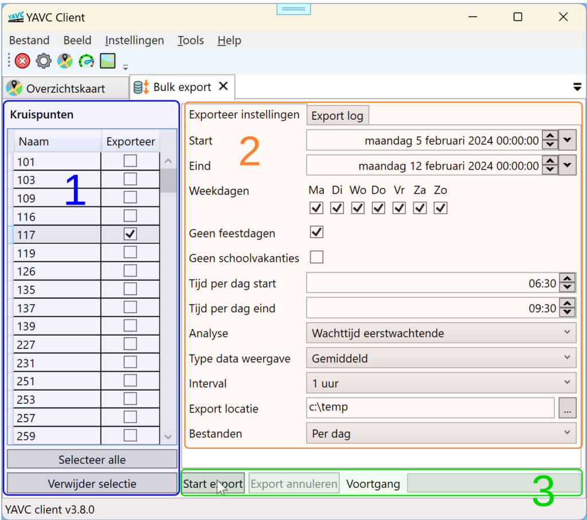

In YAVC client is het mogelijk analyse data in bulk te exporteren. Zo kan over een langere periode voor meerdere VRI's in één keer data worden geëxporteerd. Bij de export betreft het data per (gedeelte van een) dag. Export van gemiddelden of trends is momenteel niet mogelijk in bulk vorm.

Om gebruik te maken van de bulk export optie: open het werkblad via menu Tools > Bulk Export:

Bij (1) kunnen nu één of meer kruispunten worden geselecteerd. Vervolgens wordt bij (2) ingesteld op welke wijze precies welke data moet worden geëxporteerd:

- Start: begin van de te exporteren periode

- Eind: einde van de te exporteren periode (exclusief, dus tot, niet tot-en-met)

- Weekdagen: welke dagen van de week doen mee in de export

- Geen feestdagen: indien aangevinkt, worden als feestdag geconfigureerde datums overgeslagen bij de export (vanaf YAVC client versie 3.8.1)

- Geen schoolvakanties: indien aangevinkt, worden als schoolvakantie geconfigureerde datums overgeslagen bij de export (vanaf YAVC client versie 3.8.1)

- Tijd per dag start: start moment van de export, per dag die binnen de opgegeven periode ligt; zo kan dus bv. de ochtend- of avondspits worden geëxporteerd over een langere periode.

- Tijd per dag eind: eind moment van de export (exclusief), per dag die binnen de opgegeven periode ligt

- Analyse: het type analyse data dat moet worden geëxporteerd (momenteel kan enkel vooraf doorgerekende analyse data worden geëxporteerd, dus geen "realtime" data).

- Type data weergave: indien van toepassing kan hier worden opgegeven hoe de data moet worden geëxporteerd; bij Wachttijd eerstwachtende kan bv. een gemiddelde per interval, of het maximum per interval worden geëxporteerd. Dit is niet bij alle typen analyses relevant.

- Interval: het tijdsinterval om te gebruiken bij de export

- Export locatie: waar de export terecht moet komen op schijf

- Bestanden: per dag, of alle data onder elkaar in één bestand

Via de knop "Start export" bij (3) kan vervolgens de export worden gestart. De voortgang wordt ook getoond. In het tabblad "Export log" worden eventuele meldingen getoond, bv. indien voor een VRI (deels) geen data beschikbaar is binnen de ingestelde periode die moet worden geëxporteerd.
