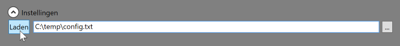
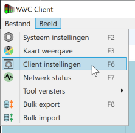
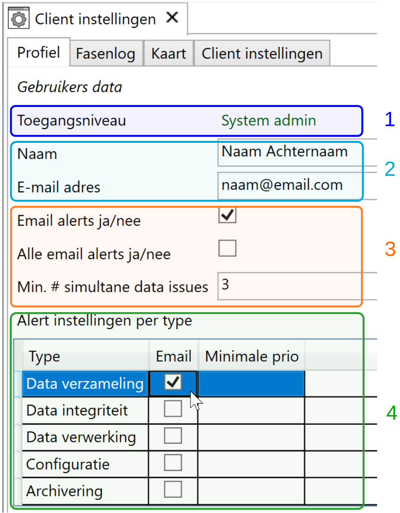

De (desktop) client van YAVC kent een configuratie op twee niveau's:

- Lokale configuratie

- Gebruikers configuratie

## Lokale configuratie

De lokale configuratie wordt op schijf opgeslagen (in C:\\Users\\<username>\\AppData\\Roaming\\YAVC). In de configuratie is opgenomen hoe authenticatie verloopt, en waar de client data op kan halen. Soms wordt deze configuratie mee verpakt door uw organisatie bij de uitrol van YAVC-client, zodat hiervoor niets behoeft te worden ingesteld.

Is de configuratie nee meeverpakt (bijvoorbeeld bij installatie van de client op een eigen laptop), dan moet dit **eenmalig** worden ingesteld. U ontvangt hiertoe een configuratie bestand van CodingConnected. Om dit bestand te gebruiken:

- Start YAVC-client
  - _Let op_: log niet in op het login venster dat nu verschijnt; dit is een default venster en dit werkt enkel in de testomgeving van CodingConnected

- Klik op het pijltje links van "Instellingen" om deze uit te klappen

- Klik op "..." en zoek het configuratie bestand op

- Klik nu op "Laden":  
   

- Herstart nu de client; de inlog pagina van uw organisatie (of van uw installatie van YAVC) zal nu worden weergegeven

### Meerdere YAVC installaties

Heeft u toegang tot meerdere installaties van YAVC, bijvoorbeeld als adviseur van diverse wegbeheerders? Dan is het handig om het login proces handmatig te starten, zodat u vóór dit start kunt kiezen bij welke installatie van YAVC u in wilt loggen:

- Default start de client automatisch het login proces; eenmaal gestart kan dit niet worden afgebroken

- Deze default kan worden uitgeschakeld ná login, via menu Instellingen > Client instellingen > tabblad Client instellingen > **aan**vinken "Geen automatische login bij start applicatie"

- Nu kunt u via bovenstaand proces (onder "Lokale configuratie") meerdere configuraties laden, waaruit vervolgens via de combobox kan worden gekozen

- Klik na de keuze voor een bepaalde installatie van YAVC op "Login" om het login proces voor die installatie te starten

- _Let op_: is het login proces eenmaal gestart, dan kan dit niet worden herstart; daartoe moet de client dan geheel herstart worden

## Client instellingen

De client instellingen worden in tegenstelling tot de lokale instellingen opgeslagen in de database van YAVC, bij het gebruikersprofiel. Zo zijn de instellingen gelijk ongeacht de locatie van waaraf YAVC-client wordt gebruikt. Deze instellingen zijn toegankelijk via het menu Beeld > Client instellingen (of sneltoets F6):

Er verschijnt nu een werkblad met een aantal tabbladen:

- Profiel: stel hier uw naam en email adres in, en of u al dan niet alerts wilt ontvangen. **Klik daarna op "Wijzigingen opslaan"!** Dit tabblad wordt hieronder nog nader toegelicht

- Fasenlog: hier kunnen diverse defaults voor de weergave van de fasenlog worden geregeld. Zie [dit artikel](../../yavv/yavv-instellingen/index.md) voor een meer gedetailleerde uitleg over de instellingen; dat artikel betreft YAVV, maar de instellingen van de fasenlog zijn 1 op 1 gelijk.

- Kaart: instellingen omtrent het kaartbeeld; dit geldt momenteel zowel voor de overzichtskaart als voor de kaart voor de weergave van DSI data

- Client instellingen: hier bevinden zich een aantal specifieke instellingen voor de client, waarmee de weergave kan worden geregeld van een aantal elementen in de interface

### YAVC gebruikersprofiel & alerts

Binnen YAVC is er per gebruiker een profiel. Dit profiel wordt opgeslagen in de database van YAVC en bevat bijvoorbeeld instellingen voor de fasenlog, kaartweergave, etc.

Een belangrijk element wat hier ook wordt geregeld betreft de instellingen omtrent het ontvangen van alerts.

De interface voor deze instellingen wordt hierboven weergegeven. De volgende opties zijn beschikbaar:

1. Actuele rol: alleen lezen; hier is te zien welke rol de gebruiker heeft in YAVC

2. Naam, email; de naam wordt gebruikt om bv. richting andere gebruikers weer te geven wie evt. aan de instellingen aan het werk is. Het email adres wordt gebruikt voor verzenden van alerts

3. Hier wordt ingesteld:
   1. Wel/niet ontvangen van email alerts: indien uit wordt niets verzonden
   2. Alle email alerts: indien aan wordt alles verzonden. _Let op!_ Dit kan een veelheid aan emails tot gevolg hebben, omdat niet wordt gekeken naar de aard en prioriteit van meldingen
   3. Minimaal aantal simultane data verzameling issues voordat een alerts wordt verzonden; hiermee kan worden gezorgd dat pas wanneer er tegelijk een X aantal meldingen omtrent dataverzameling optreden, een alert wordt verzonden (zo kan bv. een netwerk fout worden herkend)

4. Alert instellingen per type: hier kann worden ingesteld welke alerts wel/niet moeten worden verzonden, en vanaf welk prioriteitsniveau. De typen zijn:
   1. Data verzameling: dit is wellicht het belangrijkst: indien de verzameling stokt wordt een issue aangemaakt door YAVC. Hoe langer dit aanhoudt, hoe hoger de prioriteit wordt. Zie ook [hier](../yavc-bewaking-dataverzameling/index.md).
   2. Data integriteit: dit type issue wordt aangemaakt wanneer er fouten in de data worden gevonden; denk hierbij aan verkeerde volgorde van berichten, CRC fouten, etc.
   3. Data verwerking: indien het verwerken van data stokt, er dus geen analyse data meer wordt aangemaakt, wordt dit type issue aangemaakt
   4. Configuratie: dit wordt aangemaakt wanneer YAVC een nieuwe configuratie heeft herkend in de data (zie verder [hier](../omgang-met-configuraties-in-yavc/index.md))
   5. Archivering: dit wordt aangemaakt wanneer de archivering van data mislukt (bv. omdat het archief vol is)
