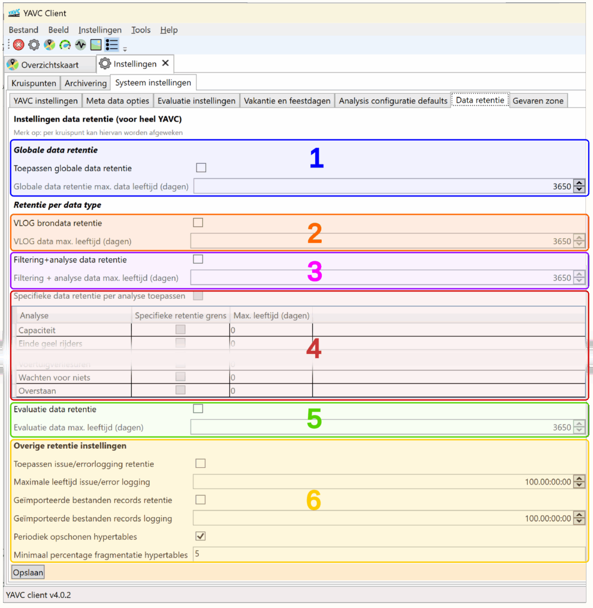

Bij data rententie gaat het om de vraag: hoe lang moet data worden opgeslagen? Bij gebruik van YAVC over een langere periode, zal het ruimtebeslag van de data steeds verder toenemen. Dit leidt onherroepelijk dat de vraag: welke data moet hoe lang worden behouden?

YAVC biedt een aantal mogelijkheden voor dataretentie, ofwel het bepalen van de duur van de opslag van data. Retentie van data is binnen YAVC van toepassing voor de navolgende typen data:

- VLOG data: dit is dus de brondata, zoals die wordt opgehaald van de verkeersregelautomaten, en wordt gebruikt voor de weergave van de fasenlog.
    - Filtering/validatie data: dit betreft informatie over de validiteit van detectormeldingen in de VLOG data; deze informatie wordt gebruikt om de betrouwbaarheid van de analysedata te verbeteren.

- Analysedata: dit betreft afgeleide data, waarbij op basis van de VLOG data diverse grootheden worden doorgerekend, zoals intensiteiten, roodrijders, cyclustijden, wachttijden, et cetera.

- Evaluatiedata: het is binnen YAVC (met een extra module) mogelijk op basis van de uitkomsten van de analyses evaluatiegegevens te berekenen, zoals rapportcijfers.

- Overige data: hierbij gaat het om logging van foutmeldingen, bijhouden van ophalen bestanden.

- Voor alle overige data in YAVC (dit betreft in hoofdzaak configuratie gegevens) wordt geen dataretentie toegepast.

Bij de omgang met retentie van data binnen YAVC zijn er een aantal mogelijke werkwijzen denkbaar:

- Globale dataretentie: wanneer dit is ingeschakeld, is de bewaartermijn voor alle typen data binnen het systeem gelijk.

- Opgesplitste dataretentie: het is ook mogelijk, per typedata afzonderlijk te bepalen hoe lang deze bewaard moet worden.
    - Middels opgesplitste dataretentie is het bijvoorbeeld mogelijk ruwe VLOG data langer te bewaren dan de analysedata, of juist andersom.
    
    - Bij opgesplitste dataretentie is het mogelijk per type analyse af te wijken van de globaal ingestelde bewaartermijn voor analysedata: zo kunnen bijvoorbeeld intensiteitgegevens langer worden bewaakt dan overige analysedata, of kan bepaalde analysedata juist korter worden bewaard.

- Afwijken per intersectie: bij de configuratie van een intersectie is het mogelijk afzonderlijke instellingen op te geven voor dataretentie voor die specifieke intersectie. **LET OP:** dit staat in dat geval geheel los van de instellingen op niveau van YAVC als geheel, en _wordt ook dan toegepast wanneer dataretentie globaal is uitgeschakeld_.

De mogelijke instellingen voor data retentie binnen YAVC client worden hieronder weergegeven:

De volgende instellingen zijn hier beschikbaar (waarmee de diverse mogelijkheden zoals hierboven toegelicht kunnen worden ingeregeld):

1. Globale data retentie: instellen van het aantal dagen dat data globaal wordt bewaard. Data ouder dan deze instelling wordt dagelijks ('s nachts) verwijdert; dit betreft dan dus VLOG data, analyse data, en evt. evalautie data
    - De opties hieronder zijn enkel dan beschikbaar wanneer globale dataretentie is uitgeschakeld

3. VLOG dataretentie: instellen van het aantal dagen dat ruwe VLOG data wordt bewaard. Let op: is de VLOG data eenmaal weg, dan kan er geen analysedata meer worden (her)berekend.
    - Merk op: in tegenstelling tot de labels bij de vinkjes in deze afbeelding, geldt de bewaartermijn van analysedata niet voor filtering; filtering is zonder VLOG data nutteloos; daarom geldt bewaartermijn voor VLOG data ook voor filtering. Vanaf versie 4.0.3 van de client is dit gecorrigeerd.

5. Analyse dataretentie: instellen van het aantal dagen dat analysedata moet worden bewaard.

7. Specifieke dataretentie per type analyse: indien retentie van analysedata is ingeschakeld, kan je desgewenst per typeanalyse worden afgeweken van de algemene ingestelde bewaartermijn. Zowel een kortere als een langere termijn is mogelijk.

9. Evaluatie dataretentie: instellen van het aantal dagen dat evaluatiedata bewaard moet worden.

11. Overige retentie-instellingen: hier worden ingesteld hoe lang error logging moeten worden bewaard, alsook de records van geïmporteerde bestanden.
     - Periodiek opschonen hypertables: wanneer in YAVC analysedata worden herberekend, kan het leiden tot fragmentatie in de database. Deze optie zorgt ervoor dat periodiek (één keer per week) de betreffende tabellen worden nagelopen, en fragmentatie waar nodig wordt verholpen. Dit belast de server enigszins, maar kan zorgen voor vermindering van het ruimtegebruik.
