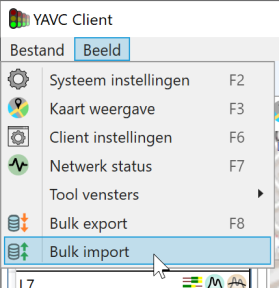
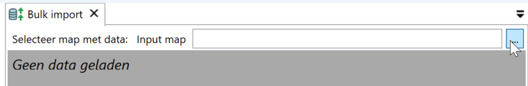
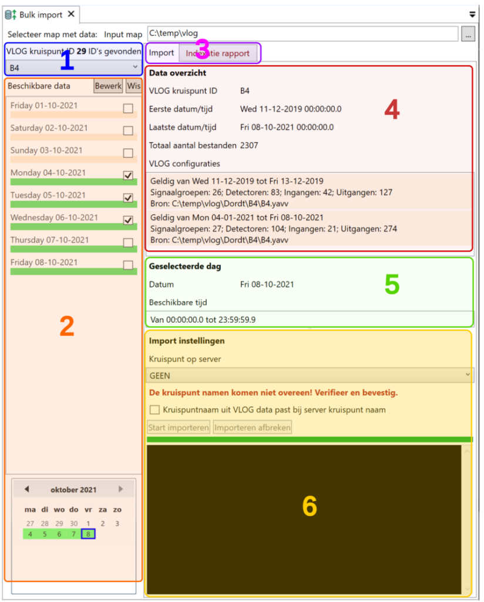

Het is in YAVC als eindgebruiker mogelijk historische data te importeren. Op deze manier kan historische data worden geladen waar en wanneer relevant; dit bespaart veel ruimte ten opzichte van een complete bulk import, en veel tijd omdat import van data altijd gepaard gaat met issues in die data.

Import van data gaat via een apart werkblad. Open dit werkblad via het menu Beeld > Bulk import:

Selecteer nu een map van schijf waarin de te importeren data staat, door te klikken op de knop met "...":

_Merk op:_ de data mag binnen de gekozen map in submappen staan, en eventueel verder verdeeld. Belangrijk is hierbij wel dat de bestanden in een (al dan niet onderliggende) map op volgorde staan van tijd. Wanneer de VLOG standaard wordt gevolgd voor wat betreft naamgeving van bestanden is dit altijd zo.

_Let op:_ data waarbij één bestand meerdere dagen omvat kan problemen opleveren. Idealiter is er in elk geval een split naar een volgend bestand om 00:00 uur.

Na het kiezen van een map wordt de data uit de map uitgelezen. Dit al naar gelang de hoeveelheid data in de map tussen enkele seconden en enkele minuten in beslag nemen. Is de data geladen, dan verschijnt het volgende scherm:

Deze weergave bestaat uit een aantal elementen die hieronder worden toegelicht.

1. Hier wordt het aantal gevonden ID's weergegeven, in dit geval bijvoorbeeld 29. Deze worden uitgelezen uit de VLOG data. De data wordt ingedeeld per ID; tussen ID's kan worden geswitched met de dropdown button.
2. De beschikbare data voor de geselecteerde kruising (id, zie bij 1) wordt hier weergeven. De lijst is een weergave van de dagen voor de maand die in de kleine kalender onderaan is geselecteerd. Gebruik de lijst voor het bekijken van beschikbaarheid per dag, en het selecteren van afzonderlijke dagen voor import. Gebruik de kleine kalender voor het manouvreren door de tijd.
3. Hier kan worden gekozen tussen het weergeven van informatie over de data en de import mogelijkheden, en een tabblad met informatie over eventuele fouten en overlap in de data
4. Van de geselecteerde kruising wordt hier enige informatie weergeven. Naast eerste en laatste gevonden datum, is hier een lijst te zien met gevonden VLOG configuraties. Deze zullen na import in YAVC ook zo verschijnen.
5. Hier wordt enige informatie weergegeven over de geselecteerde dag in de lijst met dagen (zie bij 2)
6. Hier kan worden ingesteld naar welke kruising in YAVC de data behorende bij dit kruispunt ID uit de VLOG data moet worden geïmporteerd. Indien de naam van die kruising in YAVC niet 1 op 1 overeenstemt met de kruising ID uit de VLOG data moet expliciet worden aangevinkt dat het toch klopt.

_Let op!_ De knop "Start importeren" zorgt voor het importen van **alle** geselecteerde data. Dat wil zeggen: van de geselecteerde kruising, maar ook van andere kruispunten waarvan evt. dagen zijn aangevinkt. De UI (user interface) is hier mogelijk verwarrend en zal nog worden aangepast.

Na klikken op "Start importeren" zal de data naar YAVC worden overgezet. De log toont de voortgang en evt. meldingen die optreden. Importeren kan geruime tijd in beslag nemen.

_Let op!_ Aangerade wordt, gedurende de import van data de client verder niet te benutten.

Is de import voltooid, dan is de data direct in de fasenlog beschikbaar. De analyse data wordt voor historische data 's nachts doorgerekend.
