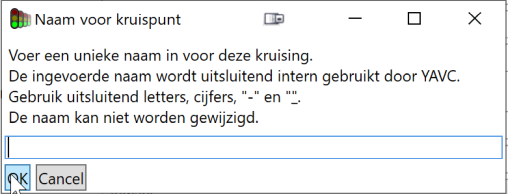

## Toevoegen kruising

Open om te beginnen het systeem configuratie werkblad. Links in beeld is een lijst met geconfigureerde kruispunten te zien; hieronder bevinden zich twee knoppen om kruispunten toe te voegen en te verwijderen.

_Let op!_ Om een kruispunt toe te kunnen voegen in YAVC is het niveau van systeem beheerder nodig. Heeft een gebruiker deze toegang niet, dan zijn de betreffende knoppen niet zichtbaar.

Klik op “toevoegen” om een kruispunt toe te voegen. Er verschijnt een dialoogvenster waarin de naam voor de kruising kan worden opgegeven.

_Let op!_ Dit betreft de **interne naam**, en deze is later niet meer te wijzigen. Deze interne naam wordt gebruikt in systeem logging van YAVC, en voor het aanmaken van mappen voor tijdelijke opslag van data, en archivering. Naast deze interne naam is er een apart veld waarin de weer te geven naam van de kruising kan worden ingesteld; dit kan wél worden gewijzigd.

De interne naam mag enkel bestaan uit uit letter en cijfers, en evt. – en \_ hoewel dat niet wordt aanbevolen. De naam moet uniek zijn binnen YAVC en kan dus slechts één keer worden gebruikt.

## Kruising instellen

Nadat de kruising is toegevoegd kan deze verder worden ingesteld. Selecteer de kruising; rechts verschijnen nu de instellingen voor deze kruising. Er zijn drie tabbladen zichtbaar:

- Algemene instellingen: instellen van algemene informatie zoals naam, straatnamen, en ook een aantal YAVC-specifieke instellingen waaronder de te gebruiken connectie configuratie

- Verbinding: hier kunnen een of meer connectie configuraties worden aangemaakt en ingesteld

- VLOG configuraties: hier kunnen analyse configuraties worden beheerd

Per tabblad wordt hieronder nader toegelicht wat kan worden ingesteld en welke betekenis en effect dit vervolgens heeft.

### Algemene instellingen

De naam die hier instelbaar is, is de naam zoals deze verschijnt in de client van YAVC; deze heeft geen invloed op de naam die systeem-intern wordt gebruikt en is vrij instelbaar. Daarnaast zijn een aantal andere informatieve instellingen beschikbaar, zoals straatnamen, etc. Straatnamen worden, indien dit is ingeschakeld, weergegeven achter de naam van de kruising in de lijst met kruispunten in het toolvenster.

_Tip:_ lengte en breedte graden kunnen ook worden ingesteld door de kruising te selecteren op kaart, en deze met Shift+rechtermuisklik elders te plaatsen.

Er zijn een aantal YAVC specifieke instellingen beschikbaar:

- Data verzamelen: momenteel instelbaar op nooit of altijd; die is geen vinkje om later evt. mogelijk te maken bv ook op basis van een kalender (start en einde datum) data te verzamelen.

- Actieve connectie configuratie: hier kan worden gekozen uit de voor deze kruising beschikbare connectie configuraties. Dit kan uitsluitend indien er reeds één of meer connectie configuraties zijn aangemaakt (zie verderop)

- Actieve archivering configuratie: hier worden gekozen welke archiveerder actief is voor deze kruising
    - Het is dus mogelijk de data van uiteenlopende kruispunten op uiteenlopende locaties te archiveren, of van slechts een deel van de kruising de data te archiveren, en van andere te verwijderen
    
    - Ook hier geldt: dit is slechts dan instelbaar, wanneer reeds één of meer archivering configuraties zijn aangemaakt.

- Geavanceerde instellingen:
    - VLOG checksum locatie: de plek van de checksum in VLOG3, indien aanwezig. Deze instelling moet momenteel op "geen" blijven staan; YAVC zal in de toekomst eigenstandig deze locatie bepalen.
    
    - Default file VLOG lengte: de default lengte van VLOG files, in seconden. Dit is normaliter 300 seconden. Deze waarde wordt gebruikt om compleetheid van data te bepalen wanneer er een gat valt in de data
    
    - Maximale tijdsduur analyse per run, in minuten: YAVC analyseert data in "runs", normaliter elke 20 minuten. Komt er ineens veel data binnen, dan wordt dit maximum gehanteerd om de systeembelasting te beperken
    
    - Maximum aantal dagen terug tbv analyse: data ouder dan dit aantal dagen zal niet worden geanalyseerd; dit is evenwel een verouderde instelling, want er is inmiddels een historische data analyzer, die ('s nachts) ook oudere data zal verwerken.
    
    - Niet automatisch aanmaken analyse configuratie: indien aangevinkt, zal ook bij afwijkende aantallen IO, niet automatisch een nieuwe analyse configuratie worden aangemaakt. Dit is bijvoorbeeld relevant wanneer handmatig signaalgroepen zijn toegevoegd (bijvoorbeeld om tel detectoren correct in te delen); YAVC zou een dergelijke configuratie herkennen als verouderd en een nieuwe aanmaken, maar deze isntelling voorkomt dat
    
    - Timings data niet opslaan: indien aangevinkt, wordt timings data niet opgeslagen in de VLOG bij import in de database. Dit kan veel ruimte schelen omdat er soms extreem veel timings data wordt aangemaakt, waarbij timings berichten ook nog relatief groot zijn
    
    - Check VLOG header: het komt voor dat de header van VLOG files incompleet is, door de afwezigheid van bepaalde elementen in de header. Dit veroorzaakt het aanmaken van een nieuwe analyse configuratie, terwijl er eigenlijk geen sprake is van een wijziging, maar van een fout in de data. Door dit aan te vinken wordt hierop gecontroleerd voor de nadien aangevinkte elementen. Invalide data komt vervolgens niet in YAVC

- Extra meta data: hier kunnen door de gebruiker zelf gespecificeerde velden worden gevuld met data. Zie hiervoor [dit artikel](https://www.codingconnected.eu/yavvwiki/yavc/werken-met-meta-data/).

### Connectie configuratie

Per kruising kunnen hier een of meer connectie confguraties worden aangemaakt. Op deze manier is het bv. mogelijk een toekomstige wijziging alvast te configureren, en later eenvoudig om te schakelen. Tevens wordt hiermee voorgesorteerd op evt. automatische wisselingen tussen configuraties, bv. op basis van klok of andere data.

De beschikbare instellingen zijn afhankelijk van het type connectie. **Stel daarom éérst het type in, en daarna de overige velden.**

Na instellen van de configuratie(s) moet deze nog worden geactiveerd bij algemene instellingen. Indien ook “Verzamelen” op altijd staat ingesteld zal YAVC nu starten met de dataverzameling. Het kan enige tijd duren voordat er ook daadwerkelijk data zichtbaar wordt in de client; doorgaans duurt dit tot ongeveer een half uur.

#### Ftp / sftp

De instellingen zijn:

- Adres: het IP adres van de automaat

- Poort: de te gebruiken poort

- Gebruikersnaam: de te gebruiken naam voor login

- Wachtwoord: wachtwoord voor login

- Remove remotely: indien ja, wordt data na downloaden verwijderd van de automaat. YAVC zal ook als dit is uitgevinkt data niet meermaals downloaden, maar eerst kijken welke data nieuw is ten opzichte van wat reeds is opgehaald

- Negeren laatste file: soms wordt het laatste bestand nog beschreven door de automaat; vink dit aan om die file niet te downloaden

- Pad op server: pad waar de VLOG data staat

- Pad is absoluut: momenteel alleen voor ftp beschikbaar; geeft aan dat naar het ingestelde direct moet worden gemanouvreerd, en niet relatief ten opzichte van de map waar de server na inlog in landt

#### Streaming

De instellingen zijn:

- IP adres: het adres waar de stroom te beluisteren is

- Gebruik default IP adres: indien aangevinkt, zal het als default voor streaming data ingestelde adres worden genomen. Dit is bv. handig als alle data van één server komt

- Poort: de te gebruiken poort

- Type VLOG: binair of ASCII. Gebruikelijk is ASCII. Merk op dat gearchiveerde data die via streaming VLOG is opgehaald, altijd als binair wordt opgeslagen; dit scheelt 50% ruimte tov. ASCII.

- Return na verbinden: bij sommige automaten start de stroom pas als de ontvangende partij een return stuurt

- Return na timestamp: bij sommige automaten moet periodiek iets worden verstuurd om de stroom in stand te houden

#### Automatische connectie configuratie switch

Het is (sinds versie 3.5 van YAVC client) mogelijk bij optreden van een fout in de dataverzameling, in te stellen dat YAVC geautomatiseerd naar een andere connectie configuratie wisselt. Dit werkt als volgt:

- Per connectie configuratie kan in de client een prioriteit worden ingesteld
    - Deze instelling is beschikbaar in de lijst met beschikbare connectie configuraties
    
    - _Let op!_ Een **lager** cijfer betekent een **hogere** prioriteit
        - Laagste cijfer = hoogste prio
        
        - Dus cijfer 1 = hoogst, 2 = lager, 3 = nog lager, etc.
        
        - Prioriteit 0 = doet niet mee; als dis is ingesteld voor een connectie configuratie en deze is actief, wordt er in het geheel niet geswitched; tevens wordt nooit naar een connectie configuratie toe geswitched met prioriteit 0
        
        - Is de prioriteit van de actieve connectie configuratie 1, dan zal er nooit iets gebeuren; is deze b.v. 3 en zijn er andere configuraties met prioriteit 2 of 1, dan switcht YAVC naar de eerstvolgende richting 1; dus b.v. éérst naar connectie configuratie met prioriteit 2, en dan bij een volgende fout naar de configuratie met prioriteit 1.

- Per kruising wordt vervolgens automatisch switchen aan/uit gezet (default = uit); is automatisch wisselen uitgeschakeld voor een kruising, dan blijft dus altijd dezelfde connectieconfiguratie actief, ook wanneer er prioriteitsniveaus zijn ingesteld voor connectie configuraties
    - Deze instelling zit onder "geavanceerde opties" van de kruispunt instellingen
    
    - Wanneer automatische wisseling wordt ingeschakeld, moet ook worden ingesteld vanaf welk urgentieniveau automatisch geschakeld moet worden; het is aan te bevelen dit op "hoger" of "urgent" in te stellen, zodat niet onbedoeld van configuratie wordt gewisseld bij een kortdurende storing

- Treedt er een data-verzameling issue op, en is dit voldoende urgent, dan switcht YAVC, indien dit is geactiveerd, geautomiseerd conform de hierboven omschreven methodiek naar een andere connectie configuratie
    
    - Er wordt vervolgens niet direct weer geswitched naar een evt. 3e/4e/volgende connectie configuratie met een hogere prioriteit (=lager cijfer!); dit gebeurt pas dan wanneer vanaf het laatste switch moment ten minste de tijd is verlopen die is ingesteld als grenswaarde voor het minimale issue-niveau dat is ingesteld voor de automatische switch (de grens qua laatste moment van ophalen van data)
    
    - Email alerts omtrent data verzameling issues bevatten, indien autom.switch actief is, ook een regel tekst waarin staat welke conn.config actief was ten tijde van de error, en wat het prioriteitsniveau hiervan was
    
    - De automatische switch functionaliteit doet verder niets met alerts/issues, die blijven dus actief, tot er weer data binnenkomt en ze automatisch op non-actief gaan

- Merk nog op: de verbinding voor "[ophalen andere data](https://www.codingconnected.eu/yavvwiki/yavc/ophalen-niet-vlog-data/)" (indien ingesteld) switcht momenteel _niet_ mee.

### Analyse configuratie

YAVC maakt automatisch analyse configuraties aan bij binnenkomst van de data. Dit is [hier](https://www.codingconnected.eu/yavvwiki/yavc/omgang-met-configuraties-in-yavc/) nader omschreven. Per analyse configuratie zijn hier de instellingen aan te passen. Tevens kunnen configuraties hier worden gevalideerd.

_Let op!_ Het is normaal gesproken nooit nodig handmatig analyse configuraties aan te maken; het is doorgaans beter dit over te laten aan YAVC. Daarom: treedt vóór het handmatig aanpassen (toevoegen/verwijderen) van analyse configuraties bij voorkeur en indien mogelijk in overleg met CodingConnected; we bepalen dan gezamenlijk de beste aanpak.

Een automatisch aangemaakte configuratie is nog niet gevalideerd. De beheerder moet deze eerst nalopen:

- Typen en aantal rijbanen van fasen controleren

- Type, ligging (lengte, afstand tot ss) en signaalgroep van detectoren controleren (YAVC komt automatisch met een voorstel)

- Desgewenst conflicten en geeltijden configureren (bij voorkeur uit een tab.c bestand)

- Eventueel filtering of analyse instellingen aanpassen
    - Zie voor uitleg van de mogelijkheden de artikelen over filtering en analyse op de wiki
    
    - De defaults zijn doorgaand prima

- Overige instellingen aanpassen (bv. toedeling DSI)

_Let op_: namen van elementen (signaalgroepen, detectoren, ingangen, uitgangen) horen in principe niet te worden gewijzigd. Dit omdat YAVC deze (indien mogelijk) gebruikt om te controlen of de configuratie nog steeds past bij inkomende data.

Is alles in orde, dan kan het vinkje “Gevalideerd” worden aangevinkt. Klik nadien op “Opslaan”; YAVC zal nu starten met filtering en analyse. Het kan enige tijd duren voor de data in YAVC verschijnt; normaal duurt dit tot ongeveer een half uur.

_Tip:_ is het wenselijk voor een bepaalde kruising data met andere analyse instellingen dan eerder op te halen, dan kan dit ook met de "**realtime analyse**"; daarvoor is geen herberekening van data nodig, want de data wordt dan live opnieuw doorgerekend. Betreft het een specifieke case, en is de actuele configuratie verder in orde, dan is dit aan te bevelen, omdat het rekenkracht scheelt, en de analyse data op basis van de gewijzigde configuratie direct beschikbaar is.

#### Signaalgroepen

Bij signaalgroepen is het type het belangrijkste: dit bepaalt welke analyses voor deze signaalgroep wel/niet zullen worden uitgevoerd. Ook het aantal rijbanen is hier van belang, omdat dit invloed heeft op sommige analyses, en omdat detectoren moeten worden toegedeeld aan de juiste rijbaan.

Geeltijden zijn momenteel enkel van belang voor de analyse [wachten zonder reden](https://www.codingconnected.eu/yavvwiki/analyse/analyse-wachten-zonder-reden/).

#### Conflicten

Conflicten zijn van belang voor het bepalen van "[wachten zonder reden](https://www.codingconnected.eu/yavvwiki/analyse/analyse-wachten-zonder-reden/)". Ze kunnen handmatig worden opgegeven, het is echter aan te bevelen de conflicten middels een "tab.c" file in te laden. Dit kan zijn een CCOL bestand, maar een export bestand vanuit [CalcIt](https://www.codingconnected.eu/software/calcit/) of Otto is ook prima. Let op selectie van het juiste type tijden!

#### Detectoren

Juiste instellingen voor detectoren zijn van wezenlijk belang voor het correct functioneren van filtering en analyse in YAVC. Het type detector bepaald bijvoorbeeld hoe wordt gefilterd, de ligging is ook van belang voor correcte filtering (volgorde), en de toeling aan signaalgroepen is cruciaal om tot juiste uitkomsten van analyses te kunnen komen.

_Let op!_ Zorg er dus voor dat:

- het _type detector_ klopt: kop, lang en verweg voor de relevante lussen; overige lussen instellen op een ander type (bv. "Overige lus").
    - Instellen van lussen die feitelijk niet kop, lang of verweglussen zijn op dit type heeft mogelijk onbedoeld nadelige effecten op de filtering, en daarmee op de analyse uitkomsten

- _de volgorde_ klopt: de exacte ligging van detectoren is niet cruciaal, wat echter wel belangrijk is, is te zorgen dat de volgorde (per rijstrook) overstemt met de situatie op straat: er wordt namelijk gefilterd op volgorde, en een foutieve configuratie kan daarmee onbedoeld de filtering en daarmee de analyse uitkomsten beïnvloeden
    - _een uitzondering_ is de analyse "[gemiddelde wachttijd fiets](https://www.codingconnected.eu/yavvwiki/analyse/analyse-gemiddelde-wachttijd-fietsers/)": hier worden meldingen op de verweg detectie gebruikt om in te schatten wanneer fietsers bij de stopstreer arriveren; daarbij is de min of meer exacte ligging dus wel van belang (waarbij 1 of 2 meter afwijking alsnog weinig uit maakt; het betreft hoe dan ook een inschatting)

- de _toedeling aan rijstroken_ klopt: ook hier geldt dat een foutieve toedeling de volgorde filters onbedoeld in de war kan brengen

Hiaat en bezettijden worden momenteel uitsluitend benut voor visualisatie in de fasenlog.

#### Selectieve detectie

Hier kunnen detectoren die in de DSI berichten voor komen worden geconfigureerd. Dit zorgt voor het juist kunnen toedelen van DSI berichten zonder signaalgroepnummer aan signaalgroepen. Dit wordt gebruikt voor de visualisatie in de fasenlog en de analyses [DSI-in tot startgroen](https://www.codingconnected.eu/yavvwiki/analyse/analyse-tijd-inmelding-tot-groen-ov/) en [DSI-in tot DSI-uit](https://www.codingconnected.eu/yavvwiki/analyse/analyse-tijd-inmelding-tot-uitmelding-ov/).

#### Ingangen en uitgangen

Voor in- en uitgangen is slechts de naam instelbaar. Bij "multivalente" uitgangen herkent YAVC dit zelf en kan dit naar wens worden gevisualiseerd in de fasenlog.

#### Module indeling

Hier is er de keuze uit:

- VLOGModuleMessage: bepaal de actuele module op basis van in de VLOG aanwezig module-berichten

- Output: bepaal de actuele module op basis van een aantal gespecificeerde uitgangen, waarvan er telkens slechts één actief is

- MultivalentOutput: bepaal de actuele module op basis van de waarde van een multivalente uitgang

Het aantal modulen hoeft niet te worden ingesteld, dit gaat automatisch; deze instelling zal op termijn vevallen.

Bij het type 'Output' of 'MultivalentOuput' moeten uitgangen worden ingesteld, anders zal het niet werken. Gebruik hiervoor de lijst met de knoppen "Toevoegen" en "Verwijderen" eronder.

#### Analyse instellingen & filter instellingen

Hier kunnen per analyse en filter de instellingen worden geregeld. Zie voor uitleg omtrent de betekenis van de instellingen de verdere wiki van YAVC: per analyse is een artikel beschikbaar met uitleg.

#### Varia

Momenteel is hier beschikbaar:

- DSI: hier kan worden bepaald dat het toedelen van DSI berichten aan signaalgroepen handmatig moet. Is dit het geval, dan kan in de lijst worden aangegeven welke DSI-signaalgroep-naam hoort bij welke signaalgroep. Dit is bijvoorbeeld handig wanneer de regeling 1## en 2## richtingen bevat, terwijl de max voor richtingnummers in de DSI data 200 is: in dit geval kan bv DSI-sg-naam 45 worden gekoppeld aan 245, terwijl 145 wel 1-op-1 kan worden gekoppeld.
    - Deze instellingen worden, indien aanwezig, gebruikt voor de visualisatie in de fasenlog en de analyses [DSI-in tot startgroen](https://www.codingconnected.eu/yavvwiki/analyse/analyse-tijd-inmelding-tot-groen-ov/) en [DSI-in tot DSI-uit](https://www.codingconnected.eu/yavvwiki/analyse/analyse-tijd-inmelding-tot-uitmelding-ov/).

#### VLOGCFG

Gebruik dit tabblad om een CFG file in te laden. Klik op toepassen om de ingeladen file toe te passen, en de lijsten met signaalgroepen en detectoren bij te werken op basis van de geladen data. Merk op: er worden geen signaalgroepen, detectoren, etc., toegevoegd of verwijderd, er worden en namen en typen opgehaald en toegepast. De applicatie zal een melding afgeven wanneer de aantallen IO uit de CFG niet kloppen met die uit de configuratie.
