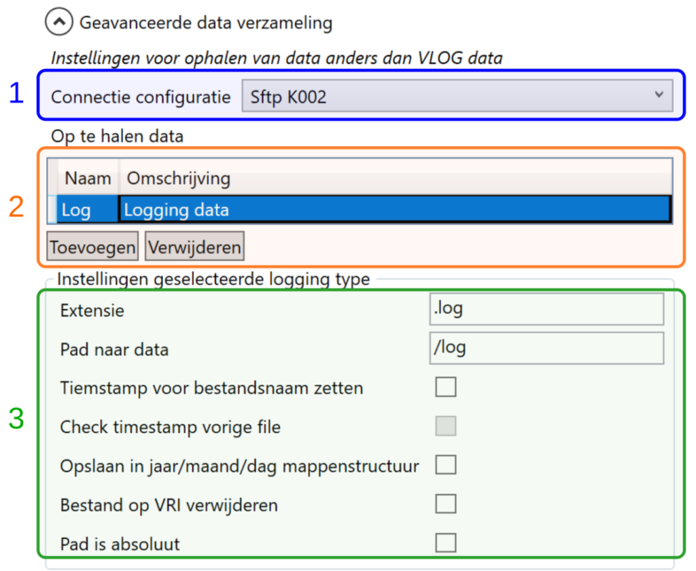

Met YAVC is het mogelijk data op te halen anders dan VLOG data, zoals bijvoorbeeld andere typen logging data die een VRI aanmaakt. De betreffende data kan geautomatiseerd worden ophaald en wordt dan opgeslagen op de server waar YAVC draait op een aangewezen locatie. Via de mogelijkheid tot het raadplegen van het server archief (YAVC client menu Tools > Server archief) kan de opgeslagen data worden opgehaald naar een lokaal systeem voor verdere verwerking.

Om gebruik te maken van deze mogelijkheid moet het volgende worden geconfigureerd in YAVC:

- Bij systeeminstellingen (uitklappen "Instellingen geavanceerde data verzameling", dit zit onder de reuguliere instellingen) moet worden ingesteld waar op de server de op te halen data moet worden opgeslagen
    - Merk op: momenteel moet na een wijziging van deze instelling de bestanden-verzamelaar (file-hamster) van YAVC worden geherstart, anders komt de wijziging niet door

Per VRI moet vervolgens worden ingesteld welke data moet worden opgehaald, en hoe deze moet worden opgeslagen:

Merk op: sinds versie 3.5 van de client geldt: er is een extra optie "Periodiek opnieuw verzamelen"; deze komt beschikbaar indien "Timestamp voor bestandsnaam zetten" is aangevinkt. "Check timestamp vorige file" komt pas beschikbaar indien periodiek opnieuw verzamelen is ingeschakeld.

De volgende instellingen zien hierbij relevant:

- Welke connectie configuratie gebruikt moet worden \[1\] (kan zijn van type ftp, sftp of monitored-folder). Deze kan dus afwijken van de verbinding via welke de VLOG data worden opgehaald

- Een of meer typen data om op te halen \[2\]; er kunnen dus meerdere typen data worden opgehaald, waarbij per type een regel in deze lijst moet worden aangemaakt

- Per type op te halen data moet het volgende worden ingesteld \[3\]:
    - De extensie - let op ! gebruik één extensie per type, zonder wildcards
    
    - Pad naar de data op de VRI
    
    - Timestamp voor bestanden zetten - indien aangevinkt, plaatst YAVC voor opgehaalde bestanden een timestamp van het moment van ophalen met het formaat yyyyMMddTHHmmss, bv.: 20230117T093900
    
    - Periodiek opnieuw verzamelen - dit is alleen beschikbaar indien het voorgaande vinkje aan is (timestamp voor bestandsnaam zetten). Indien aangevinkt, wordt data elke ronde opnieuw verzameld, ook als een bestand met dezelfde naam reeds eerder is opgehaald. _Let op!_ Dit kan zeer veel data opleveren, gebruik daarom evt. de navolgende optie om hetverzameling in te perken.
    
    - Check timestamp vorige file - dit is alleen beschikbaar indien het voorgaande vinkje aan is (periodiek verzamelen data). Indien aangevinkt, wordt vóór download eerst bekeken of er reeds eerder een bestand met deze naam is opgehaald (de timestamp voor de bestandsnaam wordt hierbij genegeerd). Zo ja, dan wordt middels de voorgevoegde timestamp nagekeken of er genoeg tijd verstreken is sinds de voorgaande download; zo ja, dan wordt opnieuw gedownload, zo nee gebeurt er niets
    
    - Minimale leeftijd vorige bestand (min.) - niet zichtbaar in bovenstaand plaatje, deze optie komt tevoorschijn wanneer 'Check timestamp vorige file' wordt aangevinkt; hier wordt ingesteld hoe lang geleden (in minuten) het ophalen van de voorgaande file minimaal moet zijn, voor er een nieuwe versie wordt opgehaald
    
    - Opslaan in jaar/maand/dag mappenstructuur - indien aangevinkt worden opgehaalde bestanden geplaatst in een map per dag, zoals ook gebeurt met VLOG data. Bv: .../K1/2023/01/17.
    
    - Bestand op VRI verwijderen - indien aangevinkt wordt na download het bestand op de server ofwel de VRI verwijderd
    
    - Pad is absoluut - indien aangevinkt geldt het ingestelde pad als absoluut; bij wisselen van map wordt dan dus niet het huidige pad (waar de client/YAVC komt na inlog op de serve/VRI) als uitgangspunt gebruikt, maar wordt gepoogd direct naar de ingestelde locatie te manouevreren.

_Merk nog op:_ er vindt momenteel geen data retentie plaats op de opgehaalde data. Dit betekent, mede afhankelijk van de aard van de opgehaalde data en de instellingen, dat het archief met data langzaam zal groeien. Dit is iets om rekening mee te houden bij het dimensioneren van de opslagruimte op de server. Op aanvraag kan CodingConnected retentie uitvoeren op de opgehaalde data.
