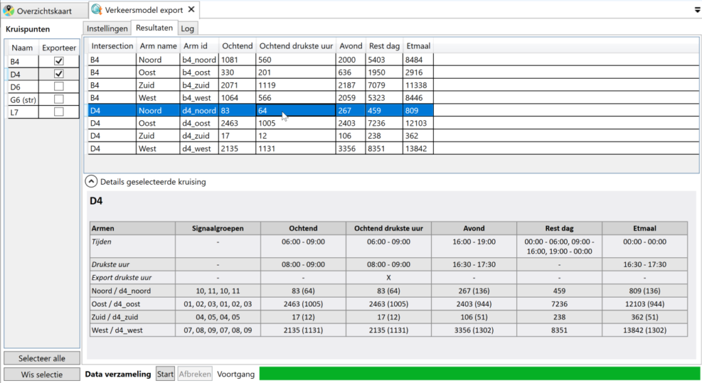
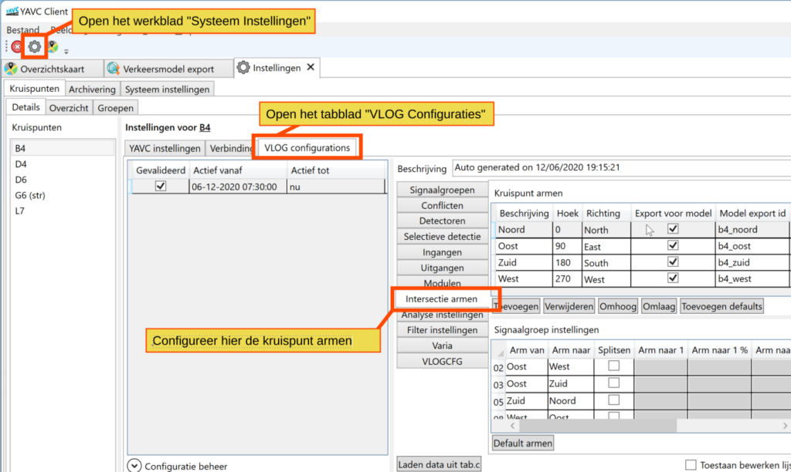
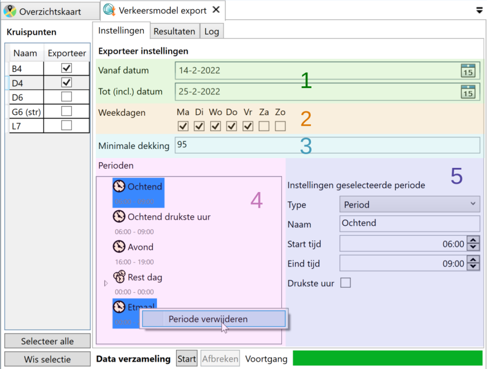
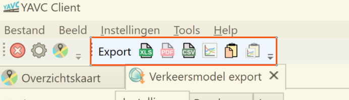

YAVC-client biedt de mogelijkheid data te exporteren voor het veelgebruike macroscopische verkeersmodel OmniTrans. Dit model heeft als invoer een lijst met kruispuntarmen van alle relevante kruispunten ("telpunten", waarbij een telpunt doorgaans concreet bestaat uit een doorsnee telling per arm van een kruising). Daarbij is per arm een totale intensiteit voor diverse perioden opgenomen. Middels YAVC-client kan deze data – na de benodigde configuratie – met een druk op de knop worden opgevraagd.

De uiteindelijke export kan na configuratie op afroep worden uitgevoerd en ziet er bijvoorbeeld als volgt uit:

Het exporteren van data voor het verkeersmodel verloopt via een aantal stappen:

1. Configuratie per kruispunt (eenmalig, behoudens configuratie wijzigingen)
2. Configuratie van de export (eenmalig)
3. Uitvoeren van de export
4. Exporteren van de export data

Hieronder worden deze stappen nader uitgewerkt.

## Configuratie per kruispunt

Open eerst het systeem instellingen werkblad (tandwiel knop op de toolbar of via menu Instellingen > Systeem Instellingen). Dit werkblad opent met een overzicht van alle kruispunten, en van de geselecteerde kruising de detail instellingen. Per kruising moet nu in het tabblad “VLOG Configuraties” worden ingesteld welke kruispuntarmen er zijn, en hoe de signaalgroepen verdeeld zijn over deze armen.

De handigste werkwijze is:

- Aanmaken kruispunt armen, al dan niet met gebruik van de knop “Toevoegen defaults”
    - Stel per arm ook het export ID in, wanneer dit gewenst is; hiermee kunnen kruispuntarmen direct worden gekoppeld aan telpunten in het verkeersmodel
    - Vink aan of een arm al dan niet meegenomen moet worden in de export. _Let op!_ niet aangevinkte armen komen niet terug in de export!
    - Merk hierbij op:
        - Voor de verkeersmodel export is de interne architectuur en afwikkeling op de kruising niet relevant; het betreft enkel de armen die de kruising voeden: die zijn als telpunten in het verkeersmodel opgenomen. Stel er is een interne naloop van 02 > 62, dan is de intensiteit bij 62 voor het verkeersmodel normaal gesproken irrelevant.
        - Is het de bedoeling dat de configuratie ook gebruikt gaat worden voor visualisatie van verkeersstromen over de kruising, dan moet wél de interne structuur worden geconfigureerd. Houd er hierbij rekening mee, dat voor bijv. een koppeling 02 > 62, er 4 armen nodig zijn: de arm waar 2 vandaan komt, waar 2 naar toe gaat, en idem voor 62. De tussenliggende arm, waar 02 en 62 in elkaar overgaan, kan niet samengevoegd worden, omdat dit geen juiste visualisatie oplevert.
- Stel per signaalgroep in, bij welke kruispuntarm deze hoort, al dan niet met gebruik van de knop “Toepassen defaults”. Die knop zorgt voor automatische toedeling van signaalgroepen op basis van naamgeving, waarbij 01/02/03 bij de oostelijke arm worden toebedeeld, etc.
    - Merk hierbij op: instellen van de arm(en) waar een signaalgroep naar toe rijdt is voor de model export niet relevant. Om de configuratie te gebruiken voor visualisatie van verkeersstromen is dit wel belangrijk.
- Sla de configuratie op, _zonder herberekenen van analyse data._ Dit laatste is belangrijk, omdat anders de analyse data wordt verwijderd en moet worden herberekend, wat hier echter niet nodig is. Indien tegelijk andere wijzigingen aan de VLOG configuratie zijn gedaan, geldt dit natuurlijk niet!

## Configuratie van de export

Open het werkblad voor de verkeersmodel export via het menu Tools > Export verkeersmodel. Het werkblad opent met een lijst met kruispunten en de instellingen voor de export. In de lijst kunnen een of meer kruispunten worden gekozen die meegenomen moeten worden in de export van data.

Qua instellingen is het volgende beschikbaar (de cijfers tussen blokhaken \[\] refereren naar de afbeelding hierboven):

- Start / einde export periode \[1\]: in deze periode wordt gezocht naar dagen die voldoen aan de selectiecriteria
- Dekkingsgraad data \[3\]: dagen binnen het opgegeven bereik (start – einde) moeten minimaal deze dekkingsgraad hebben qua data om te worden meegenomen in de selectie
- Dagen van de week \[2\]: hier kan wordena angevinkt welke dagen van de week meegenomen moeten worden
- Perioden \[4\]: middels rechtermuisklik kunnen hier perioden worden toegevoegd/verwijderd. Per opgegeven periode zal per kruispuntarm de intensiteit worden gesommeerd en zo in de export terecht komen. Per periode kan worden opgegeven:
    - Type \[5\]: periode, of collectie van onderliggende perioden. Bij keuze voor een collectie, kan geen start/einde worden ingesteld, maar kunnen (via rechtermuisklik op de periode in de lijst) onderliggende perioden worden toegevoegd. Zo kan in de export de intensiteit van meerdere perioden in één kolom terecht komen, bv. de intensiteit buiten de spitsen
    - Naam \[5\]: de naam van de periode
    - Start / eind tijd \[5\]
    - Exporteren drukste uur \[5\]: indien aangevinkt, zal in de export enkel het drukste uur worden opgenomen. Dit betreft dan het aaneengesloten drukste uur binnen de betreffende periode, waarbij wordt gezocht per kwartie

## Uitvoeren van de export

Wanneer alles is ingesteld, kan middels de knop “Start” de export worden gestart. De export verloopt lineair, per kruising, op alfabetische volgorde. Tijdens de export wordt in het tabblad “Log” gelogd wat er gebeurd. Hier worden ook eventuele meldingen gemaakt van fouten.

Er zijn diverse redenen waarom een kruising niet in de uiteindelijke export terecht kan komen:

- Er is geen gevalideerde configuratie voor de betreffende periode
- Er wordt geen analyse data gevonden voor de betreffende periode
- De geldende analyse configuratie heeft geen (volledige) configuratie van de layout
- In de betreffende periode worden geen dagen gevonden die voldoen aan de gestelde criteria (bijvoorbeeld is de dekking onvoldoende)

Voor kruispunten die wel worden meegenomen wordt in de log vermeld op basis van hoeveel dagen de export uiteindelijk gebeurt.

Zeker wanneer voor veel kruispunten en/of voor langere perioden data wordt opgevraagd, kan dit geruime tijd in beslag nemen. De voortgang wordt onderaan het werkblad weergegeven.

## Resultaten: weergeven en opslaan

De resultaten van de dataverzameling worden reeds tijdens het lopen hiervan weergegeven voor kruispunten waarvoor dit is afgerond (zie de afbeelding bovenaan deze pagina). De resultaten komen in één lijst, waarbij voor alle kruispunten onder elkaar, voor elke relevante arm per kruising, de data wordt weergegeven: het kruispunt id, de naam van de arm, de export id van de arm, en vervolgens per opgegeven periode (of periode collectie) de gesommeerde intensiteiten van de bij die arm behorende signaalgroepen.

Klikken op een regel in de tabel zorgt voor weergave van enige details van de bij die regel behorende kruising, wanneer dit wordt uitgeklapt. Hier is een tabel te zien met deels dezelfde data als in de complete tabel, echter met enige extra informatie. Zo is voor alle perioden (behoudens periode collecties) te zien wat het drukste uur is, en wat de intensiteit is voor zowel de complete periode als voor het drukste uur. Tevens is te zien welke fasen bij een arm horen: zo kan snel worden gecontroleerd of de configuratie correct is.

Opslaan van de opgehaalde data gaat via de knoppen op de toolbar:

De data kan worden opgeslagen als .xlsx (Excel), .csv (tekstbestand met daarin met ; gesepareerde data velden) of op het klembord worden geplaatst als .csv data. De opties voor export naar .pdf of .png (afbeelding) zijn niet beschikbaar omdat dit hier geen meerwaarde biedt.
