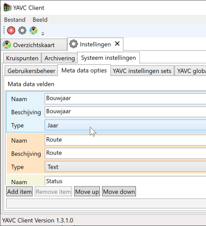
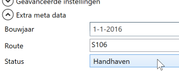

In YAVC is het mogelijk eigen meta data velden aan te maken en te vullen met data. Denk hierbij aan bouwjaar, vervangingskosten, fabrikant of automaat type. Deze data kan vervolgens worden ontsloten via de 'publieke' API.

## Configuratie van meta data

Het configureren van meta data kan middels de client van YAVC. Ga naar Instellingen > Systeem instellingen > Meta data opties. In dit venster kunnen velden worden aangemaakt. Voor de geconfigureerde velden kan nadien per intersectie in YAVC data worden opgegeven. De gebruikers interface hiervoor is hieronder te zien:

De knoppen onderaan kunnen worden gebruikt om items toe te voegen, te verwijderen, of te ordenen. De volgorde heeft vooral invloed op de volgorde waarin de items later worden weergegeven op het invul-formulier per kruising. De volgorde waarin de data terug komt via de api is niet expliciet bepaald.

_Let op!_ Na het doorvoeren van wijzigingen in de meta data configuratie moet het instellingen tabblad worden afgesloten en opnieuw geopend alvorens de nieuwe configuratie gebruikt kan worden voor het inzien en bewerken van meta data per kruispunt.

### Toevoegen van meta data items

Klik op "Add item"; er komt nu een item bij onderaan de lijst met een automatisch aangemaakte naam. Stel het nieuwe item in naam wens:

- Naam - een unieke naam voor het item, bestaande uit letters en/of cijfers zonder verdere leestekens of spaties. Deze naam is een unieke identifier van dit veld en wordt meegestuurd wanneer de meta data via de api wordt opgevraagd. De naam wordt tevens gebruikt om de data per kruising op te slaan. Wanneer de naam wordt gewijzigd komt er een melding dat de bijbehorende data per kruising ook zal worden bijgewerkt; zo wordt gezorgd dat de meta data per kruising integer blijft.
- Beschrijving - een omschrijving van het veld; deze mag alle tekens bevatten. De omschrijving wordt gebruikt voor het opbouwen van het invul-formulier per kruising. De omschrijving komt niet mee met de meta data via de api, maar wel wanneer via de api de meta-data configuratie wordt opgevraagd.
- Type - het type data dat voor dit veld per kruising zal worden opgeslagen. Momenteel zijn beschikbaar:
    - Integer - gehele getallen
    - Double - getallen met een fractie
    - Euro - een bedrag in euro's
    - String - tekst
    - DatumTijd - datum met tijd erbij
    - Datum - alleen datum, tijd wordt niet opgeslagen
    - Jaar - alleen jaartal
    - Opties - een keuzeveld uit een aantal vaste opties. Hierbij geldt:
        - voor de naamgeving van de opties gelden dezelfde regels als voor de naam van een meta veld zoals hierboven omschreven
        - opties moeten worden gescheiden met puntcomma ofwel ;
        - bij wijzigen van de opties geeft de client een melding dat dit ook bij alle kruisingen zal worden verwerkt. Zo wordt voorkomen dat er kruispunten zijn met een niet (meer) bestaande optie als waarde van dit meta data veld

### Verwijderen van items

Om een item te verwijderen: selecteer het item en klik "Remove item". De client geeft nu een melding.

_Pas op!_ Verwijderen van een veld leidt ertoe dat alle gerelateerde data per kruising wordt verwijderd - ten einde "verweesde" data te voorkomen. Dit is onherroepelijk en kan niet ongedaan gemaakt worden!

## Invoeren en bewerken van meta data

Een opmerking vooraf (herhaling van hierboven): _Let op!_ Na het doorvoeren van wijzigingen in de meta data configuratie moet het instellingen tabblad worden afgesloten en opnieuw geopend alvorens de nieuwe configuratie gebruikt kan worden voor het inzien en bewerken van meta data per kruispunt.

Na het opgeven van velden kan voor de geconfigureerde velden data worden ingevoerd per kruispunt. Hieronder een voorbeeld van het invul-formulier dat de client maakt op basis van een meta configuratie:

De tekst voor de velden is de beschijving zoals eerder opgegeven. Per type veld verschilt wat er qua interface verschijnt: voor een String komt bv een textbox, voor een Opties veld komt een combobox met opties, voor een datumtijd, datum of jaar veld komt een datum(-tijd) veld met de optie een jaar/datum/tijd te selecteren, etc.

Bij bewerken van de data komt het knopje "Opslaan" onderaan het formulier per kruising beschikbaar.

_Merk op:_ vanwege technische beperkingen wordt het "Jaar" veld weergegeven als bv "1-1-1967". In de meta data wordt evenwel uitsluitend 1967 opgeslagen.

## 'Statische' meta data

Bij het opvragen van meta data via de api, komen een aantal aanvullende velden mee in de lijst met meta data. Dat wil zeggen: ook indien er géén eigen meta data velden zijn geconfigureerd, komt er meta data terug via de api. Dit betreft velden zoals naam van de kruising, straatnamen, stad, hoogte en breedtegraag, etc. De betreffende velden zijn gemarkeerd met "\[static\]" achter de naam van het veld. Dit zijn velden die sowieso beschikbaar zijn in de client, en altijd aanwezig zijn per kruising. Deze zijn dus niet te configureren. Ze komen mee met de "eigen" meta data, zodat de meta data hiermee op een consistente manier wordt ontsloten.
