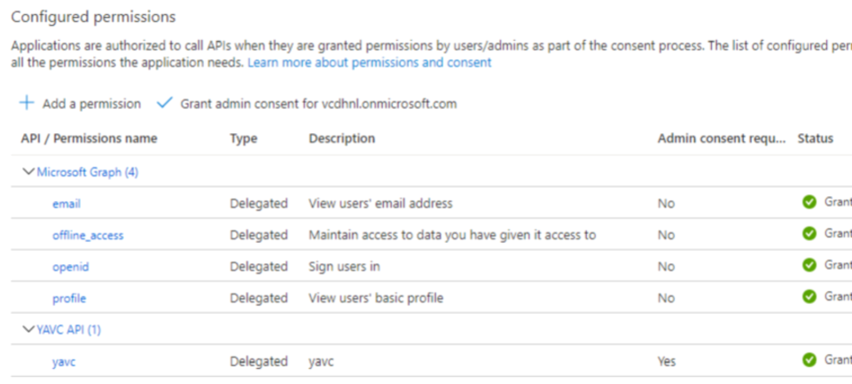

De client applicatie van YAVC is een Windows desktop applicatie. Om gebruik te kunnen maken van deze client moet worden ingelogd. Dit verloopt via een zogenaamde "identity provider". Dit is een externe toepassing die zorgt voor beheer van identiteiten (accounts), waarin voor YAVC een configuratie is aangemaakt.

De inlog maakt gebruik van OAuth2 + OpenID Connect. Dit gaat in grote lijnen als volgt:

- De client van YAVC verwijst de eindgebruiker door naar de identity provider: het inloggen gebeurt dus bij die provider. In de praktijk wordt hiertoe binnen de client een klein browser venster geopend, waarin de login pagina van de identity provider wordt geladen.
- De eindgebruiker logt op reguliere wijze in; bv. al dan niet met MFA, of in geval het te gebruiken account is gekoppeld aan het ingelogde Windows account volstaat vaak een enkele klik.
- De provider stuurt de eindgebruiker na inloggen (geautomatiseerd) terug naar YAVC client met een zogenaamde "token", een soort van toegangsbewijs. Deze token wordt door YAVC client gebruikt om te communiceren met de client-API van YAVC. Zonder geldige token kan er geen data worden opgevraagd.

Om deze werkwijze mogelijk te maken moet het volgende worden geconfigureerd:

- In de identity provider
    - De client moet als app worden geregistreerd
    - De client-API moet afzonderlijk worden geregistreerd (dit is zo, omdat het een _desktop_ applicatie betreft, en er dus sprake is van twee afzonderlijke entiteiten: de desktop app zelf, en de API die wordt gebruikt door de desktop app)
    - Toegang voor eindgebruikers om de geconfigureerde app/API te mogen gebruiken. Doorgaans wordt gewerkt met groepen.
- In YAVC:
    - De client moet op de juiste wijze kunnen verwijzen naar de identity provider
    - De client API moet worden geconfigureerd zodat deze kan controleren of inkomende token valide zijn, gegeven de ingestelde identity provider

Deze punten worden hieronder nader uitgewerkt.

## Configuratie identity provider

De gebruikte identy provider is arbitrair, zo lang OAuth2+OIDC wordt ondersteund, en in de claims een claim kan worden meegestuurd met de rol van de gebruiker in YAVC. Vaak wordt gewerkt met AzureAD of ADFS, maar YAVC zal ook functioneren met bv. KeyCloak of een service zoals [Auth0.com](http://www.auth0.com).

In het voorbeeld hier wordt voor praktische instellingen soms gerefereerd met AzureAD, omdat dit de meest voorkomende configuratie is voor YAVC.

Er moeten _twee_ apps worden geconfigureerd: de client applicatie en de client-API. Dit is zo, omdat er ook daadwerkelijk sprake is van twee applicaties: de desktop applicatie, die de eindgebruiker ziet, en de client-API, die de desktop applicatie op verzoek van de eindgebruiker, voorziet van informatie. De desktop applicatie is vanuit het perspectief van de identity provider één van in potentie vele applicaties die gebruik mogen maken van de client-API.

Uiteindelijk doel is dat een gebruiker na login een zogenaamde _access token_ krijgt, met daarin in elk geval de volgende claims: oid en/of sub (tbv. identificatie gebruikers; "sub" is bij AzureAD niet uniek voor de hele tenant), aud (het audience, dit verwijst naar de client-API), roles (mag ook anders heten, maar _moet_ een of meer van de drie rollen bevatten, te weten: user, admin, systemadmin).

### Configuratie van de desktop applicatie

Een voorbeeld van de belangrijkste instellingen voor AzureAD:

- Het betreft een _native application_, dat wil zeggen een stand-alone applicatie die op een bepaald besturingssysteem (in dit geval Windows) draait. Dit in tegenstelling tot een web applicatie; die worden in een identity provider anders geconfigureerd
- Single tenant
- Allow public client flows: NO
- Toevoegen van een callback URI, bv [http://localhost/login](http://localhost/login). Deze URI hoeft niet te verwijzen naar een bestaande website; de identity provider zal hiernaar verwijzen na succesvolle inlog; de client van YAVC herkent dit en sluit op dat moment het intern geopende browser venster af; de website wordt dus nooit echt geladen
- Qua permissions hieronder een voorbeeld:  
    
- De permissie voor de API is hier natuurlijk belangrijk, deze wordt echter apart geconfigureerd, zie verderop.

### Configuratie van de client-API

Een voorbeeld voor de belangrijkste instellingen voor AzureAD:

- Gebruik single tenant voor API access
- Allow public client flows: NO
- Onder "Expose an API": bij "Authorized client apps" de geconfigureerde native app toevoegen
- Bij app roles toevoegen van 3 rollen met als values:
    - user
    - admin
    - systemadmin
    - merk op: gebruikers moeten (bv. via groeplidmaatschap) een van deze rollen krijgen toegewezen
- Ten minste één scope aanmaken

### Benodigde gegevens voor configuratie YAVC

Aan de kant van YAVC moet de identity provider worden geconfigureerd. Hiervoor zijn de volgende gegevens nodig, die bij CodingConnected bekend moet zijn:

1. Endpoint van de tenant (bij AzureAD is dat doorgaans https://sts.windows.net/xxxxxxxx-xxxx-xxxx-xxxx-xxxxxxxxxxx, waarin op de plek van de xxx-en het ID van de tenant komt te staan)
2. De ingestelde callback uri
3. Client ID van de native app in Azure
4. Client ID van de API in Azure (dit wordt binnen Azure gebruikt als audience/resource id)
