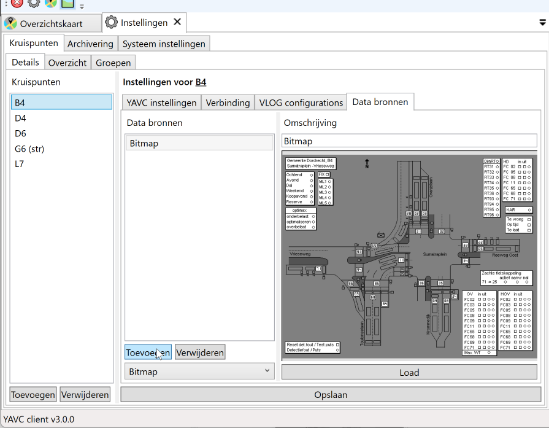
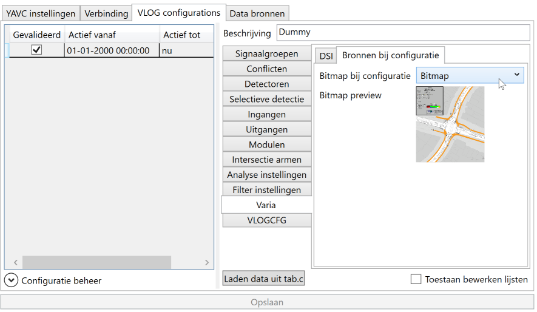
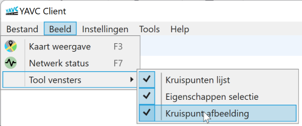

In YAVC-client is het mogelijk een ingestelde bitmap (afbeelding) weer te geven die hoort bij de actieve intersectie. Actief betekent in deze context: de intersectie van de geselecteerde fasenlog of het geselecteerde analyse werkblad. De weer te geven bitmap moet eerst zijn ingesteld bij de analyse configuratie die hoort bij de weergegeven data; bij kiezen van een andere dag, met een andere bijbehorende analyse configuratie kan de weergegeven bitmap dus veranderen.

## Instellen bitmap bij analyse configuratie

Voor een bitmap kan worden weergegeven, moet deze eerst worden geconfigureerd. Dit gaat in twee stappen:

- Toevoegen van een bitmap databron aan de kruising
- Toewijzen van de betreffende bitmap aan een analyse configuratie

### Toevoegen van een bitmap databron

Bij kruispunten in YAVC kunnen (sinds YAVC-client versie 3.x) databronnen bij kruispunten worden opgeslagen. Hier kunnen onder meer bitmaps worden opgeslagen. Open hiertoe het instellingen werkblad (systemadmin niveau is noodzakelijk!), selecteer een kruispuint, en klik dan op het tabblad "Data bronnen":

Om een bitmap toe te voegen:

- Selecteer in de lijst onder de knoppen "Toevoegen" en "Verwijderen" het type "Bitmap"
- Klik nu op "Toevoegen" (de muispijl staat hierop in de afbeelding)
- Er wordt een nieuwe bitmap toegevoegd, evenwel nog zonder bijbehorende data
- Geef de bitmap een omschrijving via het tekstvak boven de bitmap weergave
- Klik op "Laden" en zoek de gewenste bitmap op op schijf
- Klik tenslotte op "Opslaan"

### Toewijzen van een bitmap aan een analyse configuratie

Kies het tabblad "VLOG configuraties" van de betreffende kruising en klik vervolgens op de configuratie waarvoor een bitmap moet worden ingesteld. Klik daarna op het tabblad "Varia" en dan op "Bronnen bij configuratie":

Kies nu de gewenste bitmap en klik vervolgens op "Opslaan". Let op: **kies bij de vraag om wel/niet te herberekenen: Nee**. Herberekenen is in dit geval niet nodig, want er verandert inhoudelijk niets aan de analyse configuratie.

## Weergeven van bitmap bij actieve kruispunt

Is voor een kruispunt voor één of meer analyse configuraties een bitmap ingesteld, dan kan deze worden weergegeven in YAVC-client wanneer van die kruispunt data wordt weergegeven die valt binnen de periode waarvoor de betreffende analyse configuratie geldig is.

Klik hiertoe in het menu op Beeld>Tool vensters>Weergeven bitmap:

Of gebruik de snelkoppeling op de toolbar.

Er verschijnt nu een toolvenster, dat middels de multi-venster omgeving van YAVC-client op de gewenste plek kan worden geplaatst, of als zwevend venster weergegeven kan worden. In het toolvenster kan met het muiswiel worden gezoomed, alsook met Shift+Linksklik-vasthouden+Slepen, en vervolgens met Linksklik-vasthouden worden gesleept.

Bij wisselen van actief werkblad, zal ook de weergegeven bitmap worden gewijzigd. Indien geen bitmap beschikbaar is voor de actieve data, wordt hiervan melding gemaakt. Indien meerdere werkbladen met data naast/boven elkaar worden weergegeven zal van het laatste werkblad waarin/waarop is geklikt de bitmap worden weergegeven.

De positie van het bitmap weergave toolvenster wordt opgeslagen bij sluiten/herstarten van YAVC-client. Een uitzondering hierop vormt een zwevend venster, dit kan momenteel niet worden hersteld.
