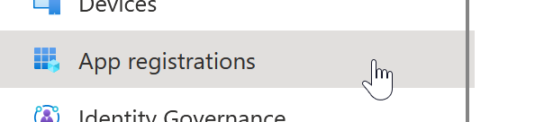
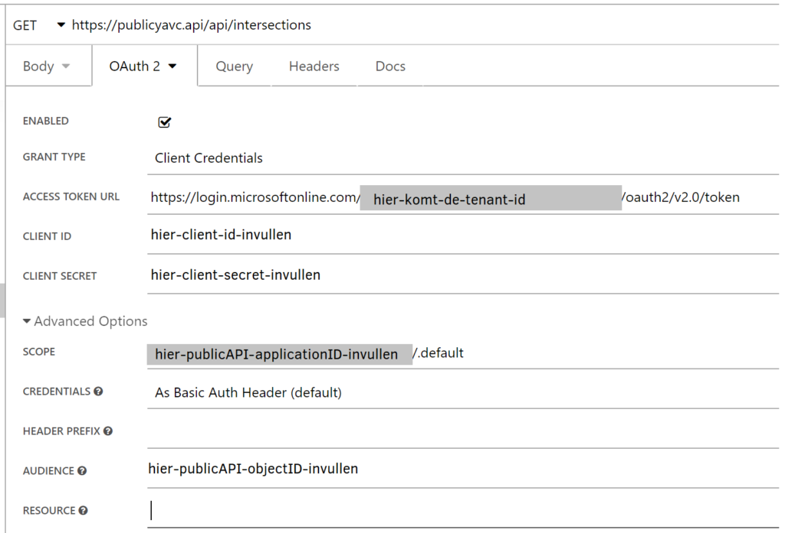

Binnen YAVC is een publieke API beschikbaar, waarmee meta data rond kruispunten en analyse data kan worden ontsloten naar andere applicaties. De API heeft de volgende kenmerken:

- RESTful API
- Beveiligd middels OAuth2
- Beschikt over ingebakken documentatie ("swagger")
- Kan de volgende data ontsluiten:
    - Meta data van kruispunten (naam, straatnamen, ligging, etc.; inclusief gebruikers meta data)
    - Beschikbaarheid van analyse data
    - Lijst met beschikbare analyses (incl. id's, die nodig zijn voor opvragen van de eigenlijke data)
    - Analyse data, voor een bepaald type analyse, een gewenste periode in de tijd, voor een opgegeven interval (bv. 15 min.)

Zie voor details over de publieke API [dit artikel](https://www.codingconnected.eu/yavvwiki/yavc/yavc-public-api/).

## Beveiliging: OAuth2 en TLS

De API is beveiligd middels OAuth2, wat met behulp van een externe identity provider geconfigureerd moet worden. Data wordt in principe altijd versleuteld tussen de API en de ontvanger. Hierbij geldt:

- De API maakt gebruik van OAuth2 voor de authenticatie
- Er wordt geen gebruik gemaakt van authorisatie
- Er wordt gebruik gemaakt van de [client credentials flow](https://auth0.com/docs/get-started/authentication-and-authorization-flow/client-credentials-flow)
- Versleuteling gebeurt met een certificaat en gebruikt TLS1.2

Het OAuth2 gedeelte moet worden geconfigureerd in de externe identity provider (IdP). Dit is vaak Azure Active Directory (AzureAD), maar kan ook een andere provider zijn (zoals Auth0, ADFS, KeyCloak, etc.). Om een externe applicatie toegang te geven tot de API is in hoofdlijnen nodig:

- Configureren van de API in de IdP (dit is het "audience" a.k.a. "resource")
- Configureren van de externe app in de IdP
- De externe app permissie geven tot het gebruiken van de API

Hieronder volgt een voorbeeld van een configuratie in AzureAD ter referentie:

- Log in op de Azure Portal
- Ga naar "Active Directory"
- Ga naar "App registrations"

- Hier moet de publieke API worden toegevoegd: klik op "New registration" en geef de API een herkenbare naam. Stel de API registration als volgt in:
    
    - Kies bij "Redirect URI" de waarde "Web" en stel de correcte callback URI in
    - Klik register
    - Stel bij "Authentication" in: "Allow public client flows" = No
    
    - Voeg via "Expose an API" een scope toe; er _moet_ één scope zijn (naam is om het even, bv. "read", de API is sowieso alleen-lezen)
    - Belangrijke informatie voor de configuratie van YAVC is:
        - Application ID van de app (tbv. juiste configuratie van de scope)
        - Directory/tenant ID (tbv. check of de token van de juiste plek komt)
        - Deze informatie heeft CodingConnected dus nodig om de API server-side correct te kunnen configureren
- Voeg op dezelfde manier een tweede app toe, nu voor de externe applicatie die toegang moet krijgen tot de API; geef de app een herkenbare naam. Stel de app als volgt in:
    - Redirect URI is hier niet nodig
    - Klik register
    - Voeg bij "Certificates and secrets" een secret toe
    - Geef de app toegang tot de API:
        - ga naar "API permissions"
        - Klik "Add a permission"
        - Klik "My APIs" en kies de eerder aangemaakte API app uit
        - Klik onder "Permissions" de enige aangemaakte scope aan (bv: read)
    - Belangrijke informatie voor de configuratie van de externe app is:
        - Application ID van de app (dus van de nieuwe, externe app, niet van de API!)
        - Object ID van de API app (hier dus juist wél van de API! Dit is tbv. juiste configuratie van resource/audience)
        - Het aangemaakte secret
        - OAuth2 token endpoint (klik op "Endpoints" om dit weer te geven)

De uiteindelijke configuratie voor een externe applicatie is bijvoorbeeld als volgt (screenshot uit [de test app insomnia](https://insomnia.rest/)):

