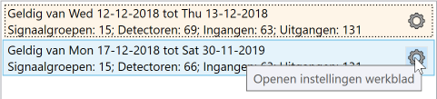
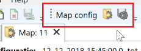

Bij VLOG data hoort altijd een configuratie. Dit kan zijn een .cfg/.vlg/.vlt bestand, of in geval van VLOG3 zit de configuratie doorgaans elk uur in de data opgenomen. Aanvullend voor analyse doeleinden is informatie nodig over ligging van lussen, welke lus bij welke fase hoort en evt. instellingen voor analyses.

T.b.v. juist uit kunnen voeren van trend analyses is het van belang dat YAVV beschikt over de juiste configuratie(s). Dit artikel gaat in op de manier waarop YAVV/bd om gaat met configuraties, en wat de gebruiker moet doen om te zorgen dat dit goed verloopt.

## Herkennen van configuraties

Tijdens de indexatie van data bepaalt YAVV voor elk bestand:

- aantal signaalgroepen
- aantal detectoren
- aantal ingangen
- aantal uitgangen

Elke unieke combinatie van deze aantallen geldt binnen deze context als "configuratie". Puur de aantallen IO elementen is als configuratie natuurlijk niet heel nuttig, dit wordt vervolgens aangevuld (zie volgende alinea). Kijken naar aantallen IO is slechts een manier voor YAVV/bd om te bepalen of en waar er sprake is van wijzigingen. Omdat VLOG werkt met index nummers, is dit belangrijk: bij gewijzigde index nummers gaat het anders mis met toedeling van event en analyse resultaten aan bijvoorbeeld fasen en detectoren.

Na indexatie worden bestanden op volgorde gezet op basis van de startdatum/tijd van de inhoud van de data. Vervolgens wordt gekeken of er gegeven de configuratie bij de start van de data, wijzigingen plaatsvinden in de aantallen IO. Is dit het geval, dan wordt een nieuwe configuratie aangemaakt. Dit levert dus op:

- Een lijst met configuraties met elk een start en einde datum/tijd.
- Elke configuratie in de lijst krijgt eigen instellingen v.w.b. naamgeving van elementen, toedeling van detectoren, analyses, etc.
- Elke configuratie heeft één bereik in de tijd waarop deze van toepassing is. Ook wanneer een eerdere configuratie weer geldig zou kunnen worden wordt dus een nieuwe aangemaakt bij een wijziging.

## Instellingen voor configuraties

Wanneer de in de data aanwezige configuraties zijn bepaald moeten deze juist worden ingesteld, t.b.v. van bv. weergave van de (preview) fasenlog en met name uitvoeren van trend analyses. YAVV doet een poging de beste instellingen in te laden, de gebruiker moet dit wel controleren.

### Automatisch zoeken naar instellingen

Net als wanneer met YAVV bestanden worden geopend ([zie hier](../../yavc/omgang-met-configuraties-in-yavc/index.md)), zoekt ook YAVV/bd automatisch naar de best passende configuratie. Hierbij geldt:

- Bij VLOG3 data wordt de configuratie uit de data zelf default ingeladen.
- Vervolgens wordt gezocht naar .yavv, .cfg, .vlt en .vlc bestanden in de geopende map - inclusief onderliggende mappen! Tevens wordt gezocht naar degelijke bestanden in de default configuratie map - indien ingesteld. Het resultaat is een complete lijst met beschikbare configuratie instellingen.
- Vervolgens wordt een match gezocht - waarbij naast de naam van het bestand ook de aantallen IO moeten matchen:
    - Als eerste een 1 op 1 match tussen TLC-id uit de data en bestandsnaam voor .yavv bestanden
    - Dan een partiële match voor .yavv bestanden
    - Vervolgens een 1 op 1 match tussen de TLC-id uit de data en een CFG bestand (.cfg, .vlc of .vlt)
    - En tenslotte een partiële match met een CFG bestand
- Per voorgaande stap worden telkens eerst configuratie bestanden uit de geopende map geprobeerd, en daarna evt. bestanden uit de default configuratie map.
- De eerst gevonden match zorgt voor toepassen van de betreffende configuratie en afbreken van het zoekproces.

### Bewerken van configuraties

Configuraties kunnen worden bewerkt door in de lijst met configuratie op het tandwiel van de betreffende configuratie te klikken.

[]

Hiermee wordt een nieuw werkblad geopend, waarin de configuratie kan worden bewerkt. Het is middels de knoppen in de toolbar ook mogelijk een configuratie bestand te gebruiken om instellingen in te laden. Tevens is het mogelijk de (al dan niet aangepaste) configuratie instellingen op schijf op te slaan.

[]

### Toepassingsbereik van configuraties

Configuraties hebben een **vast gebied in de tijd** waarop deze van toepassing zijn. In de lijst kan een configuratie worden geselecteerd, maar dit heeft momenteel geen verder effect - die mogelijkheid hoort eenvoudigweg bij het feit dat dit een lijst is.

Dit houdt dus in:

- Configuraties hebben een vaste start en einde datum/tijd voor wat betreft hun geldigheid.
- Selectie van een configuratie in de lijst heeft geen effect.
- Bewerken van een configuratie heeft alleen effect op een analyse die nadien wordt uitgevoerd voor een tijdbestek dat valt binnen start en einde geldigheid van de betreffende configuratie.

Tevens is goed om te weten (vooruitlopend op het uitvoeren van trend analyses link=TODO):

- Een trend analyse kan enkele worden uitgevoerd over een tijdsperiode waarop één unieke configuratie van toepassing is.
    - Dit is nodig, omdat wordt gewerkt met indices. Wijzigen de indices, dan wijzigt mogelijk de toedeling.
- Dagen waarop meer dan één configuratie actief zijn, kunnen niet mee doen in de trend analyse - immers: het is onzeker of data voor index x altijd hetzelfde werkelijke item betreft.
