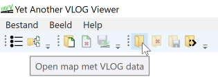
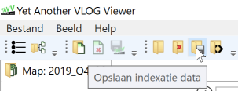
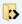
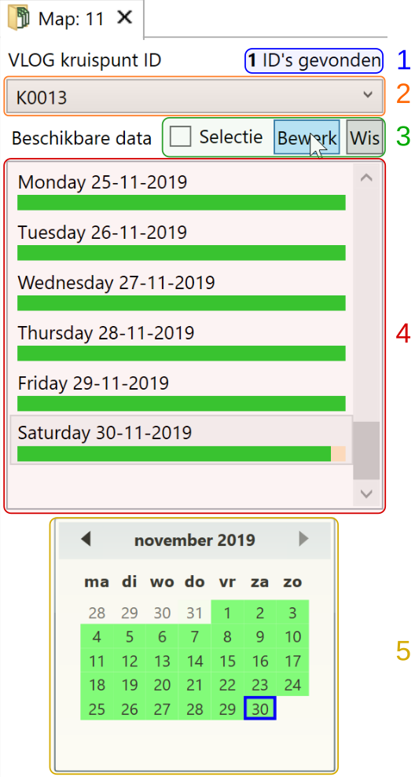
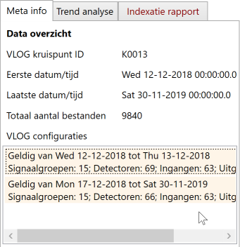
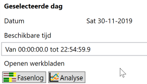

Dit artikel gaat in op de praktijk van het indexeren van data met de big-data addon voor YAVV. Voor een introductie en enige achtergrond informatie over deze addon: [zie hier](../yavv-big-data-introductie/index.md).

## Vooraf: eisen aan de brondata

YAVV/bd kan het nodige aan qua vorm en inhoud van de brondata. Toch zijn er enkele uitgangspunten en eisen om rekening mee te houden.

- Uitgangspunt is **data per dag**. Dat wil zeggen dat er per dag één of meer bestanden zijn. YAVV/bd kan niet om gaan met data waarbij binnen één bestand data van meerdere dagen zit.
    - Op termijn is de bedoeling voorbewerken van data mogelijk te maken binnen YAVV. Heeft u hier interesse in, neem dan [contact](https://www.codingconnected.eu/contact/) op.
- Indien er **overlap in de data** zit, wordt het (deels of geheel) overlappende bestand niet gebruikt. Dit is in te zien via het indexatie rapport.
- Bij **corrupte data** (bv.: onvolledige berichten) of data waarbij binnen één bestand de tijd meer dan een uur terugloopt, wordt het betreffende bestand als corrupt aangemerkt en niet gebruikt. Dit is eveneens in te zien via het indexatie rapport.
- Houdt er rekening mee dat alle VLOG data, inclusief data in onderliggende mappen, wordt geïndexeerd. Tevens wordt in alle mappen gezocht naar configuratie files.
- Tenslotte: YAVV/bd kijkt in de bestanden, de bestandsnaam doet niet ter zake. De tijd/datum alsook TLC-id (naam van de kruising) in de bestandsnaam wijkt soms af van de tijd/datum en TLC-id in de data. Voor YAVV is de inhoud, dus de tijd/datum en TLC-id uit de data, de maat der dingen. De bestandsnaam wordt niet als databron benut.

## Indexatie: de basis

Het indexeren gaat door te klikken op de knop “Openen map” op de toolbar en vervolgens de betreffende map te kiezen.

_Tip_: de map kan in het dialoogvenster geselecteerd worden in de lijst, maar wat ook werkt: wanneer de map in het dialoogvenster open staat, en in die map is verder niets geselecteerd. In het laatste geval zorgt een klik op OK ook voor selectie van de betreffende map.

Na de selectie van de map begint YAVV met de indexatie. Al naar gelang de hoeveeelheid data duurt dit langer of korter. Het proces is zo ingericht dat bij aanwezigheid van meer detectoren, er parallel wordt gewerkt. De applicatie geeft een indicatie van de voortgang.

_Let op:_ omdat de indexatie veel systeembronnen vergt, kan het zijn dat YAVV gedurende de indexatie wat minder responsief is.

Wanneer de indexatie klaar is verschijnt een weergave van de gevonden data. Dit wordt hieronder toegelicht.

## Opslag van de indexatie

Het is mogelijk de indexatie op te slaan, zodat het een volgende keer minder lang duurt om de map te openen in YAVV. Zeker bij zeer grotere datasets kan dit veel tijd schelen. Klik hiertoe op de knop op de toolbar “Opslaan indexatie”, kies de locatie en geef de bestandsnaam op.

[]

Om een opgeslagen indexatie te openen is er eveneens een knop op de toolbar beschikbaar (). Wanneer een opgeslagen indexatie wordt geopend.

- Controleert YAVV of de in de indexatie aanwezige VLOG files overeen komen met de aanwezig VLOG files op schijf. Wordt een afwijking gevonden, dan vraagt de applicatie of opnieuw geïndexeerd moet worden.
- Zoekt YAVV naar relevante configuraties – deze zijn dus niet vastgelegd in of gekoppeld aan de indexatie! 
- Voert YAVV opnieuw de toedeling van data aan kruispunten, en bepaling van beschikbaarheid van data uit, tbv. weergave aan de gebruiker.

Deze acties kosten ook (reken)tijd, maar een veelvoud minder dan een complete indexatie.

_Let op_: momenteel wordt het pad van de geïndexeerde map als **absoluut pad** opgeslagen in de indexatie. Hierdoor kan de index om het even waar worden opgeslagen, maar is de index dus niet verplaatsbaar inclusief data.

_Let op_: bij zeer grote hoeveelheden data kan YAVV na het openen van de index kort niet responsief zijn. De reden is dat het openen van de index momenteel niet op de achtergrond gebeurt.

## Het indexatie tabblad

Na indexatie is per gevonden kruispunt zichtbaar welke data beschikbaar is, en kan een selectie worden gemaakt van dagen t.b.v. trend analyse.

Hiernaast is het meest linker gedeelte van het indexatie tabblad te zien. Hier een beknopte omschrijving van de onderdelen:

1. Aantal gevonden TLC id's (kruispunt namen uit de VLOG data)
2. Selectie actieve TLC id
3. Bewerken selectie van dagen
4. Beschikbare data voor actuele maand
5. Kalender t.b.v. manouvreren in de tijd

De toedeling van data aan een kruispunt gebeurt op basis van het kruispunt ID zoals dit in de VLOG data wordt gevonden. Het aantal gevonden ID's (1) is te zien naast boven de combobox (2). Via de combobox (2) kan worden gewisseld tussen kruispunten.

_Tip_: lijkt data te ontbreken voor een kruispunt? Controleer altijd eerst of de data wellicht onder een andere TLC id toch is geïndeerd.

Van de geselecteerde kruispunt wordt naast de combobox onder tabblad "Meta info" onder het kopje "Data overzicht" weergegeven tussen welke minimale en maximale tijd/datum er data is gevonden, en hoeveel bestanden zijn geïndexeerd. Tevens worden de gevonden configuraties weergegeven.

[]

### Beschikbare data

Onder de combobox wordt de beschikbaarheid van data in de tijd weergegeven. In de lijst (4) wordt dit weergegeven van één maand, namelijk de maand behorende bij de actueel geselecteerde dag. Na indexatie wordt default de laatst beschikbare dag geselecteerd, en komt dus de maand waarin die dag valt in beeld in de kalender-lijst en kalender daaronder.

In de lijst is per dag aan de groene streep te zien is welke data beschikbaar is. Met een tooltip (te zien door de muis kort te laten zweven boven een dag) zijn details te zien van de beschikbaarheid.

Onder de lijst is een kleine kalender te zien (5). Middels de kalender is het mogelijk te manouvreren in de tijd. Bij wisseling naar een andere maand wordt ook de lijst (4) boven de kalender ververst met de dagen van die maand. Met klikken kan ook worden "uitgezoomd" zodat gemakkelijk en efficient naar een andere maand (of jaar) kan worden gesprongen.

De knoppen bij 3 zijn van belang voor het maken van een selectie van dagen t.b.v. uitvoeren van een trend analyse.

### Data per dag

Selectie van een dag in de lijst of in de kalender (middels een muisklik, de dag kleurt dan blauw gearceerd zo lang de focus daar is, anders grijs) zorgt ervoor dat naast de kalender onder de kop “Geselecteerde dag” informatie omtrent die dag wordt weergegeven.

[]

Tevens wordt rechts in beeld een preview geladen van de fasenlog voor die dag. De preview werkt net als de reguliere fasenlog, maar veel zaken zijn momenteel niet instelbaar. In de toekomst is de bedoeling bv. toedelen van detectoren aan fasen, zoom, en keuze voor GUW en/of WUS ook hier toegankelijk te maken.

#### Fasenlog en analyse per dag

Het is mogelijk voor de geselecteerde dag extra werkbladen te openen middels de knoppen “Fasenlog” en “Analyse”.

**Let op**: klikken op deze knoppen heeft als effect dat de big data addon aan de globale applicatie YAVV de instructie geeft om de aan die dag gerelateerde lijst met bestanden te openen. Dat openen verloopt vervolgens _geheel los_ van het openstaande indexatie document. Er wordt dus een nieuw en losstaand document geopend, wat verder geen verband houdt met de indexatie. Zie voor een goed begrip van het concept "Document" binnen YAVV, alsook de relatie tussen "Documenten" en "Werkbladen", [dit artikel](../documentenbeheer-in-yavv/index.md).

Het feit dat er geen relatie bestaat tussen het nieuw geopende document en het map-document is met name relevant voor de configuraties: de big data addon zoekt naar configuraties in de geïndexeerde map en alle onderliggende mappen, alsook in de default map voor configuraties indien die is ingesteld (zie hier TODO). Bij openen van bestanden uit een onderliggende map door YAVV zelf gebeurt dit echter niet, dan geldt het [de reguliere manier waarop naar configuraties wordt gezocht](../../yavc/omgang-met-configuraties-in-yavc/index.md).

In de praktijk betekent dit:

- Wijzigingen aan configuraties binnen een map-document komen niet terug in een reguliere fasenlog die middels de knoppen in het indexatie werkblad wordt geopend.
- Wil je vanuit de big-data addon snelle toegang tot de fasenlog per dag, dan is het handig eenmalig een configuratie te maken en deze op te slaan op de default locatie, waarna YAVV de configuratie zal gebruiken bij openen van de fasenlog van een specifieke dag.
