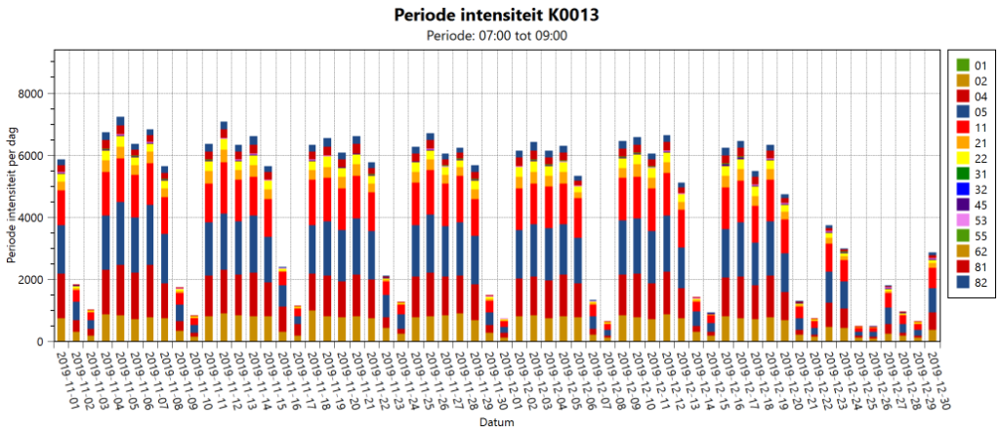

[]

Trend analyse over 2 maanden data: met YAVV/bd klaar in 1 minuut!

## Aanleiding

YAVV big data maakt het mogelijk met YAVV te werken met grote hoeveelheden data.

YAVV is in eerste instantie gemaakt voor het werken met bestanden. De applicatie leest dan data uit één of meer bestanden en kan die data visualiseren (fasenlog, DSI op kaart) en analyseren (intensiteiten, roodrijders, etc.). Het uitgangspunt hier is dat het gaat om data die een aangesloten periode bestrijkt.

Gezien deze opzet is YAVV in de basis met name geschikt om te werken met data per dag, of wellicht enkele dagen. Gemiddelden tussen dagen, of het verloop van een bepaalde indicator over een langere periode, zijn in principe op te halen, maar dit vergt zeker bij veel data erg veel handwerk op, kost veel tijd, en is foutgevoelig.

Tegen die achtergrond is het idee ontstaan om binnen YAVV het werken met grotere hoeveelheden data mogelijk te maken. De "big data" addon voor YAVV is hiervan het resultaat.

_Let op_: YAVV/bd (ofwel de big-data addon voor YAVV) vormt een apart onderdeel van YAVV en vergt een aanvullende licentie.

## Big data in een notendop

Met de big data addon wordt het mogelijk te werken met mappen waarin grotere hoeveelheden VLOG data aanwezig is. In een notendop werkt dit als volgt:

- De gebruiker kiest een map van schijf
- YAVV doorloopt recursief (dat wil zeggen inclusief onderliggende mappen) alle bestanden uit deze map.
- Bij VLOG bestanden (.vlg of .vlog) wordt de inhoud geïndexeerd. Daarbij wordt het volgende uitgelezen:
  - kruispunt ID
  - start moment van de data in het bestand (er wordt dus _in_ de data gekeken, de bestandsnaam en locatie in de mappenstructuur is hierbij niet relevant)
  - einde moment van de data in het bestand
  - aantallen fasen/detectoren/ingangen/uitgangen
- Op basis van de indexatie data deelt YAVV data toe aan één of meer kruispunten.
- Per kruispunt wordt de beschikbaarheid van data in de tijd berekend.
- Tevens wordt bepaald welke configuraties er in de data zitten (op basis van de aantallen IO) en over welke periode deze geldig zijn.
  - Dit is van belang wanneer bv. het aantal fasen of detectoren op een bepaald moment binnen het bereik van de data wijzigt.
- Na indexatie kan een selectie van dagen worden gemaakt (behorende bij één configuratie). Over de selectie kan vervolgens een trend analyse worden uitgevoerd: gemiddelde waarden over langere tijd, en het verloop van waarden over meerdere dagen.

## Verder lezen

Rond de big data addon zijn er nog diverse artikelen beschikbaar op de wiki:

- [Indexatie van data](../yavv-big-data-indexatie/index.md)
- [Omgang met configuraties](../yavv-big-data-configuraties/index.md)
- [Uitvoeren van trend analyses](../yavv-big-data-trend-analyse/index.md)

### Performance

De big-data addon is speciaal ontworpen om met grote hoeveelheden data te werken. YAVV maakt daarbij zoveel mogelijk gebruik van de mogelijkheden van moderne processoren: zo wordt data bijvoorbeeld **parallel doorgerekend**. Hierbij is veel zorg besteed aan efficiënte en optimalisatie van het gebruik van systeembronnen. Daarnaast wordt waar mogelijk rekening gehouden met de limieten van het betreffende systeem.

Hieronder toch een aantal opmerkingen rond performance en geheugengebruik:

- Werken met veel data vergt hoe dan ook veel van het systeem. Het is dus raadzaam gedurende indexatie en analyse geen andere zware taken uit te voeren op het betreffende systeem.
- Hoewel mogelijk binnen YAVV, wordt afgeraden gelijktijdig meerdere trend analyses te draaien, of gedurende een trend analyse een indexatie uit te voeren. Veel sneller zal het hierdoor niet gaan, maar de kans op te weinig geheugen wordt wel groter.
- YAVV houdt enige rekening met de hoeveelheid beschikbaar geheugen. In uitzonderlijke gevallen kan het gebeuren dat de applicatie daar toch te weinig van heeft. Enige tips:
  - Gebruik indien mogelijk een 64 bits versie van YAVV
  - Voer voor zeer grote hoeveelheden data eventueel meerdere afzonderlijke trend analyses uit
  - YAVV/bd biedt de optie de trend analyse single-threaded uit te voeren. Hoewel langzamer, kost dit doorgaans beduidend minder geheugen.
