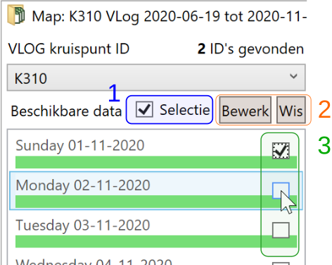
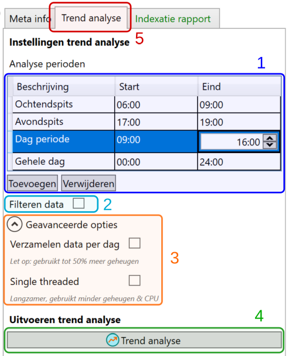
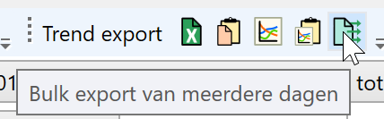

Wanneer de data uit een is geïndexeerd, en de configuratie(s) voor de data goed zijn ingesteld, is het mogelijk een trend analyse uit te voeren. Hierbij wordt gekeken naar de data per dag, worden gemiddelden berekend over langere tijd, en wordt het verloop van bepaalde indicatoren over langere tijd in beeld gebracht.

## Selectie van dagen

Om een trend analyse uit te kunnen voeren moet eerst een selectie van dagen worden gemaakt die in de analyse moeten worden meegenomen. Het maken en bewerken van de selectie gaat middels de knoppen boven de kalender-lijst met de beschikbaarheid.

Let op: in de lijst en de kalender is het óók mogelijk een dag te selecteren (in bovenstaande afbeelding is dit ook zo: de geselecteerde dag is blauw gearceerd). Die selectie heeft uitsluitend als effect dat van de betreffende dag de meta data wordt weergegeven onder het kopje “Geselecteerde dag”, en de fasenlog-preview wordt geladen ([zie hier](https://www.codingconnected.eu/yavvwiki/big-data/yavv-big-data-indexatie/#articleTOC_5)). **Deze selectie staat dus geheel los van de selectie van dagen t.b.v. de trend analyse.**

Om een selectie van dagen te maken gaan we als volgt te werk (de cijfer refereren naar de afbeelding hier boven):

- Vink “Selectie” aan boven de kalender-lijst (1), zodat er een vinkje per dag (3) zichtbaar wordt.
- Het is nu mogelijk handmatig per dag het vinkje te zetten (3)
- Doorgaans is het makkelijker middels de knop “Bewerk” (2) de selectie van dagen middels criteria op te bouwen. Er verschijnt dan een dialoogvenster:
    
    - Kies start en einde datum. Let op dat over de betreffende periode één configuratie geldig moet zijn.
    
    - Kies de verdere criteria, zoals mate van compleetheid, dag type en evt. welke maanden wel/niet meegenomen moeten worden
    - Klik op “OK”, de selectie wordt nu gemaakt
        - Merk op: maken van een selectie via het dialoogvenster dit werkt óók wanneer het vinkje “Selectie” uit staat, echter is de selectie dan niet zichtbaar.

## Uitvoeren trend analyse

Tijdens het uitvoeren van de trend analyse bepaalt YAVV van diverse waarden de totale en gemiddelde waarde voor de gehele dag. De perioden waarvoor dit gebeurt zijn instelbaar. Optioneel is mogelijk reguliere analyse data per dag op te halen.

Via de tab “Trend analyse” (bij 5 zoals hieronder te zien) komen de opties voor de analyse in beeld.

Momenteel zijn de volgende opties beschikbaar (de nummers refereren naar de afbeelding):

- Instellen perioden (1) waarvoor de trend analyse zal worden uitgevoerd. Na uitvoeren van de analyse kunnen de uitkomsten afzonderlijk per ingestelde periode worden bekeken.
    - Gebruik de knoppen om periode toe te voegen of te verwijderen
    - Klik op de tijd om die in te stellen
    - Maak gebruik van defaults: via menu Help > Instellingen YAVV > Big data; wat daar is ingesteld verschijnt in dit tabblad als default voor de perioden.
- Filteren data (2): al dan niet gebruik maken van [filtering van data](https://www.codingconnected.eu/yavvwiki/filtering/filtering-functionele-omschrijving/) tijdens uitvoeren van de analyses
- Geavanceerde opties (3):
    - Verzamelen data per dag: indien aangevinkt, verzamelt YAVV tijdens de trend analyse voor iedere dag ook (per periode) de reguliere analyse uitkomsten. Na de analyse kan hier snel doorheen worden gebladerd, en data naar wens worden geëxporteerd. Let op: dit kost zeker bij meerdere perioden en veel dagen significant meer werkgeheugen.
    - Single threaded: normaal gesproken voert YAVV de trend analyse zo snel mogelijk uit, waarbij meerdere dagen gelijktijdig worden doorgerekend. Indien aangevinkt, zorgt dit ervoor dat de trend analyse dag na dag, dus met een enkel (achtergrond)proces gebeurt. Dit kost beduidend meer tijd, maar kost in de regel ook minder werkgeheugen.

Na klikken op “Trend analyse” (4) opent YAVV een nieuw werkblad en gaat de analyse lopen. Dit duurt afhankelijk van de aard van de data (grote of kleine kruising), het aantal te analyseren dagen en de specificaties van de hardware van de betreffende pc, tussen enkele seconden en meerdere minuten. De applicatie geeft een indicatie van de voortgang.

Let op: indien de applicatie langdurig stil blijft staan gaat er mogelijk iets mis met de analyse. YAVV kan met veel data omgaan, maar de ervaring leert dat er met VLOG data toch nog onverwachte punten de kop op kunnen steken.

## Uitkomsten trend analyse

Na uitvoeren van een trend analyse is de volgende data beschikbaar:

- Gemiddelde waarden voor alle analyses
- Een overzicht met totalen per periode per dag voor een aantal indicatoren
- Indien ingeschakeld: reguliere analyse data per dag

### Gemiddelden

Hier zijn per ingestelde periode per analyse gemiddelde resultaten op te vragen. Niet alle in YAVV aanwezige analyses komen hier terug; zaken als check naloop of analyses rond C-ITS data doen hier niet mee. Links in beeld kunnen periode, categorie en analyse ingesteld worden.

De weergave van analyse data is verder gelijk aan die van YAVV bij het werken met data uit bestanden, echter komen er nu ook getallen achter de komma voor waar dit normaliter niet zo is (bv.: intensiteiten, roodrijders, etc.). Waar van toepassing worden analyse resultaten herberekend (bv.: capaciteit, groenbenutting).

### Trend

Onder “Trend overzicht” is het verloop van een aantal indicatoren over de geselecteerde periode te zien. Hiermee kan bv. snel inzichtelijk worden gemaakt wanneer het een dag of week drukker of juist rustiger was in een langere periode. De volgende indicatoren zijn momenteel beschikbaar:

- Totale intensiteit per richting
- Gemiddelde wachttijd eerstwachtende
- Cyclustijd

Ook hier kan een periode gekozen worden, alsook het type analyse om weer te geven.

### Data per dag

Indien dit is ingeschakeld is ook data per dag op te vragen. Dit is dus dezelfde data als wanneer de data per dag in YAVV zou worden ingeladen en de analyse met de hand uitgevoerd zou worden. Echter nu gebeurt dit in één keer voor een bulk geselecteerde dagen.

Ook hier wordt weer de periode gekozen, de categorie en het type analyse. Middels de lijst met data links in beeld kan door de dagen heen gebladerd worden. De weergave verdere is identiek aan de reguliere analyse weergave. Instelling in de weergave blijven behouden wanneer van dag of periode wordt gewisseld.

Middels dit tabblad kan snel door data heen worden gebladerd. Tevens zijn er uitgebreide **export** mogelijkheden:

In het dialoogvenster voor bulk export kan worden ingesteld voor welke periode en welke analyse data moet worden geëxporteerd. Tevens is het interval instelbaar, en kan worden gekozen data per dag of als geheel te exporteren. Het resultaat is per periode, per analyse en al dan niet per dag een .csv bestand met de data.
