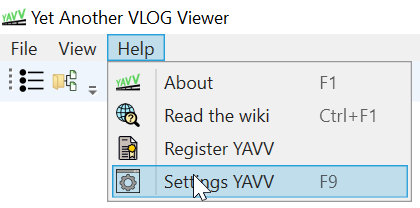

Voor de applicatie YAVV zijn diverse zaken instelbaar. Dit betreft:

- Default instellingen voor de fasenlog (ook relevant voor YAVC-client)
- Default instellingen voor analyse weergave
- Instellingen voor het DSI werkblad
- Een aantal applicatie instellingen
- Tonen/verbergen toolbars
- Indien relevant: instellingen voor de bigdata addon

De instellingen zijn beschikbaar via het menu Help>Instellingen YAVV of via de sneltoets F9:

Instellingen worden automatisch opgeslagen bij het sluiten van de applicatie.

Het instellingen werkblad is onderverdeeld in tabbladen, die hieronder worden doorlopen.

## Fasenlog (ook voor YAVC-client)

Hier zijn diverse defaults voor de weergave van de fasenlog in te stellen. Tevens zijn er een aantal instellingen omtrent het gedrag van de fasenlog bij bepaalde acties, zoals navigatie. Het betreft de volgende instellingen:

- Items onder **Weergave algemeen** (deze zijn enkel hier instelbaar en gelden dus voor de hele applicatie):
    - Doorzichtigheid tooltip: dit beïnvloedt de mate van doorzichtigheid van de tooltip die zichtbaar is in de fasenlog wanneer de muis over objecten gaat
    - Rood als rode lijn: indien aangevinkt, wordt rood (externe status) weegegeven als rode lijn
    - Item label in tooltip: indien uitgevinkt, wordt in de tooltip _niet_ het naam van het item waar de status bij hoort weergegeven
    - Horizontal/verticale zoom: de default zoom bij openen van een nieuwe fasenlog
    - Wachten voor niets info in tooltip: indien aangevinkt, wordt in de tooltip detailinfo gegeven over evt. wachten voor niets gedurende een roodfase
    - Sorteren detectoren per rijstrook: indien aangevinkt (=default) wordt bij sorteren detectie per fase, de detectie aanvullend per rijstrook gesorteerd
    - DSI tooltip: dit kan worden uitgeklapt, waarna kan worden geregeld welke DSI velden wel/niet in de tooltip voor DSI berichten opgenomen moeten worden
- Items onder **Defaults bij openen fasenlog**:
    - dit beïnvloedt de stand van de diverse weergave opties bij het openen van een nieuwe fasenlog
    - deze instellingen zijn per geopende fasenlog ook actueel instelbaar via de toolbar/het menu; bij instellingen is instelbaar wat default aan/uit staat voor een nieuw geopende fasenlog
- Items onder **Weergave selectie/tijd**:
    - Popup met tijd tijdens scrollen: indien aangevinkt, verschijnt er tijdens horizontaal scrollen in de fasenlog met de scrollbar, een popup met de tijd waarnaar gescrolled is.
    - Start/einde tijd in scrollbar: indien aangevinkt, wordt links en rechts in de horizontale scrollbar start/einde tijd weergegeven van het zichtbare stuk van de fasenlog
    - Scrollen naar event type: hiermee wordt bepaald waareen event of status wisseling wordt geplaatst wanneer daar naartoe wordt gemanoevreerd:
        - Midden op scherm: het event of de status wisseling wordt midden op het venster geplaatst
        - Offset vanaf venster start tijd: het event of de status wisseling wordt geplaatst de ingestelde hoeveelheid tijd rechts vanaf de starttijd van het weergegeven stuk fasenlog
    - Scrollen offset (enkel beschikbaar indien “Scrollen naar event type” is ingesteld op “Offset”): de offset vanaf de linkerkant van het venster
    - Maak selectie bij scrollen naar event: indien aangevinkt, wordt bij scrollen naar een event of status wisseling een verticale selectie streep geplaatst.
- Items onder **YAVC client settings**:
    - Laden gehele dag: indien aangevinkt, wordt bij selecteren van een dag in YAVC client default gestart met het op de achtergrond inladen van de gehele dag. Deze functie is ook altijd beschikbaar per actueel geopende fasenlog via de toolbar.

## Fasenlog popups

Hier is instelbaar welke marges worden genomen bij het bepalen van de (geschatte) gereden snelheid wanneer een popup wordt gemaakt voor twee detectoren. Zowel de marge voor tijd als voor afstand is instelbaar.

## Analyse

Momenteel is hier uitsluitend instelbaar of de hoogste waarden moeten worden gemarkeerd voor analyse in tabelvorm. Dit is ook actueel instelbaar voor een geopend analyse werkblad via de geavanceerde instellingen (zie hier: [Analyse weergave](https://www.codingconnected.eu/yavvwiki/analyse/analyse-weergave/)).

## DSI werkblad

Hier is instelbaar welke kolommen moeten worden weergegeven in de lijst met DSI berichten op het DSI werkblad.

## Applicatie

Dit betreft applicatie instellingen voor YAVV, die geen direct verband met VLOG:

- Check op update: indien uit, wordt bij start het programma niet gezocht naar een evt. beschikbare update
- Automatisch laden enkele configuratie ongeacht naam: indien aan, wordt een enkele cfg/vlt/vlc/yavv configuratie die bij VLOG data wordt gevonden, altijd geladen, ongeacht of de naam van het betreffende configuratie bestand overeen komt met de in de data gevonden naam van de kruising
- Default map voor configuraties: hier kan een map worden ingesteld, waar YAVV zoekt naar geschikte configuraties bij het laden van data
- Bestandsnaam incl. pad als document naam: indien aan, wordt in de tabbladen in YAVV het complete pad van geopende data weergegeven in plaats van enkel de bestandsnaam

## Toolbars

Hier is instelbaar welke toolbars wel/niet moeten worden weergeven. In YAVV zijn veel functionaliteiten ook via het menu beschikbaar. Wordt een bepaalde functionaliteit zelden gebruikt (bv. export), dan kan die worden verborgen. Is die dan toch nodig, dan is die (in geval van export) alsnog bereikbaar via het menu Fasenlog
