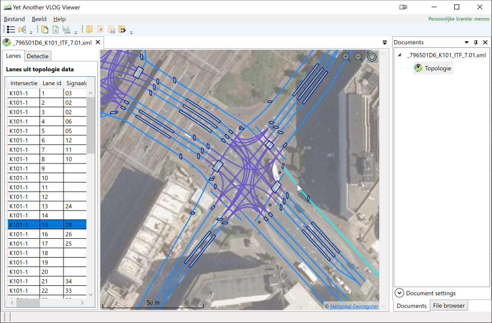
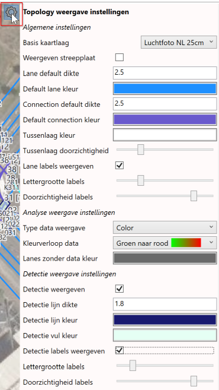

Met de topology addon kunnen binnen YAVV topologie bestanden (ITF bestanden) worden geopend en gevisualiseerd op kaart. Van lanes en detectie wordt de data in tabelvorm weergegeven. De visualisatie op kaart is instelbaar, en kan tevens worden gekoppeld aan analyse data op basis van VLOG.

_Notitie:_ dit artikel betreft de topology addon vanaf YAVV 1.9. Tot 1.9 was er omtrent detectie geen data beschikbaar binnen YAVV.

## Installatie

Bij gebruik van de [setup](../../faq/zoek-de-verschillen-setup-vs-portable/index.md) is de topology addon een aparte optie tijdens de installatie van YAVV. Deze staat default uit en moet worden aangevinkt om de addon mee te installeren. Indien u YAVV reeds heeft geïnstalleerd zijn er twee opties:

- De setup nogmaals starten en de installatie aanpassen
- YAVV verwijderen (deïnstallatie via "Toevoegen en verwijderen programma's") en vervolgens opnieuw installeren met de topology addon aangevinkt.

Is de addon eenmaal geïnstalleerd, dan zal bij een update van de applicatie de optie automatisch opnieuw worden aangevinkt.

Bij gebruik van de [portable versie](../../faq/zoek-de-verschillen-setup-vs-portable/index.md) zit de addon er al bij en volstaat het hebben van de juiste licentie.

### Licentie

Voor het gebruik van de topologie functionaliteit binnen YAVV is een aanvullende licentie nodig. Wanneer u reeds een licentie heeft moet u deze vervangen door de licentie waarin de topology functionaliteit ook is ingeschakeld. Zie hierover [dit artikel](../yavv-hoe-en-wat-rond-licenties/index.md) onder "Hernieuwen van een licentie".

## Openen van ITF bestanden

Wanneer de addon beschikbaar is, en de juiste licentie wordt gevonden, komt er in het menu File een extra optie beschikbaar: "Openen ITF bestand". Gebruik deze optie om het gewenste XML bestand met de ITF data te selecteren. Er wordt een nieuw tabblad geopend, waarin de data op kaart wordt geplot, en van de lanes en detectie tevens data in tabelvorm zichtbaar is.

### Navigeren in de data

Na openen van een ITF bestand kan de kaart middels slepen worden verplaatst. Zoom kan met het muiswiel, of met de vergrootglas knoppen rechtsbovenin het venster met de kaart.

Klikken op een lane of detector in de tabel of op kaart zorgt voor selectie van het betreffende item. Bij klikken op de kaart scrollt de lijst met items automatisch naar het betreffende item toe.

### Visualisatie instellingen

De weergave van lanes, connections (dat zijn de verbindingen tussen lanes die over het kruisingsvlak lopen) en detectoren is instelbaar. Klik hierop het knopje met het tandiwiel symbool rechts bovenin het venster met de kaart.

De instellingen spreken grotendeels voor zichzelf, hieronder nog een overzicht:

- Basis kaartlaag: dit is de kaartlaag die onder de ITF data komt te liggen. Er zijn diverse opties, waaronder:
  - Diverse kaarten van Microsoft Bing
  - Openstreetmap
  - Kaarten van het [nationale georegister](https://www.nationaalgeoregister.nl/) waaronder een luchtfoto en "BRT top 10"
  - Etc.
- Weergeven streepplaat: zorgt voor weergave van lijnen bovenop het kaartbeeld met GPS informatie
- Lane default dikte: dikte van lanes indien niet gekoppeld aan analyse data
- Default lane kleur: kleur van lanes indien niet gekoppeld aan analyse data
- Connection default dikte: dikte van connections indien niet gekoppeld aan analyse data
- Default connection kleur: kleur van connections indien niet gekoppeld aan analyse data
- Tussenlaag kleur: hiermee wordt de kleur van de laag tussen de achtergrondkaart en de ITF data ingesteld. Dit kan worden gebruikt om het kaartbeeld wat uit te vagen zodat de ITF data beter zichtbaar is
- Tussenlaag doorzichtigheid: de doorzichtigheid van de tussenlaag. Merk op dat er ook reeds een doorzichtige kleur kan worden ingesteld
- Lane labels weergeven: indien dit aan staat worden labels weergegeven met de naam van bij een lane behorende signaalgroep. Indien een signaalgroep meerdere lanes heeft, wordt \[1\], \[2\] etc. achter de naam van de fase geplaatst
- Lettergrootte en doorzichtigheid label: spreekt voor zichzelf
- Type data weergave: indien er analyse data met de ITF wordt gekoppeld, bepaalt deze instelling het type koppeling: kleur, lijndikte of beide
  - Bij keuze voor dikte of beide komen twee extra opties tevoorschijn voor minimale en maximale dikte
  - Bij keuze voor kleur of beide kan het kleurverloop worden ingesteld
- Lanes zonder data kleur: kleur van lanes die niet gekoppeld zijn aan een signaalgroep
- Detectie weergeven: al dan niet weergeven van detectoren op kaart; alleen relevant indien er detectoren (sensoren in ITF termen) in de data zitten én die detectoren beschikken over geo data (hun "shape" ofwel vorm).
- Detectie lijn dikte, kleur: spreekt voor zichzelf
- Detectie vul kleur: de kleur waarmee detectoren worden gevuld; default staat deze enigszins doorzichtig ingesteld
- Detectie labels weergeven: weergeven van de namen van detectoren op kaart
