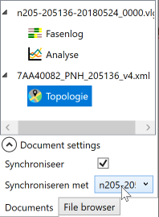

Met behulp van de [topology addon](https://www.codingconnected.eu/yavvwiki/topology/yavv-topology-introductie/) voor YAVV is het mogelijk analyse data te plotten op kaart. Dit gaat op hoofdlijnen als volgt:

- Open het gewenste ITF bestand
- Open VLOG data behorende bij deze kruising, inclusief configuratie
- Gebruik de Documenten manager om de ITF te koppelen aan de geopende VLOG data
- Stel de gewenste analyse en gewenste visualisatie in

Hieronder wordt dit in meer detail toegelicht. Voor openen van data wordt verwezen naar [dit artikel](https://www.codingconnected.eu/yavvwiki/algemeen/data-openen-met-yavv/) betreffende VLOG data en [dit artikel](https://www.codingconnected.eu/yavvwiki/topology/yavv-topology-introductie/) betreffende ITF data.

## Koppelen ITF document aan VLOG document

Voor een goed begrip van de omschreven werkwijze is het nuttig [hier](https://www.codingconnected.eu/yavvwiki/algemeen/documentenbeheer-in-yavv/) na te lezen hoe YAVV omgaat met documenten en werkbladen.

Met zowel de ITF als de VLOG data geopend kan deze worden gekoppeld:

- Open het Documentenbeheer toolvenster
- Selecteer het ITF document
- Klap onderaan "Document settings" uit
- Vink "Synchroniseer" aan
- Selecteer het document met geopende VLOG data

Default worden nu intensiteiten gekoppeld. Om andere data te visualiseren: open het analyse werkblad behorende bij de VLOG data en selecteer de gewenste analyse. Tevens kan hier bv. een selectie worden gemaakt in de tijd, wat ook door zal werken in de gekoppelde data.

## Visualisatie van analyse data

Als de data eenmaal is gekoppeld kan in het ITF/topology werkblad de visualisatie worden ingesteld. Hierbij is van belang te weten:

- Voor zowel kleur als dikte neemt YAVV de minimale en maximale waarde uit de data; dit bepaalt de rijkwijdte, en tussenliggende waarde krijgen een dikte/kleur al naar gelang hun positie tussen min en max
- Bij signaalgroepen met meerdere lanes wordt de dikte momenteel uitgesmeerd over de lanes. Het is nog niet mogelijk de data van afzonderlijke lanes te koppelen, en om te voorkomen dat een drukke signaalgroep met drie stroken het beeld vertroebeld, is voor deze aanpak gekozen.

Er zijn twee mogelijke koppelingen:

- Kleur: de minimale gevonden waarde krijgt kleur 1, de maximale kleur 2, en waarden daartussen krijgen al naar gelang hun positie de juiste kleur
- Dikte: de minimale gevonden waarde krijgt dikte 1, de maximale dikte 2, en waarden daartussen krijgen al naar gelang hun positie de juiste dikte
- De combinatie van kleur en dikte is ook mogelijk

Zie voor de mogelijke opties ook [dit artikel](https://www.codingconnected.eu/yavvwiki/topology/yavv-topology-introductie/). Verder is het aan te raden de beschikbare visualisatie opties gewoon uit te proberen om er bekend mee te raken en grip te krijgen op de mogelijkheden.
