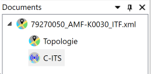
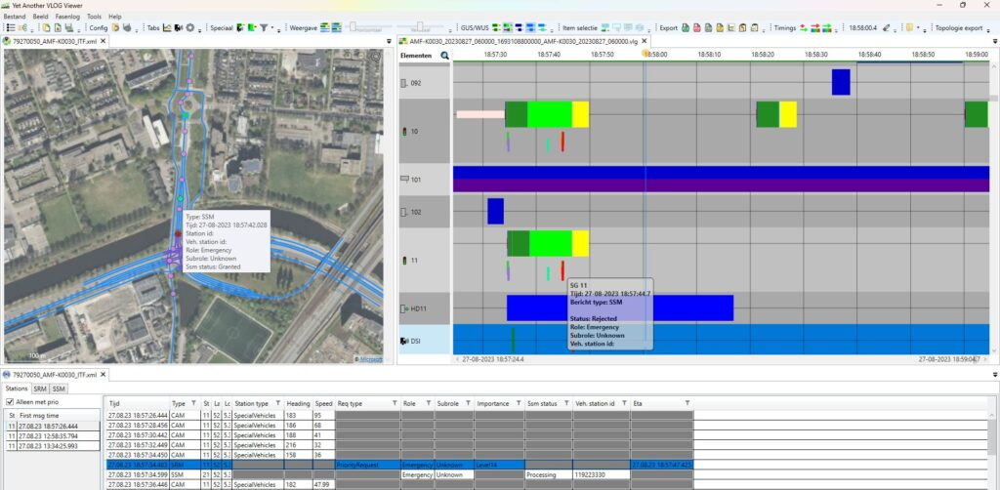
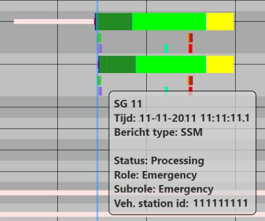

Met de topology addon van YAVV is het (sinds versie 1.21 van YAVV) mogelijk C-ITS data in te laden, weer te geven en te plotten op een ingeladen ITF bestand. Het betreft dan CAM, SRM en SSM berichten. De SRM en SSM berichten kunnen tevens worden geplot in de fasenlog.

## Wat is C-ITS data?

De afkorting C-ITS staat voor "**C**onnected **I**ntelligent **T**ransport **S**ystem", en duidt op data transport-gerelateerde systemen die onderling data uitwisselen ten gunste van doorstroming, verkeersveiligheid, etc. Het gaat om voertuigen, die bijvoorbeeld hun locatie, snelheid en richting kenbaar maken, en om wegkant systemen die deze data ontvangen, alsook data terug kunnen sturen, zoals de stand van een verkeerslicht of de status van een prioriteitsaanvraag. Relevant in dit kader zijn de volgende type berichten:

- CAM - Cooperative Awareness Message; dit wordt uitgestuurd door voertuigen, en bevat informatie over locatie, snelheid en richting

- SRM - Signal Request Message; dit wordt uitgestuurd door voertuigen die een bepaalde vorm van prioriteit kunnen aanvragen bij een verkeersregelinstallatie. Het bericht is vergelijkbaar met een KAR (Korte Afstand Radio) bericht zoals dit reeds langer in gebruik is in Nederland voor prioritering van OV en hulpdiensten.

- SSM - Signal Status Message; dit wordt verzonden door een wegkant systeem (ook wel RSU ofwel Road Side Unit) als reactie op een SRM bericht en bevat informatie omtrent de status van het betreffende verzoek

- SPAT - Signal Phase and Timings; dit bericht wordt verzonden door een wegkant systeem en bevat informatie omtrent de status van de verkeerslichten van een geregelde kruising; deze informatie zit doorgaans wel verpakt in aangeleverde C-ITS data, maar wordt (momenteel) door YAVV/topo niet uitgelezen

In de huidige Nederlandse situatie is er slechts indirect sprake van "connected" ofwel verbonden voertuigen. Alle informatie gaat via de zogenaamde UDAP ofwel het Urban Data Access Platform. Voertuigen/bestuurders die gebruik maken van bv. "flitsmeister" of een andere aangesloten app, sturen data uit naar het platform van de betreffende app. Indien deze app is aangesloten op de UDAP, gaat de data vanaf het app-platform door naar de UDAP, en vanaf de UDAP door naar relevante wegkant systemen. Dit levert een relatief grote latency op van vaak 0,5 tot soms 3 seconden. Andersom geldt dat wegkant systemen informatie leveren aan de UDAP, en deze vanaf daar weer wordt doorgezet aan andere partijen, en zo in een voertuig/bij een bestuurder terecht komt. Een voordeel van deze aanpak is dat ook voertuigen zonder ingebouwde C-ITS functionaliteit aangesloten kunnen worden via de mobiele telefoon van de bestuurder.

## Opvragen C-ITS data

De data die de UDAP passeert wordt gelogd. Het betreft hierbij door veel partijen als "privacy-gevoelig" aangemerkte data, met als vermeende reden dat de data gebruikt zou kunnen worden om "andere data te verrijken". Het is daarom niet regulier mogelijk deze data op te vragen, en raadzaam voorzichtig te zijn bij het eventueel delen van de data. (De voorbeeld data op deze pagina is zodanig geanonimiseerd dat ook na koppeling met andere al dan niet privacygevoelig data er geen gevaar bestaat dat die andere data kan worden verrijkt, behoudens wellicht wanneer het andere geanonimiseerde voorbeeld data betreft.)

Wegbeheerders (die VRI's beheren die zijn aangesloten op de UDAP) kunnen de data opvragen bij de UDAP. Deze wordt dan aangeleverd als ofwel een set .csv files met gedecodeerde berichten, ofwel in meer ruwe vorm als een .zip of .tar bestand met daarin mappen met .csv.gz bestanden. De "ruwe" data bevat ASN.1 gecodeerde data (conform de specs van ETSI wordt gebruik gemaakt van UPER ofwel unaligned package encoding rules); YAVV/topo kan deze data decoderen tbv. weergave in YAVV.

## Laden van C-ITS data

Ontvangen C-ITS data kan als volgt worden geladen in YAVV:

- Open eerst een topologie/ITF bestand (via menu Bestand of middels sneltoets Ctrl+T)

- Open nu de bijbehorende C-ITS data:
    - In gedecodeerd .csv formaat (via menu Bestand of middels sneltoets Ctrl+Shift+T); het is mogelijk in één keer meerdere bestanden te openen, bv. één of meer met CAM, één of meer met SRM en één of meer met SSM
    
    - Als map met daarin .tar en/of .csv.gz bestanden (via menu Bestand of middels sneltoets Ctrl+Shift+T)

Er wordt nu een nieuw werkblad geopend met de geladen data in de vorm van een aantal tabellen. YAVV/topo kan grote hoeveelheden data aan; inladen van meerdere dagen aan data voor een groter gebied is geen issue; wel zal het enige tijd kosten dit in te laden.

**_Let op!_** Belangrijke punten omtrent het laden van data:

- Opnieuw inladen van C-ITS data zorgt voor vervangen van evt. eerder ingeladen data. Bij sluiten van het C-ITS tabblad wordt op kaart (dwz. op het topologie werkblad) weergegeven data eveneens verwijderd.

- Identieke berichten in de data worden slechts één keer ingeladen. Als identiek gelden berichten waarvoor geldt:
    - de tijd is identiek
    
    - het type is identiek (CAM / SRM / SSM)
    
    - het station ID is identiek (bij SSM: óók het verhicle station ID is uniek)

### Formaat gedecodeerde data (.csv)

Indien gebruik wordt gemaakt van gedecodeerde data uit een of meer .csv bestanden, dienen deze bestanden een vast formaat te volgen:

- Het separeer teken tussen velden is een komma

- Decimalen worden aangeven middels een . dus bv "1.5" voor één komma vijf

- De eerste regel van het bestand moet de header bevatten met kolom namen

- Daarna moet elke regel exact even veel velden bevatten als er kolommen zijn uit de eerste regel

- Er zijn geen verplichte velden en de volgorde van velden mag afwijken van onderstaande voorbeelden; de volgorde moet natuurlijk wel identiek zijn tussen header en navolgende regels

- De timestamps moeten het formaat volgen zoals hieronder aangegeven

- Timestamp worden altijd geïnterpreteerd als UTC

Voor **CAM** levert dat bv op (header en één regel met dummy data):

```
source,timestamp,messageType,asn1data,timestampDateTime,decodeException,protocolVersion,stationId,generationDateTime,stationType,latitude,longitude,heading,speed
test.csv.gz,1693094412345,CAM,TestData//=,2023-05-01T00:00:01.659Z,,1,29850133,2023-05-01T00:00:02.234Z,passengerCar,52.1234567,5.1234567,335.00,23.51
```

Hieronder eenzelfde voorbeeld voor SRM:

```
source,timestamp,messageType,asn1data,timestampDateTime,decodeException,protocolVersion,stationId,role,subRole,importanceLevel,requestDateTime,requestIndex,requestId,requestType,regionId,intersectionId,laneId,connectionId,approachId,etaDateTime
test.csv.gz,1693133912345,SRM,TestData=,2023-05-01T10:58:31.794Z,,1,113712345,emergency,emergency,requestImportanceLevel14,2023-05-01T10:58:31.757Z,0,23,priorityRequest,27033,81,,,2,2023-05-01T10:58:31.757Z
```

Ten slotte een voorbeeld voor SSM:

```
source,timestamp,messageType,asn1Data,timestampDateTime,decodeException,protocolVersion,stationId,messageDateTime,statusIndex,regionId,intersectionId,packageIndex,vehicleStationId,role,subRole,requestId,laneId,connectionId,approachId,statusDateTime,statustest.csv.gz,1693133912345,SSM,TestData=,2023-05-01T10:58:31.907Z,,1,2130712345,2023-05-01T10:58:31.888Z,0,27033,81,0,113712345,emergency,emergency,23,,,2,2023-05-01T10:58:32.757Z,rejected
```

### Formaat ruwe data (ASN.1, .tar / .csv.gz)

De ASN.1 data komt vanuit de UDAP doorgaans als .zip bestand. Dit moet worden uitgepakt naar een lege map alvorens het in YAVV geopend kan worden. Deze map kan vervolgens worden geopend vanuit YAVV. De volgende data kan uit de betreffende map worden uitgelezen:

- Een of meer .tar bestanden: deze worden door YAVV geopend en recursief (dus inclusief alle erin aanwezige mappen) doorgelopen. In het archief aanwezige .csv.gz bestanden worden uitgelezen

- Een of meer .csv.gz bestanden (feitelijk dus een uitgepakt .tar zoals bij de vorige bullet omschreven): deze worden door YAVV uitgelezen

De map wordt recursief uitgelezen, wat betekent dat alle onderliggende mappen óók worden doorzocht op de aanwezigheid van .tar en/of .csv.gz bestanden. Het grootste deel van de data bestaat doorgaans uit SPAT data, welke door YAVV wordt overgeslagen. Deze data moet wél worden bekeken, omdat in hetzelfde .csv.gz bestand ook de eventuele SSM data zit (alle data komende ván een RSU zit in één .csv.gz bestand).

#### Beperking bij uitlezen "ruwe" C-ITS data

_**Let op!**_ Bij uitlezen van C-ITS berichten (decoderen van de "payload"), geldt binnen YAVV momenteel een beperking: vanuit de ETSI specificatie voor de codering van SRM en SSM is het mogelijk binnen één payload meerdere requests (SRM) of statussen (SSM) op te nemen. YAVV leest momenteel uitsluitend de eerste request/status uit de payload. In de praktijk levert het veel onduidelijkheid op wanneer twee requests/statussen op exact hetzelfde moment langs komen; daarom wordt deze optie nooit gebruikt (voor zover bekend bij CodingConnected).

## Werken met de data: het C-ITS werkblad

Na openen van de C-ITS data verschijnt er een nieuw werkblad. Dit hoort nu bij het reeds geopende topologie document, de data wordt dus expliciet ingeladen bij een reeds geopend topologie bestand (zie voor informatie over documenten en werkbladen in YAVV [dit artikel](https://www.codingconnected.eu/yavvwiki/algemeen/documentenbeheer-in-yavv/)). In de [Documenten manager](https://www.codingconnected.eu/yavvwiki/algemeen/documentenbeheer-in-yavv/) van YAVV (weer te geven via menu Beeld) is dit ook te zien:  
  
Gebruik naar wens [de multivenster omgeving van YAVV](https://www.codingconnected.eu/yavvwiki/algemeen/werkbladen-en-gebruikersinterface-van-yavv/) om het werkblad bv. naast, boven of onder de kaartweergave van de geladen topologie te plaatsen, zoals bijvoorbeeld hieronder te zien is:

[](https://www.codingconnected.eu/wp-content/uploads/2023/11/1698155736616.jpg)

Het C-ITS werkblad toont een drietal tabbladen:

- Stations:
    - een lijst met alle gevonden (als het goed is unieke) station ID's, met per ID daarbij weergegeven de tijd van het eerste bericht waarin dit ID voor komt
    
    - de lijst met station ID's is gesorteerd op tijd; klik om te sorteren op ID of die kolom
    
    - de lijst kan worden gefilterd door bij de kolom Station ID wat in te vullen; zo kan snel een bepaald station gezocht worden in een mogelijk zeer lange lijst (bv. om de CAM berichten bij een specifiek SSM bericht uit het tabblad SSM te kunnen zien)
    
    - naast de lijst met station ID's een lijst met alle berichten behorende bij het geselecteerde station ID
    
    - ook deze lijst is default gesorteerd op tijd; klik op een kolom om de sortering aan te passen
    
    - ook deze lijst kan worden gefilterd via de knoppen bovenaan de kolommen

- SRM
    - een lijst met alle in de data gevonden SRM berichten
    
    - default gesorteerd op tijd; klik op een kolom om de sortering aan te passen
    
    - filtering is mogelijk middels de knoppen op de kolommen

- SSM
    - een lijst met alle in de data gevonden SRM berichten
    
    - default gesorteerd op tijd; klik op een kolom om de sortering aan te passen
    
    - filtering is mogelijk middels de knoppen op de kolommen
    
    - _merk op:_ SSM berichten hebben als "Station ID" het ID van de RSU; de koppeling met CAM / SRM data loopt via het "Vehicle Station ID"

SRM en SSM data bevat normaal gesproken geen GPS coördinaten. Indien er ook CAM berichten zijn gevonden met het betreffende station ID, zal YAVV/topo op basis van de heading en snelheid van het in de tijd voorliggende CAM bericht (of eerstvolgende, indien er geen voorliggend CAM bericht is) coördinaten berekenen voor SRM en SSM berichten.

## Weergave van C-ITS data op kaart

Indien C-ITS data is ingeladen, wordt deze geplot op kaart. Daarbij geldt dat van het actief geselecteerde tabblad in het C-ITS werkblad de data op kaart wordt geplot. In het geval van het "Stations" tabblad, zijn dat de berichten behorende bij het geselecteerde station. Bij SRM / SSM betreft dat alle berichten.

Het is via het vinkje onderaan mogelijk enkel geselecteerde berichten op kaart te plotten. Selecteer naar wens met shift of control ook meerdere berichten om te plotten. Is het SSM tabblad geselecteerd, dan is tevens mogelijk van berichten met status "Granted" uitsluitend het eerste bericht op kaart weer te geven.

Het geselecteerde bericht licht op op de kaart. Tevens zorgt een klik op een bericht op de kaart voor selectie van het bericht in de betreffende lijst.

## Weergave van C-ITS data in de fasenlog

Voor de weergave van C-ITS data in de fasenlog maakt YAVV/topo gebruik van de synchronisatie optie tussen documenten die in YAVV is ingebouwd. Bijvoorbeeld [synchronisatie tussen fasenlogs](https://www.codingconnected.eu/yavvwiki/fasenlog/synchronisatie-tussen-fasenlogs/) alsook [synchronisatie tussen de topologie weergave en analyse data](https://www.codingconnected.eu/yavvwiki/topology/yavv-topology-koppelen-met-analyse-data/) werkt ook op deze manier.

Om dit te gebruiken, ga als volgt te werk:

- Selecteer het werkblad met de fasenlog waarin de C-ITS data zal worden weergegeven. Bij weergave van werkbladen naast/boven elkaar, klik toch op het werkblad of op de titel van het werkblad, zodat dit het geselecteerde werkblad wordt.
    - Dit kan ook door in de Documenten manager op de betreffende fasenlog te klikken

- Klik in [de Documenten manager](https://www.codingconnected.eu/yavvwiki/algemeen/documentenbeheer-in-yavv/) onderaan bij "Document settings"

- Vink "Synchroniseer" aan

- Selecteer het topology document uit de lijst

- Merk op: de koppeling verloopt qua instelling in YAVV dus _vanuit_ het VLOG document _naar_ het topologie document; wanneer het topologie document wordt geselecteerd (door selectie een werkblad dat bij het document hoort) zal "Synchroniseer" dan ook zijn uitgevinkt

De C-ITS data (dwz. SRM en SSM) wordt nu geplot op de fasenlog. De koppeling verloopt door te kijken naar lane ID, ingress approach ID of connection ID zoals is opgenomen in het SRM / SSM bericht (van deze drie is er altijd slechts één aanwezig in het bericht). Bij de fase(n) behorende bij het betreffende ID wordt de C-ITS data geplot. CAM data wordt (momenteel) niet geplot in de fasenlog.

In de Documenten manager is nog een optie "Fasenlog tijd synchroniseren"; deze is default aan en zorgt ervoor dat bij selectie van een C-ITS bericht in het C-ITS werkblad of op kaart, de fasenlog naar dat moment toespringt. Zie bij [de instellingen van de fasenlog](https://www.codingconnected.eu/yavvwiki/algemeen/yavv-instellingen/) (bij de bullet "Items onder Weergave selectie/tijd") om de plaatsing van dat moment op het scherm te bepalen. Het resultaat in de fasenlog is hieronder te zien:


